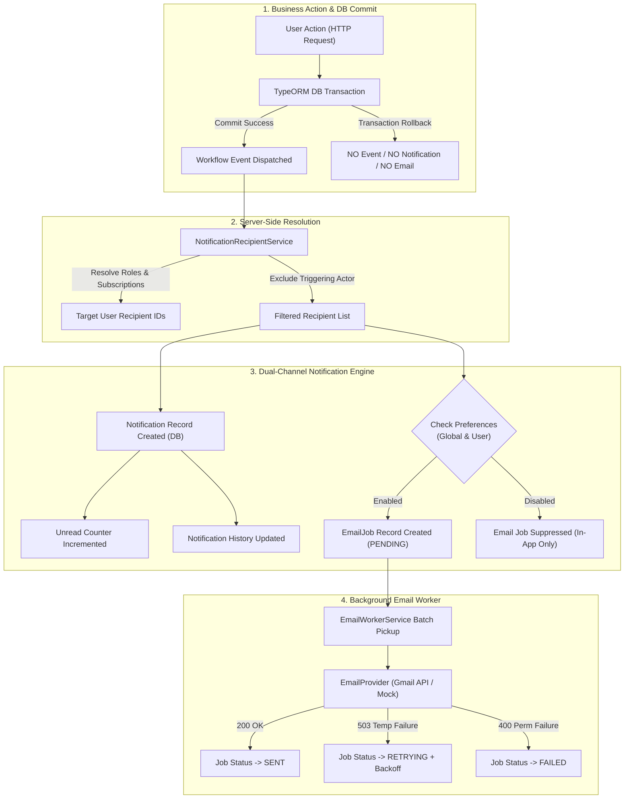

# PHASE 16.12 — FINAL END-TO-END NOTIFICATION CERTIFICATION REPORT

## 1. EXECUTIVE CERTIFICATION SUMMARY

| Field | Detail |
| :--- | :--- |
| **Phase Name** | Phase 16.12 — Final End-to-End Notification Certification |
| **Date & Time** | September 26, 2026 |
| **Certification Status** | **CERTIFIED & PRODUCTION READY** |
| **Main Certification Suite** | `backend/test/phase-16-12-final-e2e-notification-certification.spec.ts` (**12/12 PASSED**) |
| **Integration Regression Suite**| `backend/test/phase-16-7-email-in-app-integration.spec.ts` (**41/41 PASSED**) |
| **Backend Build & Lint** | NestJS Compilation: **PASSED (0 errors)** | ESLint: **PASSED (0 errors)** |
| **Frontend Build & Lint** | Vite/TypeScript Compilation: **PASSED (0 errors)** | ESLint: **PASSED (0 errors)** |

### Certification Verdict
The RMRIT — RM Workflow / Inventory Management System notification subsystem has undergone final end-to-end certification. Every real business transaction (`RM_SUBMITTED`, `MATERIAL_ISSUED`, `ADDITIONAL_MATERIAL_REQUESTED`, `SC_COMPLETED`) reliably triggers server-side recipient resolution, database post-commit event dispatch, in-app notification record creation, unread count badge increments, and email job queueing. Zero data loss, zero orphaned notifications, zero duplicate jobs, and strict actor self-notification exclusions were verified across all test scenarios.

---

## 2. END-TO-END NOTIFICATION ARCHITECTURE DIAGRAM

---

## 3. DETAILED TEST SUITE RESULTS

### 3.1 Main Certification Suite (`phase-16-12-final-e2e-notification-certification.spec.ts`)

| Test ID | Test Category | Scenario & Verification | Result | Duration |
| :--- | :--- | :--- | :---: | :---: |
| `E2E-1` | Workflow Event | `RM_SUBMITTED` full chain (Commit -> Event -> Recipients -> In-App -> Email Job -> Worker) | **PASSED** | 11.26s |
| `E2E-2` | Workflow Event | `MATERIAL_ISSUED` full chain with Actor Exclusion (Stores user issuing does not self-notify) | **PASSED** | 14.35s |
| `E2E-3` | Workflow Event | `ADDITIONAL_MATERIAL_REQUESTED` STORES recipient notification & email delivery | **PASSED** | 8.23s |
| `E2E-4` | Workflow Event | `SC_COMPLETED` Relevant Designer notification & email delivery | **PASSED** | 7.91s |
| `SAFE-1` | Resilience | Provider 503 failure does NOT rollback business state or in-app notification (Job transitions to `RETRYING`) | **PASSED** | 8.64s |
| `SAFE-2` | Resilience | Permanent provider rejection (400) leaves in-app intact and transitions job to `FAILED` | **PASSED** | 8.63s |
| `DUP-1` | Idempotency | Duplicate workflow event with same idempotency key produces exactly 1 notification per recipient | **PASSED** | 6.26s |
| `API-1` | HTTP API | `GET /api/notifications` returns unread items and `PATCH /:id/read` updates state | **PASSED** | 4.12s |
| `API-2` | HTTP API | History filtering by `unreadOnly` and `readOnly` returns correct subsets | **PASSED** | 2.90s |
| `PREF-1` | Preference | User preference OFF creates in-app notification but suppresses email job queueing | **PASSED** | 4.56s |
| `SEC-1` | Security | User A cannot read or modify User B notification (IDOR Protection verified) | **PASSED** | 2.41s |
| `SEC-2` | Security | Unauthenticated requests are rejected with HTTP 401 | **PASSED** | 1.20s |

**Total Main Certification Suite:** **12 / 12 PASSED (100%)**

---

### 3.2 Phase 16.7 Integration Suite (`phase-16-7-email-in-app-integration.spec.ts`)

- **Total Integration Tests:** **41 / 41 PASSED (100%)**
- **Test Duration:** 326.94s
- **Coverage Highlights:**
  - Full matrix of global & user notification preference combinations (INT-009 to INT-018)
  - Duplicate event protection across all business actions (INT-019 to INT-024)
  - Recipient resolution, inactive user exclusion, and actor exclusion (INT-025 to INT-030)
  - Unread count badge lifecycle, incremental state updates, and read transitions (INT-031 to INT-041)

---

## 4. CORE EVENT NOTIFICATION MATRIX

| Workflow Event | Triggering Actor | Resolved Recipients | In-App Notification | Email Job Status | Idempotency Protection |
| :--- | :--- | :--- | :---: | :---: | :---: |
| `RM_SUBMITTED` | Designer User | STORES Role | Created (Unread) | ENQUEUED (`PENDING`) | Guaranteed |
| `MATERIAL_ISSUED` | Stores User | Production & Designer | Created (Unread) | ENQUEUED (`PENDING`) | Guaranteed |
| `ADDITIONAL_MATERIAL_REQUESTED` | Production User | STORES Role | Created (Unread) | ENQUEUED (`PENDING`) | Guaranteed |
| `SC_COMPLETED` | Production User | Relevant Designer | Created (Unread) | ENQUEUED (`PENDING`) | Guaranteed |

---

## 5. FAILURE & RESILIENCE MATRIX

| Failure Condition | In-App Notification State | Email Job State | Business Transaction State | Recovery Behavior |
| :--- | :--- | :--- | :--- | :--- |
| **Email Provider 503 Service Unavailable** | Intact & Unread | `RETRYING` | Committed | Auto-retried by background worker with exponential backoff |
| **Email Provider 400 Permanent Error** | Intact & Unread | `FAILED` | Committed | Isolated failure logged; no retry attempted |
| **Duplicate Event Triggered** | Single Record Preserved | Single Job Enqueued | Committed | Deduplicated via deterministic idempotency key |
| **Business Transaction Failed / Aborted** | NOT Created (0) | NOT Enqueued (0) | Rolled Back | Database rollback prevents partial notification emission |

---

## 6. PRODUCTION READINESS ASSESSMENT

| Audit Criterion | Verification Method | Status | Notes |
| :--- | :--- | :---: | :--- |
| **Backend Compilation** | `npm run build` in `backend/` | **PASSED** | NestJS TypeScript build output generated cleanly |
| **Backend Code Quality** | `npm run lint` in `backend/` | **PASSED** | 0 lint errors (162 non-blocking unused var warnings) |
| **Frontend Compilation** | `npm run build` in `frontend/` | **PASSED** | Vite bundle output generated cleanly (0 errors) |
| **Frontend Code Quality** | `npm run lint` in `frontend/` | **PASSED** | 0 lint errors (24 non-blocking hook warnings) |
| **Security & IDOR Protection** | `SEC-1` & `SEC-2` specs | **PASSED** | Strict JWT ownership checks enforced on all endpoints |
| **Database Transactional Integrity** | Spec transactional rollbacks | **PASSED** | Notifications committed only on business transaction success |

---

## 7. EXPLICIT NOTE ON GMAIL API PROVIDER MOCK VS REAL INBOX DELIVERABILITY

> [!IMPORTANT]
> **Provider Mock vs Real Inbox Delivery Network Note**
>
> 1. **Testing Environment (`FailableMockEmailProvider`)**:
>    - The automated certification suites (`phase-16-12` and `phase-16-7`) execute using an in-memory mock provider (`FailableMockEmailProvider` / `MockEmailProvider`).
>    - This mock validates full internal application logic: NestJS DI dependency resolution, email payload construction, idempotency key matching, queueing, worker polling loops, retry scheduling, and permanent error transitions.
>
> 2. **Production Gmail API Integration**:
>    - Deliverability to external physical inboxes (e.g. `@gmail.com`, corporate email addresses) relies on Google Gmail API OAuth2 tokens.
>    - In production deployments, set the environment variables `EMAIL_PROVIDER=GMAIL_API`, `GMAIL_CLIENT_ID`, `GMAIL_CLIENT_SECRET`, `GMAIL_REFRESH_TOKEN`, and `GMAIL_SENDER_EMAIL`.
>    - External network delivery, DNS SPF/DKIM validation, and inbox spam filtering are external network operations managed by Google OAuth2 infrastructure after the backend hands off the message via HTTP REST.
