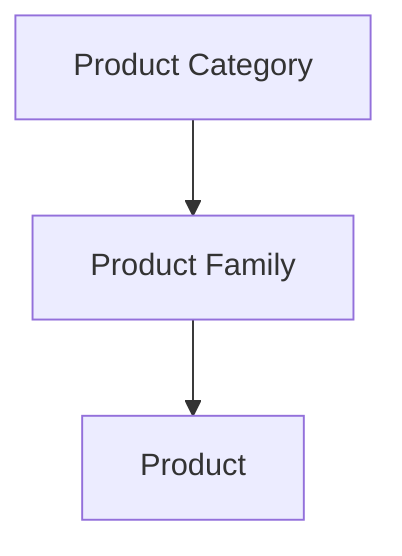
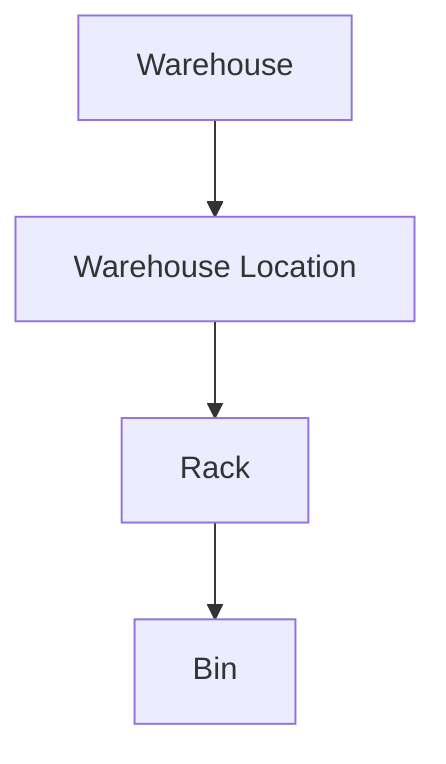
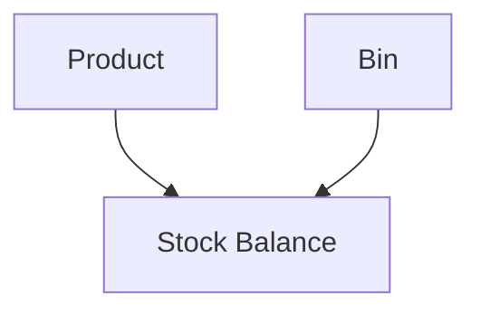
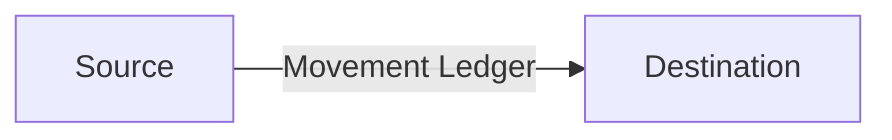
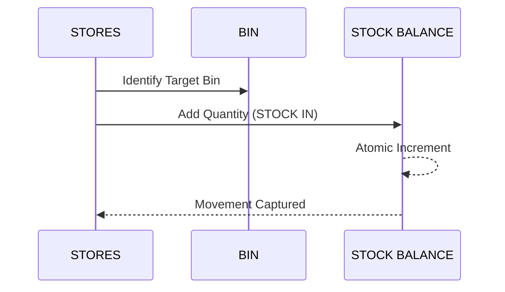
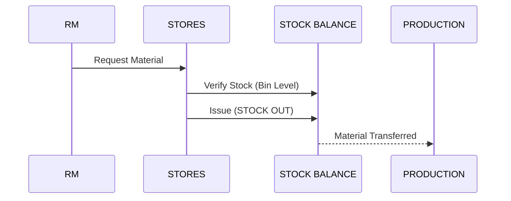

# PHASE 2.1: INVENTORY DOMAIN & STORAGE ARCHITECTURE DESIGN

## 1. Objective
Design the Inventory Domain and Physical Storage Architecture for RMRIT based on the authoritative requirements baseline. This is a design-only phase; no implementation will be modified.

## 2. Source Documents Reviewed
- `.agent/CURRENT_REQUIREMENTS_BASELINE.md`
- `.agent/REQUIREMENT_CHANGE_RECONCILIATION.md`
- `.agent/PHASE_1_REQUIREMENT_DECISION_LOG.md`
- `.agent/PHASE_1_REPORT.md`
- Phase 10 Inventory entities and design concepts.

## 3. Current Inventory Architecture
The existing Phase 10 architecture (`InventoryItem`, `StockBalance`, `StockTransaction`) is robust and provides backend-authoritative, immutable, atomic stock operations. This design will extend the existing architecture to support multi-level master data and location-aware storage, preserving its core principles.

## 4. Product Hierarchy
The RMRIT product taxonomy is defined strictly as:

- **Product Category**: Highest grouping.
- **Product Family**: Grouping of associated products.
- **Product**: Actual inventory master item. Contains Product Name, Minimum Inventory, Maximum Inventory.

## 5. Storage Hierarchy
The physical storage is structured as:

## 6. Stock Balance Granularity
To support physical traceability, Stores issues, and auditing, the authoritative stock quantity must be tracked at the most granular level (Option C).

A `StockBalance` record represents the quantity of a specific `Product` in a specific `Bin`.

## 7. Product-to-Storage Relationship
- **Multi-Warehouse**: Supported. One product can exist in multiple warehouses simultaneously.
- **Multi-Location**: Supported. One product can exist in multiple locations/bins.
- **Product Total Stock**: The global total is the sum of all valid `StockBalance` records for that Product across all locations.

## 8. Warehouse Design
- **Identity**: Warehouse Code, Warehouse Name.
- Independent physical building or major logical division.

## 9. Location Design
- **Identity**: Location Identifier/Name, Foreign Key to Warehouse.
- A designated area within a warehouse.

## 10. Rack Design
- **Identity**: Rack Identifier/Number, Foreign Key to Warehouse Location.
- One Rack can contain multiple products.

## 11. Bin Design
- **Identity**: Bin Identifier/Number, Foreign Key to Rack.
- The most granular storage compartment.

## 12. Stock Balance Design
**What Remains**: The concept of `StockBalance` representing the current operational balance, and `StockTransaction` for the immutable ledger.
**What Extends**: `StockBalance` is expanded to require a reference to `Bin` (which implies Rack, Location, and Warehouse).
**What Changes**: Instead of one balance per product, there are multiple balances per product based on location.
**What is Superseded**: The assumption that a product has only one universal stock balance record.

## 13. Inventory Movement Design
The movement ledger (`StockTransaction`) must be extended to support source and destination locations.

## 14. Stock IN

## 15. Stock OUT
External stock removal (e.g., disposal). Decrements the exact Bin's `StockBalance`.

## 16. Stores Issue

## 17. Material Return
Production returns unused material. Stores verifies and restores inventory.
**Open Question**: Does it return to the original bin or a quarantine bin? (Requires Business Decision).

## 18. Min/Max Inventory
- **Minimum Inventory**: Checked against the sum of all global `StockBalance` records for the product.
- **Maximum Inventory**: Checked globally. Exact enforcement rules require a business decision.

## 19. Stock Status
Calculated globally for a product:
- **OUT OF STOCK**: Total == 0
- **LOW STOCK**: Total > 0 AND Total < Minimum
- **NORMAL**: Total >= Minimum AND Total <= Maximum
- **EXCESS STOCK**: Total > Maximum

## 20. Inventory Filtering
The system must support querying the `StockBalance` table joined with the storage hierarchy to filter by Warehouse, Location, Rack, Bin, Product, Family, and Category.

## 21. Aggregation
Total Stock is dynamically aggregated by summing `StockBalance.quantity` grouping by Product. The database should index the `productId` and `binId` on `StockBalance`.

## 22. Reconciliation
Reconciliation must target specific Bins. If historical data lacks location, it will be marked as a data migration issue or placed in a "Legacy Virtual Bin".

## 23. Concurrency
Stock operations remain atomic at the `StockBalance` (Bin) level. Optimistic locking or row-level locking on the `StockBalance` row ensures non-negative balances when concurrent Stores users issue from the same Bin.

## 24. Existing Implementation Impact
- **Current architecture**: Preserved.
- **Problem**: Needs to support location.
- **Required change**: Add `binId` to `StockBalance` and `StockTransaction`.
- **API impact**: DTOs for Issue/Return/In must accept location/bin identifiers.

## 25. Existing Data Impact
Existing records lack Master Data and Storage mappings. Manual migration or a fallback "Legacy" warehouse/bin structure is required.

## 26. Security Impact
Preserves backend authority, RBAC, and JWT. No client-controlled stock.

## 27. Performance Considerations
- Index `(productId, binId)` on `StockBalance`.
- Index `(productId, timestamp)` on `StockTransaction` for ledger queries.

## 28. Design Decisions
| Decision ID | Decision | Recommended Architecture | Status |
| :--- | :--- | :--- | :--- |
| DEC-001 | Stock Balance Granularity | Option C (Bin Level) | RESOLVED |
| DEC-002 | Multi-Location Product | Supported | RESOLVED |
| DEC-003 | Multi-Product Bin Storage | Unknown | REQUIRES BUSINESS DECISION |
| DEC-004 | Maximum Inventory Scope | Global sum | REQUIRES BUSINESS DECISION |
| DEC-005 | Return Storage Location | Unknown | REQUIRES BUSINESS DECISION |
| DEC-006 | Source/Destination Model | Source and Dest in Ledger | RESOLVED |
| DEC-007 | Product Total Stock | Sum of all Bins | RESOLVED |
| DEC-008 | Stock Status Precedence | Out(0), Low(<Min), Normal, Excess(>Max) | RESOLVED |

## 29. Open Questions
- Can one Bin contain multiple Products?
- How is Maximum Inventory enforced (hard block vs. warning)?
- Where does returned material physically go?

## 30. Phase 7 Requirements
New entities: `ProductCategory`, `ProductFamily`, `Warehouse`, `WarehouseLocation`, `Rack`, `Bin`. Modify `StockBalance` and `StockTransaction`.

## 31. Phase 11 Requirements
Master Data implementation must include CRUD for the Product Hierarchy and Storage Hierarchy.

## 32. Phase 12 Requirements
Stores / Production workflows must be updated to reference Bins when issuing or returning material.
