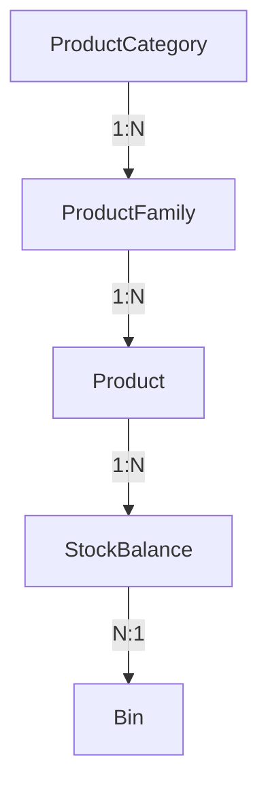

# PHASE 2.3: CATEGORY & FAMILY MASTER DESIGN

## 1. Objective
Design the complete Product Category and Product Family Master Data domain for RMRIT based on the authoritative requirements baseline, extending Phase 2.1 (Inventory & Storage Architecture) and Phase 2.2 (Product Master Design). This phase strictly covers classification taxonomies without modifying application code or database implementations.

## 2. Source Documents Reviewed
- `.agent/CURRENT_REQUIREMENTS_BASELINE.md`
- `.agent/REQUIREMENT_CHANGE_RECONCILIATION.md`
- `.agent/PHASE_1_REQUIREMENT_DECISION_LOG.md`
- `.agent/PHASE_1_REPORT.md`
- `.agent/PHASE_2.1_INVENTORY_DOMAIN_STORAGE_DESIGN.md`
- `.agent/PHASE_2.1_REPORT.md`
- `.agent/PHASE_2.2_PRODUCT_MASTER_DESIGN.md`
- `.agent/PHASE_2.2_REPORT.md`
- Existing Phase 10 entities (`InventoryItem`, `StockBalance`, `StockTransaction`).

## 3. Authority Hierarchy & Taxonomy Model
The authoritative RMRIT product taxonomy is strictly hierarchical:



**Key Architectural Rules:**
- `ProductCategory` is the highest classification level.
- `ProductFamily` is a mid-level grouping belonging to exactly one `ProductCategory`.
- `Product` belongs to exactly one `ProductFamily`.
- `ProductCategory` is derived on `Product` via `Product.family.category` (no duplicate `categoryId` on `Product`).

## 4. Product Category Business Purpose
- **Purpose**: Provides top-level classification for inventory items (e.g., Raw Materials, Fasteners, Standard Components, Consumables).
- **Scope**: Purely taxonomic and metadata-driven.
- **Inventory Isolation**: `ProductCategory` does **NOT** hold stock balances, does **NOT** track stock movements, and does **NOT** participate in stock calculation or Min/Max alerts.

## 5. Category Data Model
The `ProductCategory` domain entity comprises:
- `id`: UUID (Primary Key, immutable).
- `name`: String (Required, max 100 chars, unique, trimmed).
- `isActive`: Boolean (Required, default `true`).
- `createdAt`: Timestamp (System assigned).
- `updatedAt`: Timestamp (System assigned).

*No additional core fields are required. Costing, color, suppliers, scrap, or custom parameters are strictly excluded.*

## 6. Category Identity & Normalization Rules
- **Identity**: System-generated UUID.
- **Name Normalization**:
  - Leading and trailing whitespace are trimmed upon input.
  - Internal consecutive whitespace is collapsed to a single space.
  - Comparisons are case-insensitive. `"RAW MATERIAL"`, `" raw material "`, and `"Raw Material"` represent the EXACT SAME category.
- **Blank Names**: Rejected at validation DTO level.

## 7. Category Uniqueness Rules
- **Scope**: Category names are globally unique across RMRIT.
- **Enforcement**: Database-level `UNIQUE` index on `LOWER(TRIM(name))` + API validation.
- **Concurrent Creation**: Concurrent attempts to create duplicate category names are safely rejected by DB unique constraints.

## 8. Category Lifecycle Design
- **Active State (`isActive = true`)**:
  - Full operational visibility across search and filters.
  - Permits creation of new child `ProductFamily` entries.
- **Inactive State (`isActive = false`)**:
  - Remains visible in historical reports and master data lists (flagged as inactive).
  - **Prohibits**: Creation of NEW `ProductFamily` entries under this Category.
  - **Preserves**: Existing child Families and Products remain intact and readable for historical audit integrity.

## 9. Category Deletion & Restriction Rules
- **Hard Deletion**: Allowed **ONLY** if zero child `ProductFamily` records exist.
- **Restricted Deletion**: If one or more `ProductFamily` records reference the Category (active or inactive), hard deletion is strictly **RESTRICTED** (`onDelete: RESTRICT`).
- **Soft Deactivation**: Categories with existing dependencies must be deactivated (`isActive = false`) instead of deleted.

## 10. Product Family Business Purpose
- **Purpose**: Operational grouping of related products under a parent Category (e.g., under *Raw Materials*: *Steel Plates*, *Aluminum Rods*, *Copper Pipes*).
- **Scope**: Classification, reporting, and cascading filter UI.
- **Inventory Isolation**: Does **NOT** hold stock balances or movement ledgers.

## 11. Family Data Model
The `ProductFamily` domain entity comprises:
- `id`: UUID (Primary Key, immutable).
- `name`: String (Required, max 100 chars, trimmed).
- `categoryId`: UUID (Required Foreign Key to `ProductCategory`).
- `isActive`: Boolean (Required, default `true`).
- `createdAt`: Timestamp (System assigned).
- `updatedAt`: Timestamp (System assigned).

## 12. Family → Category Relationship Rules
- **Cardinality**: `ProductCategory` (1) ──> (N) `ProductFamily`.
- **Mandatory Parent**: Every Family **MUST** belong to a valid Category (`categoryId NOT NULL`).
- **Category Reassignment (`DEC-CATFAM-003`)**: Moving a Family from Category A to Category B is marked as **REQUIRES BUSINESS DECISION**. If permitted in future phases, reassigning a Family automatically updates the derived Category of all child Products without changing Product IDs or breaking stock ledgers.

## 13. Family Uniqueness Rules (`DEC-CATFAM-002`)
- **Scope**: `ProductFamily` names are unique within their parent Category (`UNIQUE(categoryId, LOWER(TRIM(name)))`).
- **Rationale**: Allows identical family names across distinct categories (e.g., *Standard Parts* under *Tooling* vs *Standard Parts* under *Fasteners*) while preventing duplicates within the same Category.

## 14. Family Lifecycle Design
- **Active State (`isActive = true`)**:
  - Permits creation of new child `Product` records.
  - Visible in cascading UI dropdowns.
- **Inactive State (`isActive = false`)**:
  - **Prohibits**: Creation of NEW `Product` records under this Family.
  - **Preserves**: Existing Products and their historical stock movements remain fully intact and readable.

## 15. Family Deletion Rules
- **Hard Deletion**: Allowed **ONLY** if zero child `Product` records exist.
- **Restricted Deletion**: If child Products reference the Family, hard deletion is **RESTRICTED** (`onDelete: RESTRICT`). Deactivation (`isActive = false`) must be used.

## 16. Category/Family Effect on Inventory & Stock Status
- **No Direct Stock Impact**: Stock quantities, `StockBalance`, and `StockTransaction` remain anchored exclusively at the `Product` + `Bin` level.
- **No Stock Aggregation Entities**: Category and Family do **NOT** maintain cached balance totals. Total stock per Category or Family is calculated dynamically on-demand via database aggregations (`SUM(StockBalance.currentQuantity) WHERE Product.familyId = ...`).

## 17. Filtering & Query Design
Cascading query filters for Inventory and Master Data:
```sql
-- Conceptual Inventory Filter by Category & Family
SELECT p.name AS product_name, pf.name AS family_name, pc.name AS category_name, sb.current_quantity, b.name AS bin_name
FROM stock_balances sb
JOIN products p ON sb.product_id = p.id
JOIN product_families pf ON p.family_id = pf.id
JOIN product_categories pc ON pf.category_id = pc.id
JOIN bins b ON sb.bin_id = b.id
WHERE pc.id = :categoryId AND pf.id = :familyId;
```

## 18. Product Category Derivation
`Product` entities reference `familyId` directly. The Category relationship is derived via `family.category`.
- **Benefits**: Eliminates dual-foreign-key redundancy, prevents database anomalies where `product.categoryId` contradicts `family.categoryId`.

## 19. Historical Traceability & Rename Rules
- **Product & Stock Integrity**: Stock transactions reference `productId`. Renaming a Category or Family updates the display name in joined queries without affecting historical stock transaction timestamps, quantities, or actors.
- **No Point-in-Time Category Snapshots Required**: Category/Family are organizational tags, not transactional entities. Snapshotting category names on `StockTransaction` is NOT required (`DEC-CATFAM-007` = RESOLVED).

## 20. RBAC Design
- **View Authority**: `DESIGNER`, `STORES`, `PRODUCTION`, `SENIOR_MANAGER`, `GENERAL_MANAGER`, `ADMIN`.
- **Create / Edit / Deactivate Authority**: `ADMIN` (Default). Rights for `STORES` or `DESIGNER` to create categories/families remain tied to `DEC-PROD-011` / `DEC-CATFAM-006` (**REQUIRES BUSINESS DECISION**).

## 21. Auditability
Master data changes track standard timestamps (`createdAt`, `updatedAt`). Mutation endpoints will record acting User IDs in audit logs if audit middleware is active.

## 22. Migration Impact
- Existing `InventoryItem` records will be categorized under default or newly defined `ProductCategory` and `ProductFamily` entries during Phase 11/12 migration.
- A fallback "General Raw Materials" category and family can be used for unclassified legacy data.

## 23. Validation Matrix
| Entity | Field | Rule | Required | Unique Scope | Delete Allowed |
| :--- | :--- | :--- | :--- | :--- | :--- |
| `ProductCategory` | `name` | Trimmed, 1–100 chars | Yes | Global (Case-insensitive) | Only if no Families |
| `ProductCategory` | `isActive` | Boolean | Yes | N/A | N/A |
| `ProductFamily` | `name` | Trimmed, 1–100 chars | Yes | Within Category | Only if no Products |
| `ProductFamily` | `categoryId` | Valid Category UUID | Yes | N/A | N/A |
| `ProductFamily` | `isActive` | Boolean | Yes | N/A | N/A |

## 24. Relationship Matrix
| Parent | Child | Cardinality | FK Location | Delete Rule | Deactivate Impact |
| :--- | :--- | :--- | :--- | :--- | :--- |
| `ProductCategory` | `ProductFamily` | 1:N | `ProductFamily.categoryId` | `RESTRICT` | Prevents new Families |
| `ProductFamily` | `Product` | 1:N | `Product.familyId` | `RESTRICT` | Prevents new Products |
| `Product` | `StockBalance` | 1:N | `StockBalance.productId` | `RESTRICT` | Prevents new Stock In/Out |

## 25. Business Rule Matrix
- **BR-CATFAM-001**: Category name must be non-empty and trimmed.
- **BR-CATFAM-002**: Category name must be globally unique (case-insensitive).
- **BR-CATFAM-003**: Family must belong to exactly one valid Category.
- **BR-CATFAM-004**: Family name must be unique within its parent Category.
- **BR-CATFAM-005**: Category and Family are classification entities and do NOT store stock balances.
- **BR-CATFAM-006**: Product Category is derived through Product Family.
- **BR-CATFAM-007**: Deletion of Category/Family with existing child references is strictly prohibited (`RESTRICT`).
- **BR-CATFAM-008**: Inactive Category prevents creation of new Families. Existing children remain intact.
- **BR-CATFAM-009**: Inactive Family prevents creation of new Products. Existing children remain intact.
- **BR-CATFAM-010**: Historical stock transactions remain traceable regardless of Category/Family renames.

## 26. Edge-Case Matrix
| Edge Case | Status | Design Behavior |
| :--- | :--- | :--- |
| Category with 0 Families | SUPPORTED | Allowed. Can be deleted or edited. |
| Category with active Families | RESTRICTED | Hard delete blocked. Deactivation allowed. |
| Family with 0 Products | SUPPORTED | Allowed. Can be deleted or edited. |
| Family with active Products | RESTRICTED | Hard delete blocked. Deactivation allowed. |
| Duplicate Category Name ("Steel", " steel ") | RESTRICTED | API/DB rejects duplicate via unique index. |
| Same Family Name under 2 Categories | SUPPORTED | Allowed (e.g. "Pipes" under "Steel" and "Pipes" under "PVC"). |
| Rename Category with 100 Products | SUPPORTED | Name updates instantly; Product IDs and stock ledgers unchanged. |
| Reassign Family to another Category | REQUIRES BUSINESS DECISION | Tracked under `DEC-CATFAM-003`. |
| Deactivate Category containing active Family | SUPPORTED | Block new Families; existing Families/Products remain readable. |

## 27. Performance & Indexing Design
Conceptual index strategy for Phase 7 database implementation:
- `ProductCategory`: Unique Index on `LOWER(TRIM(name))`.
- `ProductFamily`: Composite Unique Index on `(category_id, LOWER(TRIM(name)))`.
- `ProductFamily`: Index on `category_id` (for fast cascading lookup).
- `Product`: Index on `family_id` (for fast family filter queries).

## 28. Decision Register
| Decision ID | Decision Subject | Recommended Architecture | Status | Impacted Phase |
| :--- | :--- | :--- | :--- | :--- |
| **DEC-CATFAM-001** | Category Uniqueness Scope | Globally unique (case-insensitive) | RESOLVED | Phase 7 / 11 |
| **DEC-CATFAM-002** | Family Uniqueness Scope | Unique within parent Category `(categoryId, name)` | PROPOSED | Phase 7 / 11 |
| **DEC-CATFAM-003** | Family Category Reassignment | Ability to move Family between Categories | REQUIRES BUSINESS DECISION | Phase 11 |
| **DEC-CATFAM-004** | Inactive Parent Behavior | Prevents NEW child creation; existing children unaffected | RESOLVED | Phase 11 / 12 |
| **DEC-CATFAM-005** | Deletion Policy | Hard delete RESTRICTED if children exist; soft deactivation used | RESOLVED | Phase 7 / 11 |
| **DEC-CATFAM-006** | Creation Authority | Roles allowed to manage Category/Family | REQUIRES BUSINESS DECISION | Phase 11 |
| **DEC-CATFAM-007** | Historical Snapshot | Category/Family names in transactions | RESOLVED (Not required) | Phase 7 |

## 29. Open Business Decisions
- **DEC-CATFAM-003**: Should the system allow moving an existing `ProductFamily` to a different `ProductCategory`?
- **DEC-CATFAM-006** / **DEC-PROD-011**: Which specific roles (`ADMIN` only vs `STORES`/`DESIGNER`) can create/edit Category and Family master data?

## 30. Phase 2.4 Dependencies (Warehouse Structure)
- Master Data (Category/Family/Product) does **NOT** own physical storage locations.
- Warehouse, Location, Rack, and Bin entities in Phase 2.4 will connect to Products exclusively via `StockBalance` and `StockTransaction` tables.
- Inventory queries will support filtering by any combination of Category, Family, Product, Warehouse, Location, Rack, and Bin.

## 31. Phase 7 Impact (Database Design)
- Design TypeORM entities: `ProductCategory` and `ProductFamily`.
- Add foreign key `categoryId` on `ProductFamily` referencing `ProductCategory.id` (`onDelete: 'RESTRICT'`).
- Add foreign key `familyId` on `Product` referencing `ProductFamily.id` (`onDelete: 'RESTRICT'`).
- Define composite and unique indexes as specified in Section 27.

## 32. Phase 11 Impact (Master Data Implementation)
- Build backend CRUD controllers, services, and DTOs for Category and Family.
- Build frontend management screens with cascading filters (Select Category ──> Filter Families ──> Filter Products).
- Implement soft deactivation and delete restriction guards.

## 33. Phase 12 Impact (RM / Stores / Production Integration)
- Integrate Category and Family filtering into Stores Stock In, Stores Issue, and Material Return screens.
- Ensure inactive categories/families do not block processing of existing stock items.
