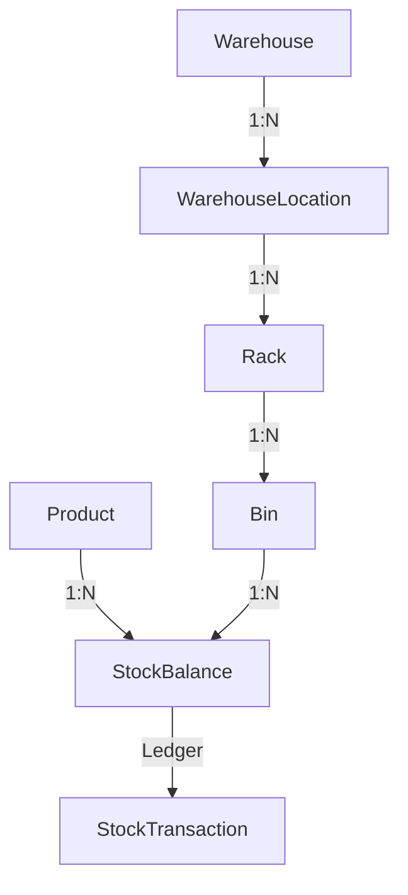

# PHASE 2.4: WAREHOUSE STRUCTURE DESIGN

## 1. Objective
Design the top-level physical storage container—`Warehouse`—for RMRIT based on authoritative requirements, establishing its identity, code/name rules, lifecycle, relationship to `WarehouseLocation`, dynamic inventory aggregation, and workflow impact. This phase is strictly design-only.

## 2. Source Documents Reviewed
- `.agent/CURRENT_REQUIREMENTS_BASELINE.md`
- `.agent/REQUIREMENT_CHANGE_RECONCILIATION.md`
- `.agent/PHASE_1_REQUIREMENT_DECISION_LOG.md`
- `.agent/PHASE_1_REPORT.md`
- `.agent/PHASE_2.1_INVENTORY_DOMAIN_STORAGE_DESIGN.md`
- `.agent/PHASE_2.1_REPORT.md`
- `.agent/PHASE_2.2_PRODUCT_MASTER_DESIGN.md`
- `.agent/PHASE_2.2_REPORT.md`
- `.agent/PHASE_2.3_CATEGORY_FAMILY_DESIGN.md`
- `.agent/PHASE_2.3_REPORT.md`
- Existing Phase 10 entities (`InventoryItem`, `StockBalance`, `StockTransaction`).

## 3. Authority Hierarchy & Storage Model
The physical storage hierarchy is strictly defined as:



**Key Architectural Rules:**
- `Warehouse` is the top-level storage entity representing a physical building or major logical storage area.
- `WarehouseLocation` belongs to exactly one `Warehouse`.
- `StockBalance` is tracked exclusively at `Product + Bin`.
- `Warehouse` does **NOT** maintain duplicate cached stock balances; total stock per Warehouse is derived dynamically from underlying Bins.

## 4. Warehouse Business Definition
- **Purpose**: High-level physical/logical storage location (e.g., *Main Raw Material Yard*, *Finished Goods Warehouse*, *Offsite Storage*).
- **Scope**: Physical storage boundary, location management root, and inventory reporting scope.
- **Workflow Isolation**: `Warehouse` is a storage master entity. It is **NOT** a workflow approval gate, production entity, or order entity.

## 5. Warehouse Identity
- **Internal Identifier**: UUID (Primary Key, immutable, assigned by system).
- **User-Facing Identifiers**:
  - `code`: Short business code (e.g., `WH-01`, `RM-YARD`).
  - `name`: Descriptive name (e.g., *Main Steel & Sheet Storage Yard*).

## 6. Warehouse Code Rules (`DEC-WH-001`, `DEC-WH-002`)
- **Format**: Alphanumeric string, max 50 characters, trimmed and automatically converted to UPPERCASE upon ingestion.
- **Required**: `code NOT NULL`.
- **Uniqueness**: Globally unique across RMRIT (`UNIQUE(LOWER(TRIM(code)))`). `"WH01"`, `"wh01"`, and `" WH01 "` are treated as identical and rejected as duplicates.
- **Mutability**: Editable via API if authorized, but foreign keys down the storage tree use internal UUID (`warehouseId`), insulating historical ledgers from code renames.

## 7. Warehouse Name Rules (`DEC-WH-003`)
- **Format**: String, max 100 characters, trimmed.
- **Required**: `name NOT NULL`.
- **Uniqueness**: Globally unique across RMRIT (`UNIQUE(LOWER(TRIM(name)))`) to prevent user ambiguity.

## 8. Warehouse Data Model
The conceptual `Warehouse` entity comprises:
- `id`: UUID (Primary Key).
- `code`: String (Required, max 50, unique, uppercase, trimmed).
- `name`: String (Required, max 100, unique, trimmed).
- `isActive`: Boolean (Required, default `true`).
- `createdAt`: Timestamp.
- `updatedAt`: Timestamp.

*Future / Not Currently Required Fields: Address, Manager Name, Phone, Email, Capacity, Cost Center, Operating Hours, GPS Coordinates, Temperature. These must NOT be added to the core entity.*

## 9. Warehouse Lifecycle Design (`DEC-WH-004`)
- **Active State (`isActive = true`)**:
  - Operational for all storage management.
  - New `WarehouseLocation` records can be created under it.
  - Targetable for **Stock IN**, **Stores Issue**, and **Material Return**.
- **Inactive State (`isActive = false`)**:
  - **Prohibits**: Creation of NEW `WarehouseLocation` entries.
  - **Prohibits**: NEW **Stock IN** operations targeting any bin in this warehouse.
  - **Preserves**: Existing stock balances remain readable and queryable.
  - **Preserves**: All historical transaction logs remain fully intact.

## 10. Warehouse Deletion & Restriction Rules (`DEC-WH-005`)
- **Hard Deletion**: Allowed **ONLY** if zero child `WarehouseLocation` records exist and zero historical `StockTransaction` or `StockBalance` records reference bins within this warehouse.
- **Restricted Deletion**: If any locations, bins, balances, or transactions exist, hard deletion is strictly **RESTRICTED** (`onDelete: RESTRICT`).
- **Soft Deactivation**: Warehouses with dependencies must be deactivated (`isActive = false`) instead of deleted.

## 11. Warehouse → Location Relationship (`DEC-WH-007`)
- **Cardinality**: `Warehouse` (1) ──> (N) `WarehouseLocation`.
- **Mandatory Parent**: `WarehouseLocation.warehouseId` is `NOT NULL`.
- **Location Code Uniqueness Scope**: Location code/identifier is unique **within its parent Warehouse** (`UNIQUE(warehouseId, LOWER(TRIM(code)))`). For example, Location `LOC-A` can exist independently inside `WH-01` and `WH-02`.

## 12. Warehouse & Inventory Relationship
- **Product Independence**: Product Master records do NOT contain warehouse fields. Product identity is global.
- **Stock Location**: Represented exclusively through `StockBalance` referencing a specific `Bin`, which cascades up to `Rack` ──> `WarehouseLocation` ──> `Warehouse`.
- **Derivation Example**:
  ```text
  Product: "Steel Sheet 10mm" (ID: P-100)
  ├── WH-01 (Main Yard)
  │   ├── Loc-A -> Rack-01 -> Bin-B1: Qty = 50
  │   └── Loc-A -> Rack-02 -> Bin-B4: Qty = 25
  │   Total WH-01 Stock = 75
  └── WH-02 (Secondary Storage)
      └── Loc-C -> Rack-01 -> Bin-B2: Qty = 100
      Total WH-02 Stock = 100

  Global Product Total Stock = 175
  ```

## 13. Multi-Warehouse Product Support
- Supported natively. A single `Product` can be stored across multiple Bins across multiple Warehouses simultaneously.
- Global stock queries aggregate all valid `StockBalance` entries across all warehouses.
- Warehouse-filtered stock queries sum balances matching a specific `warehouseId`.

## 14. Warehouse Stock Aggregation
Dynamic SQL aggregation pattern (no cached summary columns on `Warehouse`):
```sql
SELECT w.id AS warehouse_id, w.code AS warehouse_code, p.id AS product_id, p.name AS product_name, SUM(sb.current_quantity) AS total_quantity
FROM stock_balances sb
JOIN bins b ON sb.bin_id = b.id
JOIN racks r ON b.rack_id = r.id
JOIN warehouse_locations wl ON r.location_id = wl.id
JOIN warehouses w ON wl.warehouse_id = w.id
JOIN products p ON sb.product_id = p.id
WHERE w.id = :warehouseId AND p.id = :productId
GROUP BY w.id, w.code, p.id, p.name;
```

## 15. Warehouse Filtering & Search
Stock views and dropdowns support cascading filters:
`Warehouse` ──> `Location` ──> `Rack` ──> `Bin` combined with `Category` ──> `Family` ──> `Product`.

## 16. Movement & Workflow Impact
- **Stock IN**: Stores selects Warehouse ──> Location ──> Rack ──> Bin to receive stock.
- **Stores Issue**: Stores selects source Bin under a Warehouse, decrementing `StockBalance`.
- **Material Return**: Stores selects destination Bin under a Warehouse upon return verification. Destination bin selection rule is marked as open decision (`DEC-005`).
- **Warehouse-to-Warehouse Transfer (`DEC-WH-008`)**: Marked as **REQUIRES BUSINESS DECISION**. If approved, logged in `StockTransaction` using `sourceBinId` (under WH-A) and `destinationBinId` (under WH-B).

## 17. Additional Material Request Impact
Production requests for additional material trigger Stores Issue from a designated Bin under an active Warehouse, following standard Stores Issue logic.

## 18. RBAC Design
- **View Authority**: `DESIGNER`, `STORES`, `PRODUCTION`, `SENIOR_MANAGER`, `GENERAL_MANAGER`, `ADMIN`.
- **Create / Edit / Deactivate Authority**: `ADMIN` (Default). `STORES` creation authority is flagged under `DEC-WH-006` (**REQUIRES BUSINESS DECISION**).

## 19. Auditability & Historical Traceability
- Master data modifications track `createdAt` and `updatedAt`.
- Stock transactions reference immutable Bin IDs. Warehouse renames or code updates do NOT alter transaction history or stock balance quantities.

## 20. Migration & Existing Repository Impact
- Existing Phase 10 implementation tracks stock at `InventoryItem` without location.
- Phase 7 will add `Warehouse`, `WarehouseLocation`, `Rack`, and `Bin` tables.
- Legacy stock will map to a default "Main Warehouse" / "Default Bin" during Phase 11/12 migration.

## 21. Validation Matrix
| Entity | Field | Rule | Required | Unique Scope | Delete Rule |
| :--- | :--- | :--- | :--- | :--- | :--- |
| `Warehouse` | `code` | Alphanumeric, max 50, uppercase | Yes | Global (Case-insensitive) | Only if no Locations/Stock |
| `Warehouse` | `name` | Trimmed, max 100 chars | Yes | Global (Case-insensitive) | Only if no Locations/Stock |
| `Warehouse` | `isActive` | Boolean | Yes | N/A | N/A |

## 22. Relationship Matrix
| Parent | Child | Cardinality | FK Location | Delete Rule | Deactivate Impact |
| :--- | :--- | :--- | :--- | :--- | :--- |
| `Warehouse` | `WarehouseLocation` | 1:N | `WarehouseLocation.warehouseId` | `RESTRICT` | Blocks new Locations & Stock IN |
| `WarehouseLocation` | `Rack` | 1:N | `Rack.locationId` | `RESTRICT` | Blocks new Racks |
| `Product` + `Bin` | `StockBalance` | 1:N | `StockBalance.binId` | `RESTRICT` | Blocks Stock In/Out |

## 23. Business Rule Matrix
- **BR-WH-001**: Warehouse must have a valid non-empty code and name.
- **BR-WH-002**: Warehouse code must be globally unique and stored in uppercase.
- **BR-WH-003**: Warehouse name must be globally unique (case-insensitive).
- **BR-WH-004**: A Warehouse may contain multiple Warehouse Locations.
- **BR-WH-005**: A Location belongs to exactly one Warehouse.
- **BR-WH-006**: Product identity is independent of Warehouse.
- **BR-WH-007**: Stock is not stored directly on Warehouse; totals are aggregated dynamically from Bins.
- **BR-WH-008**: Single Product may exist across multiple Bins in multiple Warehouses simultaneously.
- **BR-WH-009**: Inactive Warehouse blocks new Location creation and new Stock IN.
- **BR-WH-010**: Deletion of Warehouse with existing child locations or stock transactions is strictly prohibited (`RESTRICT`).

## 24. Edge-Case Matrix
| Edge Case | Status | Design Behavior |
| :--- | :--- | :--- |
| Warehouse with 0 Locations | SUPPORTED | Allowed. Can be deleted or edited. |
| Warehouse with Locations | RESTRICTED | Hard delete blocked. Soft deactivation allowed. |
| Warehouse with active Stock | RESTRICTED | Hard delete blocked. Inactivation blocks new Stock IN. |
| Duplicate Warehouse Code ("WH01", "wh01") | RESTRICTED | Rejected at API and DB level. |
| Rename Warehouse Code/Name | SUPPORTED | Allowed; underlying UUID FKs insulate historical ledgers. |
| Product in 3 Warehouses simultaneously | SUPPORTED | Supported; Product total = global sum of all bin balances. |
| Deactivate Warehouse containing stock | SUPPORTED | Stock IN blocked; existing balances readable and queryable. |

## 25. Performance & Indexing Design
Conceptual indexes for Phase 7 database implementation:
- `Warehouse`: Unique Index on `LOWER(TRIM(code))`.
- `Warehouse`: Unique Index on `LOWER(TRIM(name))`.
- `WarehouseLocation`: Composite Unique Index on `(warehouse_id, LOWER(TRIM(code)))`.
- `WarehouseLocation`: Index on `warehouse_id`.

## 26. Decision Register
| Decision ID | Decision Subject | Recommended Architecture | Status | Impacted Phase |
| :--- | :--- | :--- | :--- | :--- |
| **DEC-WH-001** | Warehouse Code Format | Uppercase string, max 50 chars, trimmed | RESOLVED | Phase 7 / 11 |
| **DEC-WH-002** | Warehouse Code Uniqueness | Globally unique (case-insensitive) | RESOLVED | Phase 7 / 11 |
| **DEC-WH-003** | Warehouse Name Uniqueness | Globally unique (case-insensitive) | RESOLVED | Phase 7 / 11 |
| **DEC-WH-004** | Warehouse Deactivation Rules | Blocks new Locations and Stock IN; preserves history | RESOLVED | Phase 11 / 12 |
| **DEC-WH-005** | Warehouse Deletion Policy | Hard delete RESTRICTED; soft deactivation preferred | RESOLVED | Phase 7 / 11 |
| **DEC-WH-006** | Warehouse Creation Authority | Roles allowed to create/edit Warehouses | REQUIRES BUSINESS DECISION | Phase 11 |
| **DEC-WH-007** | Location Uniqueness Scope | Unique within parent Warehouse `(warehouseId, code)` | RESOLVED | Phase 7 / 11 |
| **DEC-WH-008** | Inter-Warehouse Transfer | Ability to transfer stock between warehouses | REQUIRES BUSINESS DECISION | Phase 12 |

## 27. Open Business Decisions
- **DEC-WH-006**: Which roles (`ADMIN` vs `STORES`) can create and edit Warehouses?
- **DEC-WH-008**: Is direct Warehouse-to-Warehouse stock transfer a required business feature for Phase 12?
- **DEC-005**: What is the default destination bin policy for Production Material Returns?

## 28. Phase 2.5 Dependencies (Location, Rack & Bin Design)
Phase 2.5 will design `WarehouseLocation`, `Rack`, and `Bin` entities, building directly on:
- Mandatory `warehouseId` on `WarehouseLocation`.
- Location code uniqueness scoped within `warehouseId`.
- Active/Inactive cascading behavior from Warehouse down to Bin.

## 29. Phase 7 Impact (Database Design)
- Design TypeORM entity: `Warehouse`.
- Define unique constraints on `code` and `name`.
- Prepare foreign key relationship `WarehouseLocation.warehouseId` ──> `Warehouse.id` (`onDelete: 'RESTRICT'`).

## 30. Phase 11 Impact (Master Data Implementation)
- Implement Warehouse CRUD endpoints (`/api/warehouses`), DTO validations, and uppercase code transformers.
- Build Warehouse management frontend UI with list, search, create, edit, and activation toggles.

## 31. Phase 12 Impact (Core Business Workflows)
- Integrate Warehouse ──> Location ──> Rack ──> Bin selection into Stores Stock IN and Stores Issue screens.
- Implement dynamic Warehouse stock aggregation queries for inventory reporting.
