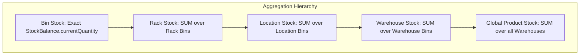

# PHASE 2.6: INVENTORY BALANCE DOMAIN DESIGN

## 1. Objective
Establish the authoritative, frozen Inventory Balance Domain design for the RMRIT manufacturing system. This document defines what "current stock" means, how stock is tracked, increased, decreased, moved, returned, aggregated, reconciled, and audited across physical storage hierarchies.

This is a **DESIGN-ONLY** specification. No source code, database tables, migrations, or APIs are modified in this phase. The design defined herein will be consumed directly by **Phase 7 (Database Design)**, **Phase 11 (Master Data Implementation)**, and **Phase 12 (Core Business Logic)**.

---

## 2. Source Documents & Authority Hierarchy
In accordance with system governance, requirements and design decisions adhere strictly to the following authority order:

1. **Current User Requirements / Requirement Baseline** (`.agent/CURRENT_REQUIREMENTS_BASELINE.md`)
2. **Phase 1 Requirement Reconciliation** (`.agent/REQUIREMENT_CHANGE_RECONCILIATION.md`, `.agent/PHASE_1_REQUIREMENT_DECISION_LOG.md`, `.agent/PHASE_1_REPORT.md`)
3. **Phase 2 Finalized Architectural Decisions**
4. **Phase 2.1 Inventory Domain & Storage Architecture** (`.agent/PHASE_2.1_INVENTORY_DOMAIN_STORAGE_DESIGN.md`)
5. **Phase 2.2 Product Master Design** (`.agent/PHASE_2.2_PRODUCT_MASTER_DESIGN.md`)
6. **Phase 2.3 Category & Family Master Design** (`.agent/PHASE_2.3_CATEGORY_FAMILY_DESIGN.md`)
7. **Phase 2.4 Warehouse Structure Design** (`.agent/PHASE_2.4_WAREHOUSE_DESIGN.md`)
8. **Phase 2.5 Location / Rack / Bin Design** (`.agent/PHASE_2.5_LOCATION_RACK_BIN_DESIGN.md`)
9. **Actual Current Repository Implementation** (`backend/src/inventory`, `backend/src/database`)
10. **Older Design Documents & Historical Documentation**
11. **Fusion Operations Conceptual References** (strictly non-authoritative reference only)

---

## 3. Repository Findings & Inspection
Inspection of the actual repository (`backend/src/inventory`, `backend/src/database/migrations`, `frontend/src/pages/InventoryPage.tsx`) reveals:

1. **Current Entities**:
   - `InventoryItem` (`backend/src/inventory/entities/inventory-item.entity.ts`): Holds material attributes (`material`, `materialType`, `grade`, `size`, `unit`, `minimumStockLevel`, `isActive`).
   - `StockBalance` (`backend/src/inventory/entities/stock-balance.entity.ts`): Holds `inventoryItemId` (unique 1:1), `currentQuantity` (`numeric(12,3)`), `openingBalance` (`numeric(12,3)`), `lastTransactionId`, `createdAt`, `updatedAt`. Enforces DB check `"current_quantity" >= 0`.
   - `StockTransaction` (`backend/src/inventory/entities/stock-transaction.entity.ts`): Holds `inventoryItemId`, `transactionType` (`STOCK_IN`, `STOCK_OUT`, `ADJUSTMENT`), `adjustmentDirection` (`INCREASE`, `DECREASE`), `quantity` (`numeric(12,3)`, check `> 0`), `referenceType`, `referenceId`, `remarks`, `createdById`, `createdAt`.
2. **Current Service & Concurrency**:
   - `InventoryService` implements atomic balance updates using raw SQL parameterized transactions (`UPDATE stock_balances SET current_quantity = current_quantity - $1 WHERE inventory_item_id = $2 AND current_quantity >= $1`) to prevent race conditions and negative balances.
   - `StockIn`, `StockOut`, `StockAdjustment`, and `Reconciliation` are functional at the `InventoryItem` level.
3. **Current Limitations / Historical Elements**:
   - The current code tracks stock globally per `InventoryItem` without any physical storage awareness (no `warehouseId`, `locationId`, `rackId`, or `binId`).
   - The current UI (`InventoryPage.tsx`) renders single-table inventory items without cascading storage dropdowns.
   - There is no support for multi-warehouse, multi-location, or multi-bin inventory distribution.

---

## 4. Current Implementation Assessment
| Architectural Area | Current Repository Implementation | Final Phase 2.6 Target Design | Status |
| :--- | :--- | :--- | :--- |
| **Balance Granularity** | 1:1 (`InventoryItem` ──> `StockBalance`) | 1:N (`Product` + `Bin` ──> `StockBalance`) | SUPERSEDED |
| **Storage Hierarchy** | None (Global item balance only) | `Warehouse ──> Location ──> Rack ──> Bin` | EXTENDED |
| **Transaction Ledger** | `StockTransaction` (item only) | `StockTransaction` (`sourceBinId` & `destBinId`) | EXTENDED |
| **Stock Atomicity** | Atomic conditional SQL update | Atomic conditional SQL update per Bin balance | PRESERVED & REUSED |
| **Non-Negative Guard** | DB Check constraint `current_quantity >= 0` | DB Check constraint `current_quantity >= 0` | PRESERVED & REUSED |
| **Numeric Precision** | `NUMERIC(12,3)` | `NUMERIC(12,3)` | PRESERVED & REUSED |
| **Reconciliation** | Item-level formula comparison | Bin-level authoritative reconciliation + rollups | EXTENDED |
| **Opening Balance** | Baseline column on `StockBalance` | Baseline column on `StockBalance(Product, Bin)` | EXTENDED |

---

## 5. Final Inventory Balance Definition: What is "Current Stock"?

In the RMRIT application, **"Current Stock" is defined strictly as the physical quantity of an identified Product located in a specific physical Bin at a given point in time.**

Key Architectural Axioms:
1. **Physical Grounding**: Stock does not exist in the abstract; it exists in a specific physical compartment (`Bin`).
2. **Backend Authoritative**: Current stock is exclusively stored and maintained in the backend database. Client applications cannot declare, overwrite, or mutate stock balances directly.
3. **Immutable History**: Every change to current stock MUST produce an immutable ledger record (`StockTransaction`).
4. **Non-Negative Constraint**: Physical stock cannot be negative. An operation that would result in `currentQuantity < 0.000` is rejected immediately at both the transaction and database constraint levels.
5. **Separation of Concerns**:
   - Master Data (`Product`, `Category`, `Family`, `Warehouse`, `Location`, `Rack`, `Bin`) defines *what* exists and *where* storage is structured.
   - Inventory Balance (`StockBalance`) defines *how much* exists at each storage point.
   - Inventory Movement (`StockTransaction`) defines *why, when, and by whom* stock changed.

---

## 6. Non-Negotiable Balance Granularity: Product + Bin

As established in Phase 2.1 (`DEC-001`) and Phase 2.5 (`BR-STORAGE-004`), the authoritative stock balance granularity is:

$$\text{Product} + \text{Bin} = \text{One StockBalance}$$

```
   ┌─────────────────────────────────────────────────────────┐
   │                    PRODUCT MASTER                       │
   │  id, name, familyId, minimumInventory, maximumInventory │
   └────────────────────────────┬────────────────────────────┘
                                │ 1:N
                                ▼
   ┌─────────────────────────────────────────────────────────┐
   │                    STOCK BALANCE                        │
   │   productId (FK) + binId (FK) [COMPOSITE UNIQUE]        │
   │   currentQuantity: NUMERIC(12,3) CHECK >= 0             │
   │   openingBalance:  NUMERIC(12,3)                        │
   │   lastTransactionId: UUID (FK)                          │
   └────────────────────────────▲────────────────────────────┘
                                │ N:1
   ┌────────────────────────────┴────────────────────────────┐
   │                      BIN MASTER                         │
   │  id, rackId (FK), code, name, isActive                  │
   └─────────────────────────────────────────────────────────┘
```

### Prohibited Balance Structures
To prevent data anomalies, split-brain stock totals, and sync race conditions, the following structures are **STRICTLY PROHIBITED**:
- ❌ No `ProductWarehouseBalance` table.
- ❌ No `ProductLocationBalance` table.
- ❌ No `ProductRackBalance` table.
- ❌ No `currentQuantity` column on `Product`.
- ❌ No `currentQuantity` column on `Warehouse`, `WarehouseLocation`, `Rack`, or `Bin`.

All higher-level stock totals (Rack Total, Location Total, Warehouse Total, Global Product Total) **MUST be calculated dynamically via SQL aggregation over underlying Bin `StockBalance` rows.**

---

## 7. Product Master Relationship
1. **Master Data Independence**: The `Product` entity (Phase 2.2) contains NO location references (`warehouseId`, `locationId`, `rackId`, `binId`) and NO stock quantity columns.
2. **Lifecycle Independence**:
   - Creating a `Product` master record does not create physical stock.
   - A `Product` becomes trackable in a Bin when a `StockBalance` row is initialized (via initial migration or first Stock IN).
   - Deactivating a `Product` (`isActive = false`) blocks new Stock IN and Stores Issues, but preserves existing `StockBalance` rows and `StockTransaction` logs for historical reporting.
3. **Multi-Bin Distribution**: A single `Product` can have multiple `StockBalance` records across multiple Bins in multiple Warehouses.

---

## 8. Bin Storage Relationship
1. **Physical Storage Anchor**: `Bin` (Phase 2.5) is the atomic storage container. Every `StockBalance` MUST reference a valid `binId`.
2. **Ownership & Derivation**:
   - A `Bin` belongs to a `Rack`.
   - A `Rack` belongs to a `WarehouseLocation`.
   - A `WarehouseLocation` belongs to a `Warehouse`.
   - Joining `StockBalance.binId` through this hierarchy yields the exact Rack, Location, and Warehouse without data duplication.
3. **Multi-Product Bin Policy (`DEC-PROD-012`)**:
   - *Technical Schema*: Composite key `(productId, binId)` natively allows multiple distinct products to occupy the same physical bin if business permits.
   - *Governance*: `DEC-PROD-012` remains preserved as an **OPEN BUSINESS DECISION**. If business rules require single-product bins, application validation enforces `COUNT(StockBalance WHERE binId = :binId AND currentQuantity > 0) <= 1`.

---

## 9. Stock Quantity Model

The system recognizes exactly eight standard quantity concepts across the inventory domain:

| Quantity Concept | Definition | Mathematical Impact on Balance | Source / Trigger |
| :--- | :--- | :--- | :--- |
| **Current Quantity** | Operational stock physically on hand in a specific Bin. | Target balance state ($Q_{\text{current}}$) | Real-time database balance. |
| **Opening Balance** | Baseline stock at system inception / migration point. | Initial reference point ($Q_{\text{open}}$) | Go-live migration / Bin setup. |
| **Stock IN** | Quantity received into a specific Bin from external receipt. | $+ \Delta Q$ (Increment destination bin) | Stores Stock IN workflow. |
| **Stock OUT** | Quantity permanently removed / disposed from a Bin. | $- \Delta Q$ (Decrement source bin) | Stores Stock OUT workflow. |
| **Stores Issue** | Quantity issued from a specific Bin to Production for an SC. | $- \Delta Q$ (Decrement source bin) | SC Material Issue workflow. |
| **Material Return** | Unused material returned from Production to a verified Bin. | $+ \Delta Q$ (Increment destination bin) | Production Return workflow. |
| **Adjustment** | Discrepancy correction following physical stock count. | $\pm \Delta Q$ (Direct increase / decrease) | Stores Reconciliation workflow. |
| **Transfer** | Physical relocation from Source Bin to Destination Bin. | $- \Delta Q_{\text{src}}$ AND $+ \Delta Q_{\text{dest}}$ (Atomic) | Bin Transfer (`DEC-WH-008`). |

---

## 10. Opening Balance Model
1. **Definition**: The baseline quantity assigned to a `(Product, Bin)` combination at the moment tracking begins in RMRIT.
2. **Storage**: Persisted as `opening_balance` (`NUMERIC(12,3)`) on `StockBalance`.
3. **Immutability**: Once operational transactions (`StockTransaction`) commence on that `StockBalance`, `opening_balance` is **IMMUTABLE**. It cannot be edited to mask discrepancies. Discrepancies must be corrected via `ADJUSTMENT` transactions.
4. **Nullable vs Default**:
   - Items created post-go-live receive `opening_balance = 0.000`.
   - Legacy migrated items receive `opening_balance = legacy_migrated_quantity`.
   - If `opening_balance IS NULL`, reconciliation flags `OPENING_BASELINE_MISSING`.
5. **Reconciliation Role**: `opening_balance` acts as the anchoring constant $Q_0$ in ledger validation:
   $$\text{Expected Current Balance} = Q_0 + \sum \text{Stock In} - \sum \text{Stock Out} \pm \sum \text{Adjustments}$$

---

## 11. Stock Balance Identity & Lifecycle
1. **Identity & Constraints**:
   - Primary Key: `id` (UUID).
   - Foreign Keys: `productId` (UUID, mandatory, `onDelete: RESTRICT`), `binId` (UUID, mandatory, `onDelete: RESTRICT`).
   - Unique Composite Constraint: `UNIQUE(product_id, bin_id)`.
2. **Zero Balance Lifecycle**:
   - When `currentQuantity` reaches `0.000`, the `StockBalance` row **REMAINS PERSISTED IN THE DATABASE**.
   - It is **NEVER deleted**.
   - *Rationale*: Preserving zero-balance rows maintains DB row-level lock anchors for concurrent updates, preserves foreign-key links to `lastTransactionId`, eliminates table churn, and provides full audit history.
3. **Re-Stocking**: When stock is subsequently added to a zero-balance bin, the existing row's `currentQuantity` is incremented from `0.000`.

---

## 12. Stock Transaction Relationship: Balance vs Ledger
The system maintains a strict separation between state and event:

$$\begin{aligned}
\textbf{StockBalance} &= \text{Mutable operational state (Current Balance snapshot)} \\
\textbf{StockTransaction} &= \text{Immutable append-only ledger (Historical movement record)}
\end{aligned}$$

```
StockTransaction (Ledger Event)
   ├── id: UUID (PK)
   ├── productId: UUID (FK -> Product)
   ├── sourceBinId: UUID (FK -> Bin, Nullable)
   ├── destinationBinId: UUID (FK -> Bin, Nullable)
   ├── transactionType: Enum (STOCK_IN, STOCK_OUT, STORES_ISSUE, RETURN, ADJUSTMENT, TRANSFER)
   ├── adjustmentDirection: Enum (INCREASE, DECREASE, Nullable)
   ├── quantity: NUMERIC(12,3) CHECK > 0
   ├── referenceType: String (e.g., 'PO_RECEIPT', 'SC_ISSUE', 'PROD_RETURN', 'AUDIT_ADJUST')
   ├── referenceId: String / UUID
   ├── remarks: Text
   ├── createdById: UUID (FK -> User)
   └── createdAt: Timestamp
```

Every balance mutation MUST execute within the same database transaction that appends the `StockTransaction` record.

---

## 13. Source and Destination Storage Semantics
To support physical traceability, every movement defines source and destination bins explicitly:

| Transaction Type | `sourceBinId` | `destinationBinId` | Balance Impact |
| :--- | :--- | :--- | :--- |
| **STOCK_IN** | `NULL` (External Vendor / Receiving) | Mandatory (`Target Bin`) | Increment `StockBalance(Product, destBin)` |
| **STOCK_OUT** | Mandatory (`Source Bin`) | `NULL` (External Disposal / Scrap) | Decrement `StockBalance(Product, srcBin)` |
| **STORES_ISSUE** | Mandatory (`Source Bin`) | `NULL` (Issued to Production SC) | Decrement `StockBalance(Product, srcBin)` |
| **RETURN** | `NULL` (Returned from Production SC) | Mandatory (`Destination Bin`) | Increment `StockBalance(Product, destBin)` |
| **ADJUSTMENT (INCREASE)** | `NULL` (Found physical surplus) | Mandatory (`Target Bin`) | Increment `StockBalance(Product, destBin)` |
| **ADJUSTMENT (DECREASE)** | Mandatory (`Target Bin`) | `NULL` (Physical shrinkage) | Decrement `StockBalance(Product, srcBin)` |
| **TRANSFER** | Mandatory (`Source Bin`) | Mandatory (`Destination Bin`) | Decrement `srcBin` AND Increment `destBin` |

*Atomic Transfer Invariant*: For any bin-to-bin transfer, the decrement of source balance and increment of destination balance occur within a single ACID transaction. Duplicate stock cannot exist during transit.

---

## 14. Stock IN Design
1. **Target Specification**: Stores user selects `Warehouse ──> Location ──> Rack ──> Bin`.
2. **Pre-Conditions & Validation**:
   - `Product.isActive == true`.
   - `Warehouse.isActive == true`, `Location.isActive == true`, `Rack.isActive == true`, `Bin.isActive == true`.
   - Movement `quantity > 0.000`.
   - If single-product bin rule (`DEC-PROD-012`) is active, verify bin contains no other product.
3. **Execution Steps**:
   - Begin DB Transaction.
   - Upsert `StockBalance` row for `(productId, binId)` with `current_quantity = current_quantity + quantity`.
   - Insert `StockTransaction` with `destinationBinId = binId`, `transactionType = 'STOCK_IN'`, `createdById = user.id`.
   - Update `StockBalance.lastTransactionId = transaction.id`.
   - Commit DB Transaction.
4. **Master Data Guard**: Stock IN never creates, updates, or alters Product Master attributes.

---

## 15. Stock OUT & Stores Issue Design
1. **Source Specification**: Stores user selects specific source `Bin` housing the product.
2. **Pre-Conditions & Validation**:
   - `Product.isActive == true` (unless draining inactive stock under `DEC-BIN-003`).
   - Storage ancestors are operational.
   - Movement `quantity > 0.000`.
   - `StockBalance(productId, binId).currentQuantity >= quantity`.
3. **Atomic Execution**:
   - Execute atomic conditional update:
     ```sql
     UPDATE stock_balances
     SET current_quantity = current_quantity - :qty,
         updated_at = NOW()
     WHERE product_id = :productId 
       AND bin_id = :sourceBinId 
       AND current_quantity >= :qty;
     ```
   - If affected rows $== 0$, rollback and throw `400 Bad Request: Insufficient Stock in selected Bin`.
   - Insert `StockTransaction` with `sourceBinId = sourceBinId`, `transactionType = 'STORES_ISSUE' | 'STOCK_OUT'`.
   - Update `StockBalance.lastTransactionId = transaction.id`.
   - Commit DB Transaction.
4. **Negative Stock Prevention**: The database-level check constraint `CHECK (current_quantity >= 0)` guarantees that even under race conditions, stock can never drop below zero.

---

## 16. Material Return Design
1. **Workflow Context**: Production returns unused/surplus raw material to Stores upon SC completion or cutoff.
2. **Stores Verification**: Stores physically inspects and verifies the returned quantity before inventory is restored.
3. **Destination Bin Selection (`DEC-005`)**:
   - *Status*: `DEC-005` remains an **OPEN BUSINESS DECISION**.
   - *Option A (Original Bin)*: System defaults destination to the exact bin from which material was originally issued.
   - *Option B (Quarantine / Staging Bin)*: Material enters an inspection bin before restocking.
   - *Option C (Stores User Selection)*: Stores selects any valid, active Bin under any active Warehouse.
4. **Execution**:
   - Atomically increment `StockBalance(productId, verifiedDestinationBinId)`.
   - Append `StockTransaction` with `destinationBinId = verifiedDestinationBinId`, `transactionType = 'RETURN'`, `referenceType = 'SC_MATERIAL_RETURN'`, `referenceId = scId`.

---

## 17. Minimum & Maximum Inventory Evaluation
1. **Product-Level Values**: `minimumInventory` and `maximumInventory` are configured exclusively on the `Product` master entity. They are NOT duplicated on `StockBalance`.
2. **Global Evaluation Formula**:
   $$\text{Global Stock} = \sum_{\text{all active bins}} \text{StockBalance.currentQuantity}$$
3. **Authoritative Stock Status Definitions**:
   - **OUT OF STOCK**: $\text{Global Stock} == 0.000$
   - **LOW STOCK**: $\text{Global Stock} > 0.000 \text{ AND } \text{Global Stock} < \text{Product.minimumInventory}$
   - **NORMAL**: $\text{Global Stock} \ge \text{Product.minimumInventory} \text{ AND } (\text{Product.maximumInventory IS NULL} \lor \text{Global Stock} \le \text{Product.maximumInventory})$
   - **EXCESS STOCK**: $\text{Product.maximumInventory IS NOT NULL} \text{ AND } \text{Global Stock} > \text{Product.maximumInventory}$
4. **Enforcement Policy (`DEC-PROD-010`)**:
   - Low Stock triggers dashboard alerts and email notifications (`Phase 19`).
   - Maximum Stock enforcement (whether Stock IN is hard-blocked or generates warning notifications) is preserved under `DEC-PROD-010`.

---

## 18. Global & Multi-Level Stock Aggregation

Because `StockBalance(Product, Bin)` is the sole authoritative record, all higher-level views are computed via dynamic SQL aggregations:



### Authoritative Aggregation SQL Patterns
1. **Global Product Total**:
   ```sql
   SELECT product_id, SUM(current_quantity) AS total_quantity
   FROM stock_balances
   WHERE product_id = :productId
   GROUP BY product_id;
   ```
2. **Warehouse Product Total**:
   ```sql
   SELECT wl.warehouse_id, sb.product_id, SUM(sb.current_quantity) AS warehouse_quantity
   FROM stock_balances sb
   JOIN bins b ON sb.bin_id = b.id
   JOIN racks r ON b.rack_id = r.id
   JOIN warehouse_locations wl ON r.location_id = wl.id
   WHERE wl.warehouse_id = :warehouseId AND sb.product_id = :productId
   GROUP BY wl.warehouse_id, sb.product_id;
   ```
3. **Location Product Total**:
   ```sql
   SELECT r.location_id, sb.product_id, SUM(sb.current_quantity) AS location_quantity
   FROM stock_balances sb
   JOIN bins b ON sb.bin_id = b.id
   JOIN racks r ON b.rack_id = r.id
   WHERE r.location_id = :locationId AND sb.product_id = :productId
   GROUP BY r.location_id, sb.product_id;
   ```
4. **Rack Product Total**:
   ```sql
   SELECT b.rack_id, sb.product_id, SUM(sb.current_quantity) AS rack_quantity
   FROM stock_balances sb
   JOIN bins b ON sb.bin_id = b.id
   WHERE b.rack_id = :rackId AND sb.product_id = :productId
   GROUP BY b.rack_id, sb.product_id;
   ```

---

## 19. Search & Filtering Architecture
The inventory domain supports two orthogonal, cascading filter hierarchies:

```
TAXONOMY FILTER:   ProductCategory ──> ProductFamily ──> Product
STORAGE FILTER:    Warehouse ──> WarehouseLocation ──> Rack ──> Bin
```

### Comprehensive Filter Query Pattern
```sql
SELECT 
    p.id AS product_id,
    p.name AS product_name,
    pf.name AS family_name,
    pc.name AS category_name,
    w.name AS warehouse_name,
    wl.name AS location_name,
    r.name AS rack_name,
    b.name AS bin_name,
    sb.current_quantity,
    sb.opening_balance
FROM stock_balances sb
JOIN products p ON sb.product_id = p.id
JOIN product_families pf ON p.family_id = pf.id
JOIN product_categories pc ON pf.category_id = pc.id
JOIN bins b ON sb.bin_id = b.id
JOIN racks r ON b.rack_id = r.id
JOIN warehouse_locations wl ON r.location_id = wl.id
JOIN warehouses w ON wl.warehouse_id = w.id
WHERE (:categoryId IS NULL OR pc.id = :categoryId)
  AND (:familyId IS NULL OR pf.id = :familyId)
  AND (:productId IS NULL OR p.id = :productId)
  AND (:warehouseId IS NULL OR w.id = :warehouseId)
  AND (:locationId IS NULL OR wl.id = :locationId)
  AND (:rackId IS NULL OR r.id = :rackId)
  AND (:binId IS NULL OR b.id = :binId)
  AND (:stockStatus IS NULL OR ...);
```

---

## 20. Reconciliation Design
Reconciliation validates database operational state against immutable transactional ledger history.

### 1. Bin-Level Reconciliation (Authoritative Engine)
For a specific `(productId, binId)`:
1. Fetch `StockBalance`: $Q_{\text{current}}$ and $Q_{\text{open}}$.
2. Aggregate ledger transactions for that exact bin:
   - $\text{Total IN} = \sum \text{quantity}$ where `destinationBinId = binId` and `transactionType IN ('STOCK_IN', 'RETURN', 'TRANSFER', 'ADJUSTMENT' (INCREASE))`
   - $\text{Total OUT} = \sum \text{quantity}$ where `sourceBinId = binId` and `transactionType IN ('STOCK_OUT', 'STORES_ISSUE', 'TRANSFER', 'ADJUSTMENT' (DECREASE))`
   - $\text{Ledger Movement} = \text{Total IN} - \text{Total OUT}$
3. Calculate Expected Quantity:
   $$Q_{\text{expected}} = Q_{\text{open}} + \text{Ledger Movement}$$
4. Evaluate Status:
   - If $Q_{\text{open}} \text{ IS NULL} \implies \textbf{NOT\_RECONCILABLE}$ (`Reason: OPENING_BASELINE_MISSING`)
   - If $|Q_{\text{current}} - Q_{\text{expected}}| < 0.0005 \implies \textbf{MATCH}$
   - If $|Q_{\text{current}} - Q_{\text{expected}}| \ge 0.0005 \implies \textbf{MISMATCH}$ ($\text{Difference} = Q_{\text{current}} - Q_{\text{expected}}$)

### 2. Rollup Reconciliations (Rack, Location, Warehouse, Global)
Higher-level reconciliations are aggregated sums of the underlying bin reconciliation records. If any underlying Bin is `MISMATCH`, the parent Warehouse/Location/Rack reports `MISMATCH`.

---

## 21. Concurrency, Locking & Atomicity Design

Simultaneous stock operations on the same physical bin must never produce race conditions or negative balances.

```
Scenario: Two Stores users issue stock concurrently from Bin B-01 (Current Stock = 10.000 KG)
- User A requests 6.000 KG
- User B requests 7.000 KG
```

### Concurrency Protection Mechanisms
1. **Transaction Isolation**: All balance mutations execute within an ACID database transaction.
2. **Row-Level Locking / Atomic Conditional SQL**:
   ```sql
   UPDATE stock_balances
   SET current_quantity = current_quantity - :qty,
       updated_at = NOW()
   WHERE product_id = :productId 
     AND bin_id = :binId 
     AND current_quantity >= :qty;
   ```
3. **Execution Guarantee**:
   - The first transaction acquires the row lock on `stock_balances`, decrements stock ($10.000 - 6.000 = 4.000$), logs the transaction, and commits.
   - The second transaction acquires the row lock, evaluates `current_quantity >= 7.000` (which is now $4.000 \ge 7.000 \implies \text{FALSE}$), affects $0$ rows, rolls back, and returns `400 Bad Request: Insufficient Stock`.
4. **Database Check Constraint**: `ALTER TABLE stock_balances ADD CONSTRAINT chk_stock_balance_non_negative CHECK (current_quantity >= 0);` as absolute safety barrier.

---

## 22. Decimal Quantity & Precision
1. **Precision Standard**: `NUMERIC(12,3)` (PostgreSQL) / `DECIMAL(12,3)`.
   - Allows up to $999,999,999.999$ units.
   - Accommodates milligram ($0.001\text{ KG}$) and millimeter ($0.001\text{ M}$) manufacturing precision.
2. **Tolerance in Comparisons**: Floating-point comparison tolerance is set to $\epsilon = 0.0005$.
3. **Out-of-Scope Elements**:
   - ❌ No unit conversion (e.g. KG to lbs, mm to inches).
   - ❌ No scrap, yield, wastage, or density formulas.
   - Quantities are stored and transacted in the native unit defined on Product Master.

---

## 23. Zero Balance Behavior
1. **Retention**: `StockBalance` row is retained when `currentQuantity == 0.000`.
2. **Deactivation Distinction**: A zero balance does NOT mean the Bin or Product is inactive.
3. **History Preservation**: `lastTransactionId`, `openingBalance`, and audit timestamps remain fully intact.
4. **Queries**: Zero-balance bins appear in inventory reports with status `OUT OF STOCK`.

---

## 24. Inactive Master Data Rules

| Inactivated Master Node | Impact on StockBalance | Impact on Stock IN | Impact on Stores Issue | Impact on History |
| :--- | :--- | :--- | :--- | :--- |
| **Product** (`isActive = false`) | Balance preserved | BLOCKED | BLOCKED | Preserved |
| **Warehouse** (`isActive = false`) | Balances in WH preserved | BLOCKED | BLOCKED | Preserved |
| **Location** (`isActive = false`) | Balances in Loc preserved | BLOCKED | BLOCKED | Preserved |
| **Rack** (`isActive = false`) | Balances in Rack preserved | BLOCKED | BLOCKED | Preserved |
| **Bin** (`isActive = false`) | Balance in Bin preserved | BLOCKED | BLOCKED (per `DEC-BIN-003`) | Preserved |

*Operational Usability Check*:
$$\text{IsBinUsable} = \text{Product.isActive} \land \text{Bin.isActive} \land \text{Rack.isActive} \land \text{Location.isActive} \land \text{Warehouse.isActive}$$

---

## 25. Storage Reassignment & Renaming Rules
1. **Renaming Storage Master Nodes**:
   - Renaming a Warehouse, Location, Rack, or Bin updates only descriptive text attributes (`code` or `name`).
   - Foreign keys in `StockBalance` and `StockTransaction` reference immutable UUID `id` values.
   - Historical ledgers and balance linkages remain 100% stable.
2. **Reassigning Physical Nodes** (`BR-STORAGE-010`):
   - Moving a Bin to a different Rack or moving a Rack to a different Location **MUST NOT silently alter stock balances**.
   - If a Bin contains non-zero stock (`currentQuantity > 0`), master data hierarchy reassignment is **RESTRICTED** unless executed via an authorized physical stock transfer transaction.

---

## 26. Auditability & Traceability (5W1H)

Every stock mutation in RMRIT is fully traceable via `StockTransaction`:
- **WHO**: `createdById` (UUID of authenticated user from JWT).
- **WHEN**: `createdAt` (UTC timestamp).
- **WHAT**: `productId` (UUID of Product Master).
- **FROM WHERE**: `sourceBinId` (UUID of source Bin, or NULL).
- **TO WHERE**: `destinationBinId` (UUID of destination Bin, or NULL).
- **HOW MUCH**: `quantity` (`NUMERIC(12,3)`).
- **WHY**: `transactionType`, `referenceType`, `referenceId`, `remarks`.
- **BALANCE STATE**: Traceable via `StockBalance.lastTransactionId` pointer and sequential transaction log replay.

No separate external audit system is required; `StockTransaction` functions as the authoritative immutable inventory ledger.

---

## 27. Existing InventoryItem Reconciliation (`DEC-PROD-014`)

### Current State vs Target Model
- **Current Repo**: `InventoryItem` holds `material`, `materialType`, `grade`, `size`, `unit`, `minimumStockLevel`.
- **Target Model**: `Product` holds `name`, `familyId` (linked to `ProductCategory`), `minimumInventory`, `maximumInventory`.

### Analysis & Mapping Strategy
1. `InventoryItem` in Phase 10 acts as a hybrid of a Raw Material Specification and a Master Product.
2. `DEC-PROD-014` is preserved as an **OPEN BUSINESS DECISION** with two design options:
   - **Option A (Product Consolidation)**: `InventoryItem` records are consolidated into `Product` master records with compound descriptive names (e.g. `name = "Steel Plate 10mm Grade 304"`), mapping `minimumStockLevel` to `minimumInventory`.
   - **Option B (Two-Tier Specification)**: `Product` acts as the abstract catalog item, while `InventoryItem` / `RMSpecification` remains a child technical specification entity linked to `Product`.
3. In both options, **`StockBalance` anchors at `(Product/Item + Bin)`**, guaranteeing full forward-compatibility.

---

## 28. Migration Impact & Strategy for Legacy Data
1. **Legacy Stock Profile**: Existing Phase 10 stock records in `stock_balances` reference `inventory_item_id` but have no physical location (`warehouse`, `location`, `rack`, `bin`).
2. **Authoritative Migration Pathway**:
   - Phase 11/12 migration script creates default storage master records:
     $$\text{MAIN WAREHOUSE (WH-01)} \longrightarrow \text{DEFAULT LOCATION (LOC-DEF)} \longrightarrow \text{DEFAULT RACK (RACK-DEF)} \longrightarrow \text{DEFAULT BIN (BIN-DEF)}$$
   - All existing `stock_balances` records are migrated into:
     $$\text{StockBalance}(\text{productId} = \text{item.id}, \text{binId} = \text{DEFAULT\_BIN\_ID}, \text{currentQuantity} = \text{item.currentQuantity}, \text{openingBalance} = \text{item.openingBalance})$$
   - Physical stock auditing in future phases can transfer stock from `BIN-DEF` to actual physical warehouse bins using standard `TRANSFER` transactions.

---

## 29. Conceptual API Design
*Conceptual design only. No endpoint code is implemented in this phase.*

| Endpoint | Method | Role Authorization | Purpose / Description |
| :--- | :---: | :--- | :--- |
| `/api/v1/inventory/summary` | `GET` | All 6 Roles | Paginated product stock totals with Min/Max status and family/category filters. |
| `/api/v1/inventory/balances` | `GET` | All 6 Roles | Detailed bin-level stock balances filtered by Warehouse, Location, Rack, Bin, Product. |
| `/api/v1/inventory/warehouses/:id/stock`| `GET` | All 6 Roles | Warehouse-level aggregated product stock summary. |
| `/api/v1/inventory/bins/:id/stock` | `GET` | All 6 Roles | Detailed stock balance for a specific physical Bin. |
| `/api/v1/inventory/transactions` | `GET` | All 6 Roles | Paginated historical movement ledger with source/dest bin filters. |
| `/api/v1/inventory/stock-in` | `POST` | `STORES`, `ADMIN` | Receive stock into exact target Bin. |
| `/api/v1/inventory/stock-out` | `POST` | `STORES`, `ADMIN` | Remove/scrap stock from exact source Bin. |
| `/api/v1/inventory/issue` | `POST` | `STORES`, `ADMIN` | Issue stock from source Bin to Production SC. |
| `/api/v1/inventory/return` | `POST` | `STORES`, `ADMIN` | Restore verified return material into destination Bin. |
| `/api/v1/inventory/transfer` | `POST` | `STORES`, `ADMIN` | Inter-bin / inter-warehouse transfer (`DEC-WH-008`). |
| `/api/v1/inventory/adjustment` | `POST` | `STORES`, `ADMIN` | Physical count adjustment on specific Bin. |
| `/api/v1/inventory/reconciliation` | `GET` | `STORES`, `ADMIN`, `SENIOR_MANAGER`, `GENERAL_MANAGER` | Bin-level and aggregated reconciliation report. |

---

## 30. Role-Based Access Control (RBAC) Matrix

Based strictly on the 6 authoritative baseline roles:
1. `DESIGNER`
2. `STORES`
3. `PRODUCTION`
4. `SENIOR_MANAGER` (Monitoring / Analytics / Alerts)
5. `GENERAL_MANAGER` (Monitoring / Analytics / Alerts)
6. `ADMIN` (System Configuration & Master Authority)

*Note: `SENIOR_DESIGNER` is permanently superseded and NOT reintroduced.*

| Inventory Operation | DESIGNER | STORES | PRODUCTION | SENIOR_MANAGER | GENERAL_MANAGER | ADMIN |
| :--- | :---: | :---: | :---: | :---: | :---: | :---: |
| **View Current Stock** | Yes | Yes | Yes | Yes | Yes | Yes |
| **View Movement History** | Yes | Yes | Yes | Yes | Yes | Yes |
| **View Reconciliation** | No | Yes | No | Yes | Yes | Yes |
| **Execute Stock IN** | No | Yes | No | No | No | Yes |
| **Execute Stock OUT** | No | Yes | No | No | No | Yes |
| **Execute Stores Issue** | No | Yes | No | No | No | Yes |
| **Verify & Process Return** | No | Yes | No | No | No | Yes |
| **Execute Stock Adjustment**| No | Yes | No | No | No | Yes |
| **Execute Bin Transfer** | No | Yes | No | No | No | Yes |
| **Create/Edit Master Storage**| No | Flagged (`DEC-WH-006`)| No | No | No | Yes |
| **Create/Edit Master Product**| No | Flagged (`DEC-PROD-011`)| No | No | No | Yes |

---

## 31. Comprehensive Business Rule Matrix

| Rule ID | Rule Statement | Condition | Expected Result | Authority Source | Status |
| :--- | :--- | :--- | :--- | :--- | :---: |
| **BR-BAL-001** | Unique Product + Bin Balance | Insert `StockBalance` | Unique `(productId, binId)` enforced by DB index | Phase 2.1 (`DEC-001`) | AUTHORITATIVE |
| **BR-BAL-002** | Non-Negative Stock | Any stock decrement | Stock balance $\ge 0.000$ enforced by DB check | Phase 1 Baseline | AUTHORITATIVE |
| **BR-BAL-003** | Positive Movement Quantity | Stock In/Out/Transfer | Quantity $> 0.000$ enforced by DTO and DB check | Phase 1 Baseline | AUTHORITATIVE |
| **BR-BAL-004** | Exact Target Storage | Stock IN / Adjustment Increase | Must reference valid, active `destinationBinId` | Phase 2.5 (`BR-STORAGE-007`)| AUTHORITATIVE |
| **BR-BAL-005** | Exact Source Storage | Stock OUT / Issue | Must reference valid, active `sourceBinId` | Phase 2.5 (`BR-STORAGE-007`)| AUTHORITATIVE |
| **BR-BAL-006** | Atomic Movement Ledger | Any balance change | `StockTransaction` appended within same DB tx | Phase 10 Architecture | AUTHORITATIVE |
| **BR-BAL-007** | Zero Balance Persistence | Stock balance reaches 0 | Row is retained with `0.000`, never deleted | Phase 2.6 Design | AUTHORITATIVE |
| **BR-BAL-008** | Inactive Master Lock | Node `isActive == false` | Blocks Stock IN and additions to child bins | Phase 2.4/2.5 Design | AUTHORITATIVE |
| **BR-BAL-009** | Minimum Stock Trigger | Global Stock < Product.min | Flags `LOW_STOCK` status and triggers alerts | Phase 2.2 Design | AUTHORITATIVE |
| **BR-BAL-010** | Maximum Stock Trigger | Global Stock > Product.max | Flags `EXCESS_STOCK` status | Phase 2.2 Design | AUTHORITATIVE |
| **BR-BAL-011** | Opening Balance Lock | Post go-live operation | `opening_balance` cannot be directly updated | Phase 2.6 Design | AUTHORITATIVE |
| **BR-BAL-012** | Master Edit Isolation | Renaming Storage/Product | Stock balances and tx history are unaffected | Phase 2.4/2.5 Design | AUTHORITATIVE |
| **BR-BAL-013** | Storage Move Restriction | Bin with stock moved in master | Forbidden without explicit stock transfer tx | Phase 2.5 (`BR-STORAGE-010`)| AUTHORITATIVE |
| **BR-BAL-014** | Atomic Transfer | Moving stock between bins | Source decrement + Dest increment in 1 tx | Phase 2.6 Design | AUTHORITATIVE |
| **BR-BAL-015** | Product Multi-Bin Support | Single Product in N Bins | Supported via N distinct `StockBalance` rows | Phase 2.1 Design | AUTHORITATIVE |
| **BR-BAL-016** | Product Multi-WH Support | Single Product in N WHs | Supported via Bins belonging to distinct WHs | Phase 2.1 Design | AUTHORITATIVE |
| **BR-BAL-017** | Derived Rollup Totals | Query WH/Loc/Rack stock | Dynamic SQL aggregation over child bins | Phase 2.4/2.5 Design | AUTHORITATIVE |
| **BR-BAL-018** | Bin-Level Reconciliation | Audit discrepancy check | $Q_{\text{current}} == Q_{\text{open}} + \text{Tx IN} - \text{Tx OUT}$ | Phase 10 / 2.6 Design | AUTHORITATIVE |

---

## 32. Conceptual Data Model & Schema Specification

```
                          ┌──────────────────────────┐
                          │     ProductCategory      │
                          ├──────────────────────────┤
                          │ PK id: UUID              │
                          │    name: VARCHAR(100)    │
                          │    isActive: BOOLEAN     │
                          └────────────┬─────────────┘
                                       │ 1:N
                                       ▼
                          ┌──────────────────────────┐
                          │      ProductFamily       │
                          ├──────────────────────────┤
                          │ PK id: UUID              │
                          │ FK categoryId: UUID      │
                          │    name: VARCHAR(100)    │
                          │    isActive: BOOLEAN     │
                          └────────────┬─────────────┘
                                       │ 1:N
                                       ▼
┌─────────────────────────┐    ┌──────────────────────────┐    ┌─────────────────────────┐
│        Warehouse        │    │         Product          │    │          User           │
├─────────────────────────┤    ├──────────────────────────┤    ├─────────────────────────┤
│ PK id: UUID             │    │ PK id: UUID              │    │ PK id: UUID             │
│    code: VARCHAR(50)    │    │ FK familyId: UUID        │    │    name: VARCHAR(100)   │
│    name: VARCHAR(100)   │    │    name: VARCHAR(255)    │    │    email: VARCHAR(150)  │
│    isActive: BOOLEAN    │    │    minInventory: NUM(12,3│    │    role: VARCHAR(50)    │
└───────────┬─────────────┘    │    maxInventory: NUM(12,3│    └────────────┬────────────┘
            │ 1:N              │    isActive: BOOLEAN     │                 │
            ▼                  └────────────┬─────────────┘                 │
┌─────────────────────────┐                 │ 1:N                           │
│    WarehouseLocation    │                 │                               │
├─────────────────────────┤                 │                               │
│ PK id: UUID             │                 │                               │
│ FK warehouseId: UUID    │                 │                               │
│    code: VARCHAR(50)    │                 │                               │
│    name: VARCHAR(100)   │                 │                               │
│    isActive: BOOLEAN    │                 │                               │
└───────────┬─────────────┘                 │                               │
            │ 1:N                           │                               │
            ▼                               │                               │
┌─────────────────────────┐                 │                               │
│          Rack           │                 │                               │
├─────────────────────────┤                 │                               │
│ PK id: UUID             │                 │                               │
│ FK locationId: UUID     │                 │                               │
│    code: VARCHAR(50)    │                 │                               │
│    name: VARCHAR(100)   │                 │                               │
│    isActive: BOOLEAN    │                 │                               │
└───────────┬─────────────┘                 │                               │
            │ 1:N                           │                               │
            ▼                               │                               │
┌─────────────────────────┐                 │                               │
│           Bin           │                 │                               │
├─────────────────────────┤                 │                               │
│ PK id: UUID             │                 │                               │
│ FK rackId: UUID         │                 │                               │
│    code: VARCHAR(50)    │                 │                               │
│    name: VARCHAR(100)   │                 │                               │
│    isActive: BOOLEAN    │                 │                               │
└───────────┬─────────────┘                 │                               │
            │ 1:N                           │                               │
            │                               │                               │
            ▼                               ▼                               │
┌─────────────────────────────────────────────────────────┐                 │
│                      StockBalance                       │                 │
├─────────────────────────────────────────────────────────┤                 │
│ PK id: UUID                                             │                 │
│ FK productId: UUID                                      │                 │
│ FK binId: UUID                                          │                 │
│    currentQuantity: NUMERIC(12,3) CHECK (>= 0)          │                 │
│    openingBalance:  NUMERIC(12,3)                       │                 │
│ FK lastTransactionId: UUID (Nullable)                   │                 │
│    createdAt: TIMESTAMP                                 │                 │
│    updatedAt: TIMESTAMP                                 │                 │
│ UNIQUE(productId, binId)                                │                 │
└────────────────────────────┬────────────────────────────┘                 │
                             │ 1:N                                          │
                             ▼                                              │
┌─────────────────────────────────────────────────────────┐                 │
│                    StockTransaction                     │                 │
├─────────────────────────────────────────────────────────┤                 │
│ PK id: UUID                                             │                 │
│ FK productId: UUID                                      │                 │
│ FK sourceBinId: UUID (Nullable)                         │                 │
│ FK destinationBinId: UUID (Nullable)                    │                 │
│    transactionType: ENUM                                │                 │
│    adjustmentDirection: ENUM (Nullable)                 │                 │
│    quantity: NUMERIC(12,3) CHECK (> 0)                  │                 │
│    referenceType: VARCHAR(50)                           │                 │
│    referenceId: VARCHAR(100) (Nullable)                 │                 │
│    remarks: TEXT (Nullable)                             │                 │
│ FK createdById: UUID ───────────────────────────────────┼─────────────────┘
│    createdAt: TIMESTAMP                                 │
└─────────────────────────────────────────────────────────┘
```

---

## 33. Edge-Case Analysis Matrix

| # | Edge Case Scenario | Expected System Behavior | Architectural Rationale | Decision / Rule Ref |
| :- | :--- | :--- | :--- | :--- |
| **1** | Stock IN to newly created Product | Initializes `StockBalance(Product, Bin)` with `current_quantity = qty`, `opening_balance = 0`. | First physical intake creates balance row. | `BR-BAL-004` |
| **2** | Stock IN to inactive Product | Rejected with `400 Bad Request`. | Inactive products cannot receive new inventory. | `BR-BAL-008` |
| **3** | Stock IN to inactive Bin | Rejected with `400 Bad Request`. | Inactive storage nodes cannot receive inventory. | `BR-BAL-008` |
| **4** | Stock OUT exact available quantity (e.g. 5.000 from 5.000) | Decrements balance to `0.000`. Row is retained with status `OUT OF STOCK`. | Zero balances remain persisted for audit/locking. | `BR-BAL-007` |
| **5** | Stock OUT greater than available (e.g. 6.000 from 5.000) | Atomic update fails affected row check ($==0$). Transaction rolls back with `400 Bad Request: Insufficient Stock`. | Non-negative stock constraint. | `BR-BAL-002` |
| **6** | Concurrent Stock OUT from two users (A: 6 KG, B: 7 KG, Stock: 10 KG) | First user succeeds ($10-6=4$ KG). Second user fails ($4 < 7$ KG) and receives Insufficient Stock error. | Atomic row locking and conditional SQL update. | Section 21 |
| **7** | Material Return to original Bin | Destination bin set to original issuing Bin; `StockBalance` incremented; Return transaction logged. | Restores stock to original location. | `DEC-005` (Opt A) |
| **8** | Material Return to different Bin | Destination bin set to specified active Bin; `StockBalance` incremented; Return transaction logged. | Permits flexible warehouse routing. | `DEC-005` (Opt C) |
| **9** | Product stored in 10 different Bins | 10 distinct `StockBalance` rows. Global stock = SUM(all 10 rows). | Native multi-bin architecture. | `BR-BAL-015` |
| **10**| Product stored in 3 different Warehouses | Distinct `StockBalance` rows linked to Bins in each Warehouse. Warehouse totals aggregated dynamically. | Native multi-warehouse architecture. | `BR-BAL-016` |
| **11**| Stock balance reaches zero | Row persists with `currentQuantity = 0.000`. History remains linked and queryable. | Prevents table churn and preserves lock anchors. | `BR-BAL-007` |
| **12**| Reactivated Product receives stock | Stock IN succeeds; existing `StockBalance` row incremented from current level. | Normal operational resumption. | `BR-BAL-008` |
| **13**| Reactivated Bin receives stock | Stock IN succeeds if parent Rack, Location, and Warehouse are active. | Normal operational resumption. | `DEC-STORAGE-001` |
| **14**| Storage master node renamed | Text attribute (`name`/`code`) updated. UUID remains unchanged; stock balances and ledgers 100% intact. | Relational integrity via UUID foreign keys. | `BR-BAL-012` |
| **15**| Storage master node deactivated | Existing balances remain viewable. New Stock IN is blocked across child bins. | Historical preservation with operational lock. | `BR-BAL-008` |
| **16**| Reconciliation difference found | System reports `MISMATCH`. User executes `ADJUSTMENT` transaction to align physical count. | Immutable ledger auditability. | Section 20 |
| **17**| Legacy stock without location | Mapped to `DEFAULT WAREHOUSE / DEFAULT BIN` during migration with `opening_balance = legacy_qty`. | Safe migration fallback. | Section 28 |
| **18**| Concurrent duplicate balance creation attempt | Database unique constraint `UNIQUE(product_id, bin_id)` rejects duplicate with `409 Conflict`. | Strict identity constraint. | `BR-BAL-001` |
| **19**| Fractional decimal quantity (e.g. 0.005 KG) | Accurately recorded using `NUMERIC(12,3)`. Epsilon tolerance ($0.0005$) used in reconciliation. | Precise decimal math without float drift. | Section 22 |
| **20**| Very large quantity (e.g. 500,000.000 KG) | Accurately handled within `NUMERIC(12,3)` limits ($< 10^9$). | Scale-safe data types. | Section 22 |
| **21**| Concurrent Stock IN and Stock OUT on same Bin | Serialized by database row-level locking on `StockBalance`. Both operations succeed if stock sufficient. | ACID transaction isolation. | Section 21 |
| **22**| Deleting Product with historical stock | Hard delete rejected (`RESTRICT`). Soft deactivation (`isActive = false`) required. | Audit and ledger protection. | Phase 2.2 (`DEC-PROD-008`)|

---

## 34. Performance & Database Indexing Design

For realistic manufacturing volumes (thousands of products, hundreds of bins, tens of thousands of monthly transactions), database queries must be optimized:

### Key Indexes for Phase 7 Implementation
1. **`StockBalance`**:
   - `CREATE UNIQUE INDEX uq_stock_balance_prod_bin ON stock_balances(product_id, bin_id);` (Identity & Lookup)
   - `CREATE INDEX idx_stock_balance_bin ON stock_balances(bin_id);` (Bin aggregation & cascading filters)
2. **`StockTransaction`**:
   - `CREATE INDEX idx_stock_tx_prod_created ON stock_transactions(product_id, created_at DESC);` (Product ledger history)
   - `CREATE INDEX idx_stock_tx_src_bin ON stock_transactions(source_bin_id);` (Source reconciliation)
   - `CREATE INDEX idx_stock_tx_dest_bin ON stock_transactions(destination_bin_id);` (Destination reconciliation)
   - `CREATE INDEX idx_stock_tx_ref ON stock_transactions(reference_type, reference_id);` (SC/PO workflow tracing)
3. **Storage Hierarchy Indexes**:
   - `CREATE INDEX idx_bin_rack ON bins(rack_id);`
   - `CREATE INDEX idx_rack_location ON racks(location_id);`
   - `CREATE INDEX idx_location_warehouse ON warehouse_locations(warehouse_id);`

---

## 35. Comprehensive Decision Register

| Decision ID | Decision Subject | Recommended Architecture | Status | Impacted Phase |
| :--- | :--- | :--- | :---: | :---: |
| **DEC-001** | Stock Balance Granularity | `Product + Bin` level | **RESOLVED** | Phase 7, 11, 12 |
| **DEC-002** | Multi-Location Product | Supported across multiple Bins/Warehouses | **RESOLVED** | Phase 7, 11, 12 |
| **DEC-005** | Return Destination Storage | Option A (Original Bin) vs Option C (Stores Selects Bin) | **REQUIRES BUSINESS DECISION** | Phase 12 |
| **DEC-006** | Source/Destination in Ledger | Explicit `sourceBinId` & `destinationBinId` on Tx | **RESOLVED** | Phase 7, 12 |
| **DEC-007** | Product Total Stock | Dynamic SQL sum over child Bins | **RESOLVED** | Phase 7, 11, 18 |
| **DEC-008** | Stock Status Precedence | Out (0), Low (<Min), Normal, Excess (>Max) | **RESOLVED** | Phase 11, 18, 19 |
| **DEC-PROD-010** | Max Inventory Enforcement | Warning notification vs Hard blocking | **REQUIRES BUSINESS DECISION** | Phase 12, 19 |
| **DEC-PROD-011** | Product Creation Authority | `ADMIN` only vs `STORES`/`DESIGNER` | **REQUIRES BUSINESS DECISION** | Phase 11 |
| **DEC-PROD-012** | Multi-Product Bin | 1 Bin ──> 1 Product vs 1 Bin ──> Multiple Products | **REQUIRES BUSINESS DECISION** | Phase 7, 11, 12 |
| **DEC-PROD-013** | Transaction Name Snapshot | Dynamic relational join vs text snapshot | **REQUIRES BUSINESS DECISION** | Phase 7, 20 |
| **DEC-PROD-014** | InventoryItem Reconciliation | Consolidate to `Product` vs Two-Tier RMSpec | **REQUIRES BUSINESS DECISION** | Phase 7, 11, 21 |
| **DEC-WH-006** | Warehouse Creation Authority| `ADMIN` only vs `STORES` | **REQUIRES BUSINESS DECISION** | Phase 11 |
| **DEC-WH-008** | Inter-Warehouse Transfer | Direct WH-to-WH transfer workflow | **REQUIRES BUSINESS DECISION** | Phase 12 |
| **DEC-BAL-001** | Opening Balance Mutability | Immutable once operational transactions begin | **RESOLVED** | Phase 7, 12 |
| **DEC-BAL-002** | Zero Balance Lifecycle | Persistent `0.000` row, never deleted | **RESOLVED** | Phase 7, 12 |

---

## 36. Downstream Phase Impact Analysis

| Phase | Title | Impact from Phase 2.6 Inventory Balance Design |
| :--- | :--- | :--- |
| **Phase 7** | Database Design | - Add `WarehouseLocation`, `Rack`, `Bin` entities.<br>- Refactor `StockBalance` with `binId` and `UNIQUE(product_id, bin_id)`.<br>- Refactor `StockTransaction` with `source_bin_id` and `destination_bin_id`.<br>- Add check constraints for non-negative balances. |
| **Phase 11** | Master Data Implementation | - Implement CRUD services for Product Hierarchy & Storage Hierarchy.<br>- Implement cascading dropdowns (`Warehouse ──> Location ──> Rack ──> Bin`). |
| **Phase 12** | Core Business Workflows | - Integrate bin-level selection into Stores Stock IN, Stores Issue, and Material Return.<br>- Execute atomic row-level decrement during Stores Issue. |
| **Phase 13** | Business Logic | - Enforce stock validation rules, non-negative checks, and parent active status guards. |
| **Phase 18** | Reporting Engine | - Build dynamic SQL aggregation reports for Warehouse, Location, and Product totals. |
| **Phase 19** | Alert Engine | - Trigger alerts on `LOW_STOCK` and `EXCESS_STOCK` based on global product sum. |
| **Phase 20** | Audit & Traceability | - Utilize `StockTransaction` source/destination bin history for full 5W1H material auditing. |
| **Phase 21** | Data Migration | - Migrate legacy stock into `DEFAULT WAREHOUSE / DEFAULT BIN` with `opening_balance`. |
| **Phase 22** | E2E Testing | - Test concurrent stock out, multi-bin issue, return routing, and zero balance restocking. |

---

## 37. Final Design Status

$$\textbf{PHASE 2.6 INVENTORY BALANCE DESIGN IS COMPLETE AND FROZEN.}$$
$$\textbf{STATUS: READY FOR PHASE 2.7}$$
