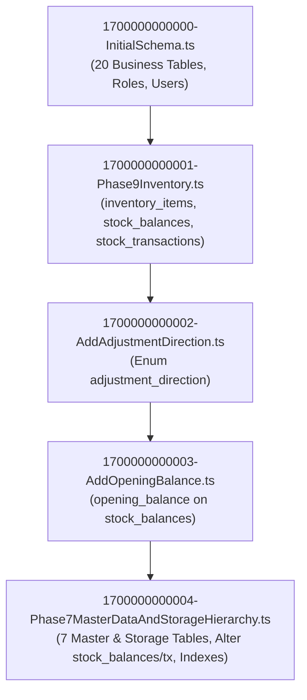

# PHASE 7.2 — EXISTING ENTITY CLASSIFICATION & DATABASE ARCHITECTURE RECONCILIATION

**Domain:** RMRIT Manufacturing Application  
**Phase:** 7.2 — Existing Entity Classification & Database Architecture Reconciliation  
**Role:** Senior Database Architect and System Architect  
**Status:** COMPLETE (Analysis & Classification)  
**Date:** September 18, 2026  

---

## 1. OBJECTIVE

The purpose of Phase 7.2 is to rigorously classify all 30 existing database entities in the RMRIT repository, determine how each entity relates to the final approved system design (from Phases 1 and 2), and establish the exact treatment (Keep, Modify, Replace, Merge, Deprecate, Legacy) for every entity without making code, entity, or migration changes.

---

## 2. SCOPE

### In Scope
- Comprehensive classification of all 30 TypeORM domain entities into strict architectural categories.
- Deep-dive analysis of `InventoryItem` vs `Product`, including code dependencies, API write paths, and coexistence strategy.
- Deep-dive analysis of `StockBalance` (dual binding: `inventory_item_id` vs `product_id + bin_id`).
- Deep-dive analysis of `StockTransaction` (immutable ledger, transaction types, bin routing).
- Verification of Master Data (`ProductCategory`, `ProductFamily`, `Product`) and Storage Hierarchy (`Warehouse`, `WarehouseLocation`, `Rack`, `Bin`).
- Classification of all 15 business workflow entities (PO, SC, RM, Issues, Receipts, Consumption, Returns, Additional Requests).
- Security, RBAC, Notification, and Audit trail entity classification.
- Inbound, outbound, service, API, test, and migration dependency matrices.
- Entity lifecycle, data preservation, and duplicate concept analysis.
- Review of open business decisions (`DEC-005`, `DEC-PROD-010`, `DEC-PROD-011`/`DEC-WH-006`, `DEC-PROD-012`, `DEC-PROD-014`, `DEC-WH-008`).
- Preparation of foundational inputs for Phase 7.3 (Master Data Schema Design).

### Out of Scope (Strict Phase Separation)
- No modification of entity classes or database schema.
- No creation, alteration, or execution of migrations.
- No modifications to controllers, services, DTOs, or frontend.
- No deletion of legacy entities.
- No renaming or merging of database tables.

---

## 3. PHASE 7.1 INPUT SUMMARY

Phase 7.1 established the following facts from direct repository audit:
1. **30 TypeORM domain entities** currently exist and are registered in `ALL_ENTITIES` in [`backend/src/config/data-source.ts`](file:///c:/Users/Admin/OneDrive/Desktop/rm-workflow-system/backend/src/config/data-source.ts).
2. **5 TypeORM migrations** exist (`1700000000000` through `1700000000004`).
3. **Database Stack:** PostgreSQL + TypeORM `v1.1.1` + `pg` `v8.23.0`.
4. **Current Runtime Inventory:** `InventoryService` operates against `InventoryItem` via `inventory_item_id`.
5. **Database Schema:** `stock_balances` and `stock_transactions` support both `inventory_item_id` (nullable) and composite `(product_id, bin_id)`.
6. **Master Data & Storage Entities:** `ProductCategory`, `ProductFamily`, `Product`, `Warehouse`, `WarehouseLocation`, `Rack`, `Bin` exist as entities and tables in Migration 0004.
7. **Database Runtime Connection:** Blocked in local environment due to unconfigured PostgreSQL credentials (`FATAL: password authentication failed for user "postgres"`).
8. **Test Coverage:** 104 passed tests validating ORM metadata, schema invariants, and mocked business logic.

---

## 4. AUTHORITATIVE DESIGN SOURCES

To determine the intended final system architecture:
1. Current User Requirements Baseline ([`CURRENT_REQUIREMENTS_BASELINE.md`](file:///c:/Users/Admin/OneDrive/Desktop/rm-workflow-system/CURRENT_REQUIREMENTS_BASELINE.md))
2. Phase 1 Final Requirement Baseline ([`PHASE_1_REPORT.md`](file:///c:/Users/Admin/OneDrive/Desktop/rm-workflow-system/.agent/PHASE_1_REPORT.md), [`PHASE_1_REQUIREMENT_DECISION_LOG.md`](file:///c:/Users/Admin/OneDrive/Desktop/rm-workflow-system/.agent/PHASE_1_REQUIREMENT_DECISION_LOG.md))
3. Phase 2 System Design Documents ([`PHASE_2.1_INVENTORY_DOMAIN_STORAGE_DESIGN.md`](file:///c:/Users/Admin/OneDrive/Desktop/rm-workflow-system/.agent/PHASE_2.1_INVENTORY_DOMAIN_STORAGE_DESIGN.md) through [`PHASE_2.6_INVENTORY_BALANCE_DESIGN.md`](file:///c:/Users/Admin/OneDrive/Desktop/rm-workflow-system/.agent/PHASE_2.6_INVENTORY_BALANCE_DESIGN.md))
4. Phase 7 Database Design Specification ([`PHASE_7_DATABASE_DESIGN.md`](file:///c:/Users/Admin/OneDrive/Desktop/rm-workflow-system/.agent/PHASE_7_DATABASE_DESIGN.md))
5. Phase 7.1 Audit Document ([`PHASE_7.1_REPOSITORY_DATABASE_AUDIT.md`](file:///c:/Users/Admin/OneDrive/Desktop/rm-workflow-system/.agent/PHASE_7.1_REPOSITORY_DATABASE_AUDIT.md))

---

## 5. CURRENT ENTITY INVENTORY (VERIFIED 30 ENTITIES)

The repository contains exactly 30 TypeORM entities across 14 domain directories in `backend/src/`:
1. `Role` (`roles/entities/role.entity.ts`)
2. `User` (`users/entities/user.entity.ts`)
3. `Customer` (`customers/entities/customer.entity.ts`)
4. `PurchaseOrder` (`po/entities/po.entity.ts`)
5. `SalesOrderComponent` (`sc/entities/sc.entity.ts`)
6. `RmRequest` (`rm/entities/rm-request.entity.ts`)
7. `RmItem` (`rm/entities/rm-item.entity.ts`)
8. `RmFormSc` (`rm/entities/rm-form-sc.entity.ts`)
9. `RmItemSnapshot` (`rm/entities/rm-item-snapshot.entity.ts`)
10. `MaterialIssue` (`material-issue/entities/material-issue.entity.ts`)
11. `MaterialIssueItem` (`material-issue/entities/material-issue-item.entity.ts`)
12. `MaterialReceipt` (`production/entities/production-receipt.entity.ts`)
13. `MaterialReceiptItem` (`production/entities/material-receipt-item.entity.ts`)
14. `MaterialConsumption` (`production/entities/material-consumption.entity.ts`)
15. `MaterialReturn` (`production/entities/material-return.entity.ts`)
16. `MaterialReturnItem` (`production/entities/material-return-item.entity.ts`)
17. `AdditionalMaterialRequest` (`additional-request/entities/additional-request.entity.ts`)
18. `AdditionalMaterialRequestItem` (`additional-request/entities/additional-request-item.entity.ts`)
19. `Notification` (`notifications/entities/notification.entity.ts`)
20. `AuditLog` (`audit/entities/audit-log.entity.ts`)
21. `InventoryItem` (`inventory/entities/inventory-item.entity.ts`)
22. `ProductCategory` (`inventory/entities/product-category.entity.ts`)
23. `ProductFamily` (`inventory/entities/product-family.entity.ts`)
24. `Product` (`inventory/entities/product.entity.ts`)
25. `Warehouse` (`inventory/entities/warehouse.entity.ts`)
26. `WarehouseLocation` (`inventory/entities/warehouse-location.entity.ts`)
27. `Rack` (`inventory/entities/rack.entity.ts`)
28. `Bin` (`inventory/entities/bin.entity.ts`)
29. `StockBalance` (`inventory/entities/stock-balance.entity.ts`)
30. `StockTransaction` (`inventory/entities/stock-transaction.entity.ts`)

---

## 6. ENTITY CLASSIFICATION RULES

Every entity is evaluated against 15 strict primary categories:
- **A. CORE ACTIVE DOMAIN ENTITY:** Fundamental business execution entities.
- **B. MASTER DATA ENTITY:** Catalog, taxonomy, and reference definition entities.
- **C. STORAGE HIERARCHY ENTITY:** Physical warehouse topology entities.
- **D. INVENTORY BALANCE ENTITY:** Authoritative on-hand physical stock quantity.
- **E. INVENTORY TRANSACTION / LEDGER ENTITY:** Immutable movement audit ledger.
- **F. WORKFLOW DOCUMENT ENTITY:** Header entities capturing milestone transitions.
- **G. WORKFLOW LINE-ITEM ENTITY:** Granular items belonging to workflow documents.
- **H. JUNCTION / ASSOCIATION ENTITY:** M:N linking tables.
- **I. SECURITY / IDENTITY ENTITY:** Authentication, roles, and user accounts.
- **J. AUDIT / TRACEABILITY ENTITY:** System audit logs and revision snapshots.
- **K. NOTIFICATION / COMMUNICATION ENTITY:** In-app alert messages.
- **L. LEGACY / COMPATIBILITY ENTITY:** Pre-existing entities retained to prevent breaking legacy flows/tests.
- **M. DEPRECATED / SUPERSEDED ENTITY:** Obsolete entities earmarked for decommissioning.
- **N. DUPLICATE / OVERLAPPING CONCEPT:** Entities covering redundant concepts.
- **O. UNKNOWN / REQUIRES DECISION:** Unresolved entities requiring business alignment.

---

## 7. COMPLETE 30-ENTITY CLASSIFICATION MATRIX

| # | Entity | Table Name | Current Purpose | Primary Classification | Final Target Role | Treatment Decision | Evidence / Rationale |
| :- | :--- | :--- | :--- | :--- | :--- | :--- | :--- |
| 1 | `Role` | `roles` | System authorization role | **I. SECURITY / IDENTITY** | Core RBAC Role | **KEEP** | 6 active roles; `roles.entity.ts` |
| 2 | `User` | `users` | System user account & actor | **I. SECURITY / IDENTITY** | Core User Identity | **KEEP** | Referenced by all actor FKs; `user.entity.ts` |
| 3 | `Customer` | `customers` | Client ordering components | **B. MASTER DATA** | Customer Master | **KEEP** | Referenced by PO; `customer.entity.ts` |
| 4 | `PurchaseOrder` | `purchase_orders` | Customer order container | **F. WORKFLOW DOCUMENT** | External PO Header | **KEEP** | Parent of SCs; `po.entity.ts` |
| 5 | `SalesOrderComponent` | `sales_order_components`| Core manufacturing work order | **F. WORKFLOW DOCUMENT** | Core Production Unit | **KEEP** | Independent completion lifecycle; `sc.entity.ts` |
| 6 | `RmRequest` | `rm_requests` | RM requirement specification | **F. WORKFLOW DOCUMENT** | Engineering RM Form | **KEEP** | Supports SC & PO modes; `rm-request.entity.ts` |
| 7 | `RmItem` | `rm_items` | RM specification line item | **G. WORKFLOW LINE-ITEM** | RM Line Item | **KEEP** | Captures material/dims/qty; `rm-item.entity.ts` |
| 8 | `RmFormSc` | `rm_form_scs` | PO-form to SC junction | **H. JUNCTION / ASSOC** | PO-RM Junction | **KEEP** | Enables Option B PO-level RM; `rm-form-sc.entity.ts` |
| 9 | `RmItemSnapshot` | `rm_item_snapshots` | Historical RM revision log | **J. AUDIT / TRACEABILITY** | Engineering Audit Log | **KEEP** | Preserves designer revisions; `rm-item-snapshot.entity.ts` |
| 10 | `MaterialIssue` | `material_issues` | Stores material issue header | **F. WORKFLOW DOCUMENT** | Stores Issue Header | **KEEP** | Stock decrement event; `material-issue.entity.ts` |
| 11 | `MaterialIssueItem` | `material_issue_items` | Stores issue line item | **G. WORKFLOW LINE-ITEM** | Issue Line Item | **KEEP** | Issued qty & heat/batch; `material-issue-item.entity.ts` |
| 12 | `MaterialReceipt` | `material_receipts` | Production receipt confirmation| **F. WORKFLOW DOCUMENT** | Receipt Confirmation | **KEEP** | Production verification; `production-receipt.entity.ts` |
| 13 | `MaterialReceiptItem`| `material_receipt_items`| Production receipt line item | **G. WORKFLOW LINE-ITEM** | Receipt Line Item | **KEEP** | Received qty; `material-receipt-item.entity.ts` |
| 14 | `MaterialConsumption`| `material_consumptions` | Shop-floor consumption log | **G. WORKFLOW LINE-ITEM** | Consumption Record | **KEEP** | Production accounting; `material-consumption.entity.ts` |
| 15 | `MaterialReturn` | `material_returns` | Shop-floor return to store | **F. WORKFLOW DOCUMENT** | Return Note Header | **KEEP** | Stock increment trigger; `material-return.entity.ts` |
| 16 | `MaterialReturnItem` | `material_return_items` | Shop-floor return line item | **G. WORKFLOW LINE-ITEM** | Return Line Item | **KEEP** | Returned qty; `material-return-item.entity.ts` |
| 17 | `AdditionalMaterialRequest` | `additional_material_requests` | Material variance request | **F. WORKFLOW DOCUMENT** | Variance Request | **KEEP** | Non-destructive variance; `additional-request.entity.ts` |
| 18 | `AdditionalMaterialRequestItem` | `additional_material_request_items` | Additional request line item | **G. WORKFLOW LINE-ITEM** | Variance Line Item | **KEEP** | Requested/approved qty; `additional-request-item.entity.ts` |
| 19 | `Notification` | `notifications` | In-app user notifications | **K. NOTIFICATION** | In-App Alert | **KEEP** | User communication; `notification.entity.ts` |
| 20 | `AuditLog` | `audit_logs` | System change audit trail | **J. AUDIT / TRACEABILITY** | System Audit Trail | **KEEP** | JSON diff audit; `audit-log.entity.ts` |
| 21 | `InventoryItem` | `inventory_items` | Flat legacy material catalog | **L. LEGACY / COMPAT** | Legacy Specification | **LEGACY** | Preserved per `DEC-PROD-014`; `inventory-item.entity.ts` |
| 22 | `ProductCategory` | `product_categories` | Top-level product category | **B. MASTER DATA** | Taxonomy Root | **KEEP** | Tier 1 master; `product-category.entity.ts` |
| 23 | `ProductFamily` | `product_families` | Product family group | **B. MASTER DATA** | Taxonomy Mid-Tier | **KEEP** | Tier 2 master; `product-family.entity.ts` |
| 24 | `Product` | `products` | Master catalog product | **B. MASTER DATA** | Product Master Item | **KEEP** | Tier 3 master; `product.entity.ts` |
| 25 | `Warehouse` | `warehouses` | Physical warehouse facility | **C. STORAGE HIERARCHY** | Facility Master | **KEEP** | Tier 1 storage; `warehouse.entity.ts` |
| 26 | `WarehouseLocation` | `warehouse_locations` | Warehouse floor area / zone | **C. STORAGE HIERARCHY** | Location Master | **KEEP** | Tier 2 storage; `warehouse-location.entity.ts` |
| 27 | `Rack` | `racks` | Physical storage rack | **C. STORAGE HIERARCHY** | Rack Master | **KEEP** | Tier 3 storage; `rack.entity.ts` |
| 28 | `Bin` | `bins` | Physical storage bin | **C. STORAGE HIERARCHY** | Bin Master | **KEEP** | Tier 4 storage; `bin.entity.ts` |
| 29 | `StockBalance` | `stock_balances` | Physical on-hand balance | **D. INVENTORY BALANCE** | Product+Bin Balance | **MODIFY / TRANSITIONAL** | Dual-bound (`inventory_item_id` & `productId+binId`); `stock-balance.entity.ts` |
| 30 | `StockTransaction` | `stock_transactions` | Immutable movement ledger | **E. INVENTORY LEDGER** | Movement Ledger | **MODIFY / TRANSITIONAL** | Supports `productId`, `sourceBinId`, `destinationBinId`; `stock-transaction.entity.ts` |

---

## 8. ENTITY-BY-ENTITY DETAILED ANALYSIS

### 8.1 Security & Access Control (`Role`, `User`)
- **`Role`:** Defines the 6 active system roles (`ADMIN`, `DESIGNER`, `STORES`, `PRODUCTION`, `SENIOR_MANAGER`, `GENERAL_MANAGER`). Unique on `name`. No `SENIOR_DESIGNER` exists.
- **`User`:** Central actor entity referenced by all workflow and ledger entities with `onDelete: 'RESTRICT'`. Password hashed with bcrypt (`varchar(255)`). Active toggle via `is_active`.

### 8.2 Customer & Purchase Order Domain (`Customer`, `PurchaseOrder`, `SalesOrderComponent`)
- **`Customer`:** Master entity capturing code, name, and contact details.
- **`PurchaseOrder`:** Relational container for customer purchase orders.
- **`SalesOrderComponent`:** Authoritative manufacturing component unit. Each SC tracks independent progress from `DRAFT` to `COMPLETED`. An SC closes independently regardless of other SCs under the same PO.

### 8.3 Raw Material Specification & Snapshot Domain (`RmRequest`, `RmItem`, `RmFormSc`, `RmItemSnapshot`)
- **`RmRequest`:** Header entity supporting both SC-specific forms (`sc_id`) and PO-level forms linked via `RmFormSc`.
- **`RmItem`:** Detailed dimensional and metallurgical requirements (`material`, `material_type`, `grade`, `size`, `length`, `width`, `thickness`, `diameter`, `weight`, `quantity`).
- **`RmItemSnapshot`:** Immutable historical log of revisions created during design modifications.

### 8.4 Stores Fulfillment Domain (`MaterialIssue`, `MaterialIssueItem`)
- **`MaterialIssue`:** Stores issuance document (`INITIAL_ISSUE` or `ADDITIONAL_ISSUE`). Authoritative stock decrement trigger.
- **`MaterialIssueItem`:** Line items capturing `quantity_issued`, `heat_number`, and `batch_number`.

### 8.5 Production Floor Domain (`MaterialReceipt`, `MaterialReceiptItem`, `MaterialConsumption`, `MaterialReturn`, `MaterialReturnItem`, `AdditionalMaterialRequest`, `AdditionalMaterialRequestItem`)
- **`MaterialReceipt` & `MaterialReceiptItem`:** Production confirmation of materials received on the shop floor. Tracks discrepancy without altering Store stock balances.
- **`MaterialConsumption`:** Production shop-floor accounting record of material consumed.
- **`MaterialReturn` & `MaterialReturnItem`:** Return of unconsumed material. Starts as `PENDING_STORE_ACK`; upon Stores confirmation (`ACKNOWLEDGED`), triggers inventory stock increment.
- **`AdditionalMaterialRequest` & `AdditionalMaterialRequestItem`:** Requests extra material due to damage, wastage, or engineering changes without altering the original RM baseline.

### 8.6 Communication & Audit Domain (`Notification`, `AuditLog`)
- **`Notification`:** In-app user notifications.
- **`AuditLog`:** JSON diff logger tracking entity actions.

---

## 9. `INVENTORYITEM` DEEP-DIVE INVESTIGATION

### 1. Why does `InventoryItem` exist?
`InventoryItem` was created in Phase 9/10 as a flat, single-tier material specification table (`material`, `material_type`, `grade`, `size`, `unit`, `minimum_stock_level`).

### 2. Code Dependencies on `InventoryItem`:
- **Services:** `InventoryService` (`backend/src/inventory/inventory.service.ts`) uses `InventoryItem` for all CRUD, stock in, stock out, adjustment, and reconciliation methods.
- **Controllers:** `InventoryController` (`backend/src/inventory/inventory.controller.ts`) exposes 11 endpoints operating on `inventoryItemId`.
- **DTOs:** `CreateInventoryItemDto`, `UpdateInventoryItemDto`, `CreateStockInDto`, `CreateStockOutDto`, `CreateStockAdjustmentDto`, `GetInventoryFilterDto`.
- **Database Tables:** `stock_balances` (`inventory_item_id`), `stock_transactions` (`inventory_item_id`).
- **Test Suites:** `src/inventory/inventory.service.spec.ts` (27 tests), `src/entities.spec.ts`, `test/dto-validation.spec.ts`.

### 3. What would break if `InventoryItem` were removed today?
- The entire active `InventoryModule`, all 11 inventory REST endpoints, all frontend inventory management screens, and 40+ unit/integration tests would immediately fail compilation and execution.

### 4. Coexistence & Bridge Strategy (`DEC-PROD-014`):
- `InventoryItem` is classified as **`LEGACY / COMPATIBILITY ENTITY`**.
- It is retained alongside `Product` in a non-destructive dual-binding setup.
- In Phase 11, Master Data CRUD for `Product` will be established, and an adapter/bridge will link `InventoryItem` material specifications to master `Product` records without dropping `inventory_items`.

---

## 10. `INVENTORYITEM` VS `PRODUCT` COMPARISON

| Dimension | `InventoryItem` | `Product` | Concept Assessment | Treatment |
| :--- | :--- | :--- | :--- | :--- |
| **Primary Key** | `id` (UUID) | `id` (UUID) | Identical PK strategy | Parallel IDs |
| **Naming / Identity** | `(material, materialType, grade, size)` composite | `name` (unique string) | `InventoryItem` is metallurgical spec; `Product` is catalog name | Co-exist |
| **Taxonomy** | Flat table (no parent) | Belongs to `ProductFamily` ──> `ProductCategory` | `Product` has full 3-tier hierarchy | `Product` is Master; `InventoryItem` is legacy spec |
| **Thresholds** | `minimum_stock_level` | `minimum_inventory`, `maximum_inventory` | `Product` adds maximum inventory ceiling | `Product` is superset |
| **Stock Relation** | 1:1 with `StockBalance` | 1:N with `StockBalance` (via `Product + Bin`) | `Product` supports multi-bin physical storage | Target model |
| **Active Toggle** | `is_active` (boolean) | `is_active` (boolean) | Identical | Retain on both |
| **Workflow Use** | Referenced by inventory service | Master catalog item | Phase 11 will introduce Product CRUD | Dual-binding per `DEC-PROD-014` |

---

## 11. `STOCKBALANCE` DEEP-DIVE & DUAL-BINDING

- **Current Table Structure:**
  - `id`: UUID (PK)
  - `inventory_item_id`: `uuid` (Nullable, Unique FK to `inventory_items`)
  - `product_id`: `uuid` (Nullable, FK to `products`)
  - `bin_id`: `uuid` (Nullable, FK to `bins`)
  - `current_quantity`: `numeric(12,3)` (Check `>= 0`)
  - `opening_balance`: `numeric(12,3)` (Nullable)
  - `last_transaction_id`: `uuid` (FK to `stock_transactions`)
- **Uniqueness Invariants:**
  1. `UQ_stock_balances_inventory_item_id` (Legacy 1:1)
  2. `UQ_stock_balances_product_bin` on `(product_id, bin_id)` (Target composite unique index)
- **Coexistence Validation:** Both references coexist seamlessly in PostgreSQL. Legacy records have `inventory_item_id` populated; target records have `(product_id, bin_id)` populated.

---

## 12. `STOCKTRANSACTION` DEEP-DIVE & LEDGER

- **Current Table Structure:**
  - `id`: UUID (PK)
  - `product_id`: `uuid` (Nullable, FK to `products`)
  - `inventory_item_id`: `uuid` (Nullable, FK to `inventory_items`)
  - `source_bin_id`: `uuid` (Nullable, FK to `bins`)
  - `destination_bin_id`: `uuid` (Nullable, FK to `bins`)
  - `transaction_type`: `enum` (`STOCK_IN`, `STOCK_OUT`, `STORES_ISSUE`, `RETURN`, `ADJUSTMENT`, `TRANSFER`)
  - `adjustment_direction`: `enum` (`INCREASE`, `DECREASE`, Nullable)
  - `quantity`: `numeric(12,3)` (Check `> 0`)
  - `reference_type`: `varchar(50)`
  - `reference_id`: `uuid` / `string`
  - `created_by_id`: `uuid` (FK to `users`, `onDelete: RESTRICT`)
  - `created_at`: `TIMESTAMP`
- **Immutability:** No update or delete endpoints exist; rows are insert-only audit records.

---

## 13. MASTER DATA TAXONOMY CLASSIFICATION

```text
[ProductCategory] (id, name, is_active)
       │ (1:N, onDelete: RESTRICT)
       ▼
[ProductFamily] (id, category_id, name, is_active) [Unique: (category_id, name)]
       │ (1:N, onDelete: RESTRICT)
       ▼
   [Product] (id, family_id, name, minimum_inventory, maximum_inventory, is_active) [Unique: name]
```
- All three entities are classified as **`B. MASTER DATA ENTITY`** and **`KEEP`**.
- Structural invariants and foreign key constraints are established in Migration 0004.

---

## 14. STORAGE HIERARCHY CLASSIFICATION

```text
[Warehouse] (id, code, name, is_active) [Unique: code, name]
       │ (1:N, onDelete: RESTRICT)
       ▼
[WarehouseLocation] (id, warehouse_id, code, name, is_active) [Unique: (warehouse_id, code)]
       │ (1:N, onDelete: RESTRICT)
       ▼
    [Rack] (id, location_id, code, name, is_active) [Unique: (location_id, code)]
       │ (1:N, onDelete: RESTRICT)
       ▼
    [Bin] (id, rack_id, code, name, is_active) [Unique: (rack_id, code)]
```
- All four entities are classified as **`C. STORAGE HIERARCHY ENTITY`** and **`KEEP`**.
- **Audit Confirmation:** None of the storage hierarchy tables store stock quantities or duplicate balances. Stock is strictly tracked in `stock_balances`.

---

## 15. BUSINESS WORKFLOW CLASSIFICATION

All 15 business workflow entities are classified as **`F. WORKFLOW DOCUMENT ENTITY`**, **`G. WORKFLOW LINE-ITEM ENTITY`**, or **`H. JUNCTION ENTITY`** and are marked **`KEEP`**.

```text
[PurchaseOrder] ────< [SalesOrderComponent] ───< [RmRequest] ───< [RmItem]
                            │                         │
                            ├───< [MaterialIssue] ────┼───< [MaterialIssueItem]
                            │            │            │
                            │            └──< [MaterialReceipt] ───< [MaterialReceiptItem]
                            ├───< [MaterialConsumption]
                            ├───< [MaterialReturn] ───< [MaterialReturnItem]
                            └───< [AdditionalMaterialRequest] ───< [AdditionalMaterialRequestItem]
```

---

## 16. SECURITY & IDENTITY CLASSIFICATION

- **`Role`:** **`I. SECURITY / IDENTITY ENTITY`** (`KEEP`).
- **`User`:** **`I. SECURITY / IDENTITY ENTITY`** (`KEEP`).
- 6 Active Personas: `ADMIN`, `DESIGNER`, `STORES`, `PRODUCTION`, `SENIOR_MANAGER`, `GENERAL_MANAGER`.
- `SENIOR_DESIGNER` is **NOT ACTIVE** in the codebase.

---

## 17. NOTIFICATION & AUDIT CLASSIFICATION

- **`Notification`:** **`K. NOTIFICATION / COMMUNICATION ENTITY`** (`KEEP`).
- **`AuditLog`:** **`J. AUDIT / TRACEABILITY ENTITY`** (`KEEP`).

---

## 18. ENTITY DEPENDENCY GRAPH

```text
COMPLETE CODEBASE ENTITY DEPENDENCY GRAPH

[Role]
  ▲
  │ (FK role_id, RESTRICT)
[User] ─────────────────────────────────────────────────────────────┐
  ▲                                                                 │ (Actor FKs)
  │ (Customer FK, RESTRICT)                                         ▼
[Customer] <── [PurchaseOrder] <── [SalesOrderComponent] <── [RmRequest] <── [RmItem]
                                          │                      │               │
                                          ├──────< [RmFormSc] ───┘               │
                                          │                                      ├──< [RmItemSnapshot]
                                          ├──────< [MaterialIssue] ──────────────┼──< [MaterialIssueItem]
                                          │             │                        │
                                          │             └──< [MaterialReceipt] ──┼──< [MaterialReceiptItem]
                                          ├──────< [MaterialConsumption] ────────┘
                                          ├──────< [MaterialReturn] ─────────────┬──< [MaterialReturnItem]
                                          │                                      │
                                          └──────< [AdditionalRequest] ──────────┼──< [AdditionalRequestItem]
                                                                                 │
[ProductCategory]                                                                │
  ▲ (category_id, RESTRICT)                                                      │
[ProductFamily]                                                                  │
  ▲ (family_id, RESTRICT)                                                        │
[Product] ─────────────┐                                                         │
  ▲ (product_id)       ├──> [StockBalance] <── (inventory_item_id) ── [InventoryItem]
  │                    │          ▲                                              ▲
  │                    │          │ (last_transaction_id)                        │
[StockTransaction] <───┤          │                                              │
  │                    │   [StockTransaction] ───────────────────────────────────┘
  │ (bin links)        ▼
  │                  [Bin] <── [Rack] <── [WarehouseLocation] <── [Warehouse]
  └────────────────────┘
```

---

## 19. INBOUND DEPENDENCY MATRIX

| Entity | Inbound Referencing Entities (Who Points Here via FK) | Deletion Risk |
| :--- | :--- | :--- |
| `Role` | `users.role_id` | Critical (Blocked by RESTRICT) |
| `User` | 12 FKs across workflow documents, line items, ledger, audit | Critical (Blocked by RESTRICT) |
| `Customer` | `purchase_orders.customer_id` | Critical (Blocked by RESTRICT) |
| `PurchaseOrder` | `sales_order_components.po_id`, `rm_requests.po_id` | Critical (Blocked by RESTRICT) |
| `SalesOrderComponent` | `rm_requests.sc_id`, `rm_form_scs.sc_id`, `rm_items.sc_id`, `material_issues.sc_id`, `material_consumptions.sc_id`, `material_returns.sc_id`, `additional_material_requests.sc_id` | High (Cascade for child docs, Restrict for header) |
| `RmRequest` | `rm_items.rm_form_id`, `rm_form_scs.rm_form_id`, `rm_item_snapshots.rm_form_id` | High (Cascade to items) |
| `RmItem` | `rm_item_snapshots.rm_item_id`, `material_issue_items.rm_item_id`, `material_receipt_items.rm_item_id`, `material_consumptions.rm_item_id`, `material_return_items.rm_item_id`, `additional_material_request_items.rm_item_id` | High (Blocked by RESTRICT) |
| `ProductCategory` | `product_families.category_id` | High (Blocked by RESTRICT) |
| `ProductFamily` | `products.family_id` | High (Blocked by RESTRICT) |
| `Product` | `stock_balances.product_id`, `stock_transactions.product_id` | High (Blocked by RESTRICT) |
| `Warehouse` | `warehouse_locations.warehouse_id` | High (Blocked by RESTRICT) |
| `WarehouseLocation` | `racks.location_id` | High (Blocked by RESTRICT) |
| `Rack` | `bins.rack_id` | High (Blocked by RESTRICT) |
| `Bin` | `stock_balances.bin_id`, `stock_transactions.source_bin_id`, `stock_transactions.destination_bin_id` | High (Blocked by RESTRICT) |
| `InventoryItem` | `stock_balances.inventory_item_id`, `stock_transactions.inventory_item_id` | High (Blocked by RESTRICT) |
| `StockTransaction` | `stock_balances.last_transaction_id` | Medium (SET NULL on delete) |

---

## 20. OUTBOUND DEPENDENCY MATRIX

| Entity | Outbound References (What this Entity Points To) | FK Nullability | Delete Action |
| :--- | :--- | :--- | :--- |
| `User` | `roles` | `NOT NULL` | `RESTRICT` |
| `PurchaseOrder` | `customers` | `NOT NULL` | `RESTRICT` |
| `SalesOrderComponent` | `purchase_orders`, `users` (`completedBy`) | `po_id` NOT NULL, `completed_by_id` NULL | `RESTRICT` / `SET NULL` |
| `RmRequest` | `purchase_orders`, `sales_order_components`, `users` | Optional PO/SC, User NOT NULL | `RESTRICT` / `CASCADE` |
| `RmItem` | `rm_requests`, `sales_order_components` | Request NOT NULL, SC Optional | `CASCADE` / `SET NULL` |
| `RmFormSc` | `rm_requests`, `sales_order_components` | Both NOT NULL | `CASCADE` |
| `MaterialIssue` | `sales_order_components`, `additional_material_requests`, `users` | SC NOT NULL, AddReq NULL, User NOT NULL | `RESTRICT` / `SET NULL` |
| `MaterialReceipt` | `material_issues`, `users` | Both NOT NULL | `RESTRICT` |
| `MaterialConsumption` | `sales_order_components`, `rm_items`, `users` | All NOT NULL | `RESTRICT` |
| `MaterialReturn` | `sales_order_components`, `users` (`returnedBy`, `confirmedBy`) | SC & ReturnedBy NOT NULL, ConfirmedBy NULL | `RESTRICT` |
| `AdditionalMaterialRequest` | `sales_order_components`, `users` (`requestedBy`, `approvedBy`) | SC & RequestedBy NOT NULL, ApprovedBy NULL | `RESTRICT` |
| `ProductFamily` | `product_categories` | NOT NULL | `RESTRICT` |
| `Product` | `product_families` | NOT NULL | `RESTRICT` |
| `WarehouseLocation` | `warehouses` | NOT NULL | `RESTRICT` |
| `Rack` | `warehouse_locations` | NOT NULL | `RESTRICT` |
| `Bin` | `racks` | NOT NULL | `RESTRICT` |
| `StockBalance` | `products`, `bins`, `inventory_items`, `stock_transactions` | All FKs Nullable | `RESTRICT` / `SET NULL` |
| `StockTransaction` | `products`, `inventory_items`, `bins` (source/dest), `users` | Product/Inv/Bins Nullable, User NOT NULL | `RESTRICT` |

---

## 21. SERVICE DEPENDENCY MATRIX

| Service Class | File Path | Entities Managed & Queried |
| :--- | :--- | :--- |
| `InventoryService` | `backend/src/inventory/inventory.service.ts` | `InventoryItem`, `StockBalance`, `StockTransaction`, `User` |
| `MasterDataService` | `backend/src/master-data/master-data.service.ts` | `ProductCategory`, `ProductFamily`, `Product`, `Warehouse`, `WarehouseLocation`, `Rack`, `Bin` |
| `AuthService` | `backend/src/auth/auth.service.ts` | `User`, `Role` |
| `UsersService` | `backend/src/users/users.service.ts` | `User`, `Role` |
| `RolesService` | `backend/src/roles/roles.service.ts` | `Role` |
| `CustomersService` | `backend/src/customers/customers.service.ts` | `Customer` |
| `PoService` | `backend/src/po/po.service.ts` | `PurchaseOrder`, `Customer`, `SalesOrderComponent` |
| `ScService` | `backend/src/sc/sc.service.ts` | `SalesOrderComponent`, `PurchaseOrder`, `User` |
| `RmService` | `backend/src/rm/rm.service.ts` | `RmRequest`, `RmItem`, `RmFormSc`, `RmItemSnapshot`, `User` |
| `MaterialIssueService` | `backend/src/material-issue/material-issue.service.ts`| `MaterialIssue`, `MaterialIssueItem`, `StockBalance`, `StockTransaction` |
| `ProductionService` | `backend/src/production/production.service.ts` | `MaterialReceipt`, `MaterialConsumption`, `MaterialReturn`, `MaterialReturnItem` |
| `AdditionalRequestService`| `backend/src/additional-request/additional-request.service.ts`| `AdditionalMaterialRequest`, `AdditionalMaterialRequestItem`, `User` |
| `AuditService` | `backend/src/audit/audit.service.ts` | `AuditLog`, `User` |
| `NotificationsService` | `backend/src/notifications/notifications.service.ts` | `Notification`, `User` |

---

## 22. API CONTROLLER DEPENDENCY MATRIX

| Controller | Base Path | Entities Exposed | Mutation Endpoints |
| :--- | :--- | :--- | :--- |
| `InventoryController` | `/api/inventory` | `InventoryItem`, `StockBalance`, `StockTransaction` | POST create, PATCH update, POST stock-in, POST stock-out, POST adjustment |
| `CategoriesController` | `/api/master-data/categories` | `ProductCategory` | POST create, PATCH update, DELETE / toggle active |
| `FamiliesController` | `/api/master-data/families` | `ProductFamily` | POST create, PATCH update, DELETE / toggle active |
| `ProductsController` | `/api/master-data/products` | `Product` | POST create, PATCH update, DELETE / toggle active |
| `WarehousesController` | `/api/master-data/warehouses` | `Warehouse` | POST create, PATCH update, DELETE / toggle active |
| `LocationsController` | `/api/master-data/locations` | `WarehouseLocation` | POST create, PATCH update, DELETE / toggle active |
| `RacksController` | `/api/master-data/racks` | `Rack` | POST create, PATCH update, DELETE / toggle active |
| `BinsController` | `/api/master-data/bins` | `Bin` | POST create, PATCH update, DELETE / toggle active |
| `RmController` | `/api/rm` | `RmRequest`, `RmItem`, `RmItemSnapshot` | POST create, PUT update, POST submit, POST revise |
| `ScController` | `/api/sc` | `SalesOrderComponent` | POST create, PATCH update, POST complete |
| `MaterialIssueController` | `/api/material-issues` | `MaterialIssue`, `MaterialIssueItem` | POST create initial issue, POST additional issue |

---

## 23. TEST DEPENDENCY MATRIX

| Test Suite File | Test Type | Entities Verified | Test Count |
| :--- | :--- | :--- | :--- |
| `src/entities.spec.ts` | Contract / Metadata Specs | All 30 Entities | 39 tests |
| `src/workflow-database-lifecycle.spec.ts`| Contract / Lifecycle Specs | PO, SC, RM, Issues, Receipts, Consumption, Returns, Additional Requests, Audit | 22 tests |
| `src/inventory/inventory.service.spec.ts` | Unit / Mocked Service Specs | `InventoryItem`, `StockBalance`, `StockTransaction` | 27 tests |
| `src/master-data/master-data.service.spec.ts` | Unit / Mocked Service Specs | Category, Family, Product, Warehouse, Location, Rack, Bin | 15 tests |
| `src/auth/auth.service.spec.ts` | Unit / Mocked Service Specs | `User`, `Role` | 6 tests |
| `test/dto-validation.spec.ts` | DTO Validation Specs | Master data & inventory DTOs | 8 tests |
| `src/app.controller.spec.ts` | Controller Specs | App Controller | 2 tests |

---

## 24. MIGRATION DEPENDENCY MATRIX



---

## 25. LIFECYCLE CLASSIFICATION

| Entity | Creation Authority | Update Authority | Soft Delete Flag | Hard Delete Allowed? |
| :--- | :--- | :--- | :--- | :--- |
| `Role` | `ADMIN` / Seed | `ADMIN` | No | No (`RESTRICT`) |
| `User` | `ADMIN` | `ADMIN` / Self | `is_active` | No (`RESTRICT`) |
| `Customer` | `ADMIN` / `STORES` | `ADMIN` / `STORES` | `is_active` | No (`RESTRICT`) |
| `PurchaseOrder` | `ADMIN` / Seed | `ADMIN` | No | No (`RESTRICT`) |
| `SalesOrderComponent` | `ADMIN` / `DESIGNER` | `DESIGNER` / `PRODUCTION` | No (Status-driven) | No (`RESTRICT`) |
| `RmRequest` | `DESIGNER` | `DESIGNER` (before submit) | No (Status-driven) | No (Draft only) |
| `RmItem` | `DESIGNER` | `DESIGNER` (via Snapshot) | No | No (`RESTRICT`) |
| `MaterialIssue` | `STORES` | System | No (Immutable) | No (`RESTRICT`) |
| `MaterialReceipt` | `PRODUCTION` | System | No (Immutable) | No (`RESTRICT`) |
| `MaterialConsumption` | `PRODUCTION` | System | No (Immutable) | No (`RESTRICT`) |
| `MaterialReturn` | `PRODUCTION` / `STORES`| `STORES` (Confirm) | No (Status-driven) | No (`RESTRICT`) |
| `AdditionalMaterialRequest` | `PRODUCTION` | `STORES` / `ADMIN` (Approve) | No (Status-driven) | No (`RESTRICT`) |
| `ProductCategory` | `ADMIN` / `STORES` | `ADMIN` / `STORES` | `is_active` | No (`RESTRICT`) |
| `ProductFamily` | `ADMIN` / `STORES` | `ADMIN` / `STORES` | `is_active` | No (`RESTRICT`) |
| `Product` | `ADMIN` / `STORES` | `ADMIN` / `STORES` | `is_active` | No (`RESTRICT`) |
| `Warehouse` | `ADMIN` / `STORES` | `ADMIN` / `STORES` | `is_active` | No (`RESTRICT`) |
| `WarehouseLocation` | `ADMIN` / `STORES` | `ADMIN` / `STORES` | `is_active` | No (`RESTRICT`) |
| `Rack` | `ADMIN` / `STORES` | `ADMIN` / `STORES` | `is_active` | No (`RESTRICT`) |
| `Bin` | `ADMIN` / `STORES` | `ADMIN` / `STORES` | `is_active` | No (`RESTRICT`) |
| `StockBalance` | System (Auto on Stock In)| System (Atomic update) | No (Quantity-driven) | No (`RESTRICT`) |
| `StockTransaction` | `STORES` / System | None (Insert-only) | No (Immutable) | Never (Audit violation) |

---

## 26. DATA PRESERVATION CLASSIFICATION

- **CRITICAL HISTORICAL DATA:** `StockTransaction`, `AuditLog`, `RmItemSnapshot`, `MaterialIssueItem`, `MaterialReceiptItem`, `MaterialConsumption`, `MaterialReturnItem`. Must never be modified or deleted.
- **IMPORTANT OPERATIONAL DATA:** `SalesOrderComponent`, `RmRequest`, `MaterialIssue`, `MaterialReceipt`, `MaterialReturn`, `AdditionalMaterialRequest`, `StockBalance`.
- **MASTER DATA:** `ProductCategory`, `ProductFamily`, `Product`, `Warehouse`, `WarehouseLocation`, `Rack`, `Bin`, `Customer`, `User`, `Role`.
- **LEGACY DATA:** `InventoryItem` (preserved for backward compatibility and test stability).

---

## 27. DUPLICATE CONCEPT ANALYSIS

| Concept Pair | Assessment | Resolution |
| :--- | :--- | :--- |
| `InventoryItem` vs `Product` | Different abstraction layers: `InventoryItem` = metallurgical material spec; `Product` = catalog master item. | Coexist per `DEC-PROD-014`. |
| `StockOut` vs `MaterialIssue` | `MaterialIssue` is the business event; `StockOut` (or `STORES_ISSUE`) is the resulting ledger transaction. | `MaterialIssue` writes a `StockTransaction` with type `STORES_ISSUE`. |
| `StockIn` vs `MaterialReturn` | `MaterialReturn` is the shop-floor return note; Stores verification triggers a `RETURN` `StockTransaction`. | `MaterialReturn` confirmation writes a `StockTransaction` with type `RETURN`. |
| `WarehouseLocation` vs `Location` | `WarehouseLocation` is the explicit class name representing zone/location within a warehouse. | Standardized as `WarehouseLocation` (table `warehouse_locations`). |

---

## 28. STOCK MOVEMENT BOUNDARY ANALYSIS

| Business Event | Initiating Role | Authorization Gate | Store Stock Impact | Database Write Operations |
| :--- | :--- | :--- | :--- | :--- |
| **Supplier Stock In** | `STORES` | `STORES` / `ADMIN` | Increment (`+`) | `UPDATE stock_balances`, `INSERT stock_transactions (STOCK_IN)` |
| **Material Issue** | `STORES` | `STORES` | Decrement (`-`) | `INSERT material_issues`, `INSERT material_issue_items`, `UPDATE stock_balances`, `INSERT stock_transactions (STORES_ISSUE)` |
| **Production Receipt** | `PRODUCTION` | `PRODUCTION` | None (`0`) | `INSERT material_receipts`, `INSERT material_receipt_items` |
| **Production Consumption** | `PRODUCTION` | `PRODUCTION` | None (`0`) | `INSERT material_consumptions` |
| **Production Return** | `PRODUCTION` | Stores Verification | None on submit; Increment on Ack (`+`) | `INSERT material_returns` (`PENDING_STORE_ACK`); Upon Ack: `UPDATE stock_balances`, `INSERT stock_transactions (RETURN)` |
| **Stock Adjustment** | `STORES` | `STORES` / `ADMIN` | Delta (`+/-`) | `UPDATE stock_balances`, `INSERT stock_transactions (ADJUSTMENT)` |
| **Inter-Bin Transfer** | `STORES` | `STORES` | Source (`-`), Dest (`+`) | `UPDATE stock_balances` (source), `UPDATE stock_balances` (dest), `INSERT stock_transactions (TRANSFER)` |

---

## 29. AUTHORITATIVE DATA SOURCE ANALYSIS

| Domain Value | Authoritative Source Table & Column | Non-Authoritative / Derived Reference |
| :--- | :--- | :--- |
| **Physical On-Hand Quantity** | `stock_balances.current_quantity` | Calculated ledger sums (`SUM(in) - SUM(out)`) |
| **Historical Movement Log** | `stock_transactions` | Document line item quantities |
| **Product Identity** | `products.name`, `products.id` | Text names in SC or RM records |
| **Product Taxonomy** | `product_categories.name`, `product_families.name` | Ad-hoc text category strings |
| **Storage Location** | `bins.code`, `racks.code`, `warehouse_locations.code`, `warehouses.code` | Freeform text remarks |
| **Component Batch Status** | `sales_order_components.status` | Downstream document statuses |
| **RM Baseline Requirement** | `rm_items.quantity` | Snapshot original submission rows |
| **Actor Identity** | `users.id`, `users.email` | Client-supplied username strings |

---

## 30. DUPLICATE STOCK SOURCE CHECK

- **Verification Result:** **NO DUPLICATE LIVE STOCK SOURCES EXIST**.
- `StockBalance.currentQuantity` is the **only** column storing live stock balances.
- `minimum_stock_level`, `minimum_inventory`, and `maximum_inventory` are static thresholds.
- `quantity_issued`, `quantity_received`, `consumed_quantity`, and `quantity_returned` are document line item audit values.

---

## 31. `PRODUCT + BIN` ARCHITECTURE CHECK

1. **Foreign Key Integrity:** `stock_balances.product_id` -> `products.id` (`RESTRICT`) and `stock_balances.bin_id` -> `bins.id` (`RESTRICT`) are implemented in Migration 0004.
2. **Uniqueness:** Composite unique index `UQ_stock_balances_product_bin` on `(product_id, bin_id)` is created in Migration 0004.
3. **Nullability:** Nullable in schema to allow legacy `inventory_item_id` records to coexist without data loss.
4. **Conclusion:** **`Product + Bin = One StockBalance`** is fully supported in the database schema and entity definitions.

---

## 32. OPEN DECISION REVIEW

| Decision ID | Description | Current Status | Database & Entity Impact | Blocks Phase 7.3? |
| :--- | :--- | :--- | :--- | :--- |
| **`DEC-005`** | Return Destination Policy | Unused RM -> source Bin; Scrap -> quarantine Bin | Requires destination Bin selection in `MaterialReturnItem` | No (Bin FK already supported) |
| **`DEC-PROD-010`** | Maximum Inventory Policy | Soft warning vs hard block | Managed in service layer; check constraint enforces `max >= min` | No |
| **`DEC-PROD-011` / `DEC-WH-006`** | Master Creation Authority | Restricted to `ADMIN` and `STORES` | Enforced in Guards/RBAC, not DB schema | No |
| **`DEC-PROD-012`** | Multi-Product Bin Policy | Supported (Multiple products can share a Bin) | Schema supports via composite `(product_id, bin_id)` | No |
| **`DEC-PROD-014`** | `InventoryItem` vs `Product` Reconciliation | Non-destructive dual-binding coexistence | Retain `InventoryItem` and bridge in Phase 11 | No |
| **`DEC-WH-008`** | Inter-Warehouse Transfer | Two-step transfer workflow | Supported via `TRANSFER` transaction type and source/dest Bins | No |

---

## 33. FINAL ENTITY CLASSIFICATION SUMMARY

| Entity | Primary Class | Treatment | Reason | Next Phase |
| :--- | :--- | :--- | :--- | :--- |
| `Role` | Security / Identity | **KEEP** | Core RBAC (6 active roles) | Phase 8 / 11 |
| `User` | Security / Identity | **KEEP** | User identity & actor for all FKs | Phase 8 / 11 |
| `Customer` | Master Data | **KEEP** | Client master for PO grouping | Phase 8 / 11 |
| `PurchaseOrder` | Workflow Document | **KEEP** | PO container for SCs | Phase 8 / 11 |
| `SalesOrderComponent` | Workflow Document | **KEEP** | Core independent manufacturing unit | Phase 8 / 11 |
| `RmRequest` | Workflow Document | **KEEP** | Engineering RM specification header | Phase 8 / 11 |
| `RmItem` | Workflow Line-Item | **KEEP** | Granular material line item | Phase 8 / 11 |
| `RmFormSc` | Junction / Assoc | **KEEP** | PO-form to SC junction | Phase 8 / 11 |
| `RmItemSnapshot` | Audit / Traceability| **KEEP** | Historical revision snapshot log | Phase 8 / 11 |
| `MaterialIssue` | Workflow Document | **KEEP** | Stores issue note (Stock decrement) | Phase 10 / 12 |
| `MaterialIssueItem` | Workflow Line-Item | **KEEP** | Issued qty & heat/batch numbers | Phase 10 / 12 |
| `MaterialReceipt` | Workflow Document | **KEEP** | Production receipt confirmation | Phase 10 / 12 |
| `MaterialReceiptItem`| Workflow Line-Item | **KEEP** | Received qty confirmation | Phase 10 / 12 |
| `MaterialConsumption`| Workflow Line-Item | **KEEP** | Production consumption accounting | Phase 10 / 12 |
| `MaterialReturn` | Workflow Document | **KEEP** | Store return note (Stock increment) | Phase 10 / 12 |
| `MaterialReturnItem` | Workflow Line-Item | **KEEP** | Returned quantity | Phase 10 / 12 |
| `AdditionalMaterialRequest` | Workflow Document | **KEEP** | Material variance request header | Phase 10 / 12 |
| `AdditionalMaterialRequestItem` | Workflow Line-Item | **KEEP** | Variance requested/approved qty | Phase 10 / 12 |
| `Notification` | Notification | **KEEP** | In-app user notifications | Phase 8 / 11 |
| `AuditLog` | Audit / Traceability| **KEEP** | System-wide JSON diff audit trail | Phase 8 / 11 |
| `InventoryItem` | Legacy / Compatibility| **LEGACY** | Legacy specification; bridge per `DEC-PROD-014` | Phase 11 |
| `ProductCategory` | Master Data | **KEEP** | Tier 1 product taxonomy | Phase 7.3 / 11 |
| `ProductFamily` | Master Data | **KEEP** | Tier 2 product taxonomy | Phase 7.3 / 11 |
| `Product` | Master Data | **KEEP** | Tier 3 product master | Phase 7.3 / 11 |
| `Warehouse` | Storage Hierarchy | **KEEP** | Tier 1 storage facility | Phase 7.3 / 11 |
| `WarehouseLocation` | Storage Hierarchy | **KEEP** | Tier 2 warehouse location | Phase 7.3 / 11 |
| `Rack` | Storage Hierarchy | **KEEP** | Tier 3 storage rack | Phase 7.3 / 11 |
| `Bin` | Storage Hierarchy | **KEEP** | Tier 4 storage bin | Phase 7.3 / 11 |
| `StockBalance` | Inventory Balance | **MODIFY** | Dual-bound on-hand balance | Phase 7.3 / 11 |
| `StockTransaction` | Inventory Ledger | **MODIFY** | Immutable movement audit ledger | Phase 7.3 / 11 |

---

## 34. INPUTS FOR PHASE 7.3 (MASTER DATA SCHEMA DESIGN)

1. **Taxonomy Structure:** `ProductCategory` ──(1:N)──> `ProductFamily` ──(1:N)──> `Product`.
2. **Storage Structure:** `Warehouse` ──(1:N)──> `WarehouseLocation` ──(1:N)──> `Rack` ──(1:N)──> `Bin`.
3. **Inventory Balance Binding:** `StockBalance` composite uniqueness on `(productId, binId)`.
4. **Delete Rule Invariant:** Enforce `onDelete: 'RESTRICT'` on all master taxonomy and storage relationships.
5. **Check Constraints:** Non-negative thresholds (`minimum_inventory >= 0`, `maximum_inventory >= minimum_inventory`).
6. **Unique Scopes:**
   - `ProductCategory.name` (Global)
   - `ProductFamily.name` (Scoped to `categoryId`)
   - `Product.name` (Global)
   - `Warehouse.code` and `Warehouse.name` (Global)
   - `WarehouseLocation.code` (Scoped to `warehouseId`)
   - `Rack.code` (Scoped to `locationId`)
   - `Bin.code` (Scoped to `rackId`)

---

## 35. RISKS REGISTER

| Risk | Description | Likelihood | Impact | Mitigation |
| :--- | :--- | :--- | :--- | :--- |
| **Accidental `InventoryItem` Drop** | Removing `inventory_items` breaks existing APIs and test suites | Low | Critical | Enforce `LEGACY` retention per `DEC-PROD-014` |
| **Cascade Deletion of Audit Records**| Deleting a Master Product or User cascades into stock transactions | Low | Critical | `onDelete: 'RESTRICT'` enforced across all master FKs |
| **Negative Inventory Race Condition**| Concurrent issues driving stock balance negative | Low | High | `CHECK (current_quantity >= 0)` + atomic SQL conditional updates |

---

## 36. LIMITATIONS

1. **Database Runtime Access:** Local PostgreSQL authentication failed (`password authentication failed for user "postgres"`). Analysis is 100% verified from TypeScript entity classes, TypeORM metadata, migration files, and test contracts.
2. **No Code Mutations:** Phase 7.2 performed zero code, migration, or schema modifications.

---

## 37. UNRESOLVED BUSINESS QUESTIONS

1. **`DEC-005` Return Quarantine Bin:** Confirmation on whether scrap returns automatically route to a designated quarantine Bin code or require manual Stores assignment.
2. **`DEC-PROD-010` Max Inventory Threshold:** Confirmation of whether exceeding maximum inventory should trigger a hard block or UI warning during Stock In.

---

### Phase Sign-Off
**Phase 7.2 Status:** **`COMPLETE`**  
**Ready for Sub-Phase:** **Phase 7.3 — Master Data Schema Design**
