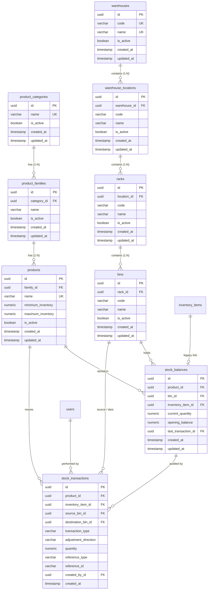

# PHASE 7.3 — FINAL MASTER DATA, STORAGE & INVENTORY DATABASE SCHEMA DESIGN

**Domain:** RMRIT Manufacturing Application  
**Phase:** 7.3 — Final Master Data, Storage & Inventory Database Schema Design  
**Role:** Senior Database Architect + Enterprise System Architect + Data Modeling Specialist  
**Status:** COMPLETE (Design & Specification Only — Zero Code / Schema Mutation)  
**Date:** September 18, 2026  

---

## 1. OBJECTIVE

Phase 7.3 establishes the authoritative, enterprise-grade **Final Database Schema Design** for the Master Data taxonomy (`ProductCategory`, `ProductFamily`, `Product`), Storage Hierarchy (`Warehouse`, `WarehouseLocation`, `Rack`, `Bin`), and Inventory Foundation (`StockBalance`, `StockTransaction`, with legacy `InventoryItem` boundary).

This document serves as the immutable structural contract governing future database migrations, entity implementations, service queries, and frontend integrations.

---

## 2. SCOPE

### In Scope (Design Only)
- Complete database specification for the 3 Product Master entities (`product_categories`, `product_families`, `products`).
- Complete database specification for the 4 Storage Hierarchy entities (`warehouses`, `warehouse_locations`, `racks`, `bins`).
- Complete database specification for the 2 Inventory entities (`stock_balances`, `stock_transactions`).
- Formal boundary, coexistence, and transitional dual-binding design for `InventoryItem` (`DEC-PROD-014`).
- Comprehensive Foreign Key, Constraint, Index, and Data Ownership matrices.
- Concrete rules for Multi-Product Bins, Multi-Warehouse Products, and derived inventory status calculation.
- Performance, concurrency, transaction isolation, and auditability designs.

### Out of Scope (Strict Phase Separation)
- Zero modification of entity code, DTOs, controllers, services, or frontend.
- Zero creation, alteration, or execution of migrations.
- Zero modification of live database data.
- No deletion, renaming, or merging of tables.

---

## 3. AUTHORITATIVE SOURCES

1. **Requirements Baseline:** [`CURRENT_REQUIREMENTS_BASELINE.md`](file:///c:/Users/Admin/OneDrive/Desktop/rm-workflow-system/CURRENT_REQUIREMENTS_BASELINE.md) & [`REQUIREMENT_CHANGE_RECONCILIATION.md`](file:///c:/Users/Admin/OneDrive/Desktop/rm-workflow-system/REQUIREMENT_CHANGE_RECONCILIATION.md)
2. **Phase 1 Decisions:** [`.agent/PHASE_1_REPORT.md`](file:///c:/Users/Admin/OneDrive/Desktop/rm-workflow-system/.agent/PHASE_1_REPORT.md) & [`.agent/PHASE_1_REQUIREMENT_DECISION_LOG.md`](file:///c:/Users/Admin/OneDrive/Desktop/rm-workflow-system/.agent/PHASE_1_REQUIREMENT_DECISION_LOG.md)
3. **Phase 2 Design Documents:**
   - [`.agent/PHASE_2.1_INVENTORY_DOMAIN_STORAGE_DESIGN.md`](file:///c:/Users/Admin/OneDrive/Desktop/rm-workflow-system/.agent/PHASE_2.1_INVENTORY_DOMAIN_STORAGE_DESIGN.md)
   - [`.agent/PHASE_2.2_PRODUCT_MASTER_DESIGN.md`](file:///c:/Users/Admin/OneDrive/Desktop/rm-workflow-system/.agent/PHASE_2.2_PRODUCT_MASTER_DESIGN.md)
   - [`.agent/PHASE_2.3_CATEGORY_FAMILY_DESIGN.md`](file:///c:/Users/Admin/OneDrive/Desktop/rm-workflow-system/.agent/PHASE_2.3_CATEGORY_FAMILY_DESIGN.md)
   - [`.agent/PHASE_2.4_WAREHOUSE_DESIGN.md`](file:///c:/Users/Admin/OneDrive/Desktop/rm-workflow-system/.agent/PHASE_2.4_WAREHOUSE_DESIGN.md)
   - [`.agent/PHASE_2.5_LOCATION_RACK_BIN_DESIGN.md`](file:///c:/Users/Admin/OneDrive/Desktop/rm-workflow-system/.agent/PHASE_2.5_LOCATION_RACK_BIN_DESIGN.md)
   - [`.agent/PHASE_2.6_INVENTORY_BALANCE_DESIGN.md`](file:///c:/Users/Admin/OneDrive/Desktop/rm-workflow-system/.agent/PHASE_2.6_INVENTORY_BALANCE_DESIGN.md)
4. **Phase 7 Specifications:** [`.agent/PHASE_7_DATABASE_DESIGN.md`](file:///c:/Users/Admin/OneDrive/Desktop/rm-workflow-system/.agent/PHASE_7_DATABASE_DESIGN.md)
5. **Phase 7.1 Audit & Phase 7.2 Classification:** [`.agent/PHASE_7.1_REPOSITORY_DATABASE_AUDIT.md`](file:///c:/Users/Admin/OneDrive/Desktop/rm-workflow-system/.agent/PHASE_7.1_REPOSITORY_DATABASE_AUDIT.md) & [`.agent/PHASE_7.2_ENTITY_CLASSIFICATION.md`](file:///c:/Users/Admin/OneDrive/Desktop/rm-workflow-system/.agent/PHASE_7.2_ENTITY_CLASSIFICATION.md)

---

## 4. PHASE 7.2 PRESERVED ARCHITECTURAL FACTS

1. **Master Data Structure:** 3-tier hierarchy: `ProductCategory (1:N) ──> ProductFamily (1:N) ──> Product`.
2. **Storage Structure:** 4-tier hierarchy: `Warehouse (1:N) ──> WarehouseLocation (1:N) ──> Rack (1:N) ──> Bin`.
3. **Authoritative Stock Identity:** `Product + Bin = One StockBalance`.
4. **Entity Classifications:**
   - Master Data: `ProductCategory`, `ProductFamily`, `Product` (`KEEP`)
   - Storage Hierarchy: `Warehouse`, `WarehouseLocation`, `Rack`, `Bin` (`KEEP`)
   - Inventory Foundation: `StockBalance` (`MODIFY / TRANSITIONAL`), `StockTransaction` (`MODIFY / TRANSITIONAL`)
   - Legacy Boundary: `InventoryItem` (`LEGACY / COMPATIBILITY` — MUST NOT BE DROPPED)

---

## 5. FINAL ARCHITECTURE OVERVIEW

```text
====================================================================================================
                               FINAL DATABASE TOPOLOGY ARCHITECTURE
====================================================================================================

      PRODUCT TAXONOMY                               STORAGE HIERARCHY
      ────────────────                               ─────────────────
  ┌───────────────────────┐                      ┌───────────────────────┐
  │   product_categories  │                      │       warehouses      │
  └──────────┬────────────┘                      └──────────┬────────────┘
             │ 1:N (RESTRICT)                               │ 1:N (RESTRICT)
             ▼                                              ▼
  ┌───────────────────────┐                      ┌───────────────────────┐
  │    product_families   │                      │  warehouse_locations  │
  └──────────┬────────────┘                      └──────────┬────────────┘
             │ 1:N (RESTRICT)                               │ 1:N (RESTRICT)
             ▼                                              ▼
  ┌───────────────────────┐                      ┌───────────────────────┐
  │        products       │                      │         racks         │
  └──────────┬────────────┘                      └──────────┬────────────┘
             │                                              │ 1:N (RESTRICT)
             │                                              ▼
             │                                   ┌───────────────────────┐
             │                                   │          bins         │
             │                                   └──────────┬────────────┘
             │                                              │
             └───────────────┐              ┌───────────────┘
                             │              │
                             ▼              ▼
                     ┌──────────────────────────────┐
                     │        stock_balances        │
                     │  UQ(product_id, bin_id)      │
                     │  CHK(current_quantity >= 0)  │
                     └──────────────┬───────────────┘
                                    │
                                    ▼ 1:N (RESTRICT)
                     ┌──────────────────────────────┐
                     │      stock_transactions      │
                     │  CHK(quantity > 0)           │
                     │  INSERT-ONLY IMMUTABLE       │
                     └──────────────────────────────┘
```

---

## 6. PRODUCT CATEGORY FINAL SCHEMA DESIGN (`product_categories`)

- **Table Name:** `product_categories`
- **Purpose:** Top-level categorization of raw materials, components, and manufactured items.
- **Columns:**
  - `id`: `uuid` NOT NULL PRIMARY KEY DEFAULT `uuid_generate_v4()`
  - `name`: `varchar(100)` NOT NULL UNIQUE (`UQ_product_categories_name`)
  - `is_active`: `boolean` NOT NULL DEFAULT `true`
  - `created_at`: `TIMESTAMP` NOT NULL DEFAULT `now()`
  - `updated_at`: `TIMESTAMP` NOT NULL DEFAULT `now()`
- **Normalization & Case Rules:** Stored trimmed; case-insensitive comparison recommended at application layer; unique constraint `UQ_product_categories_name` enforced at database layer.
- **Foreign Keys:** None (Root Master).
- **Delete Behavior:** `RESTRICT` if referenced by any child `product_families`.

---

## 7. PRODUCT FAMILY FINAL SCHEMA DESIGN (`product_families`)

- **Table Name:** `product_families`
- **Purpose:** Intermediate classification grouping related products under a Category.
- **Columns:**
  - `id`: `uuid` NOT NULL PRIMARY KEY DEFAULT `uuid_generate_v4()`
  - `category_id`: `uuid` NOT NULL
  - `name`: `varchar(100)` NOT NULL
  - `is_active`: `boolean` NOT NULL DEFAULT `true`
  - `created_at`: `TIMESTAMP` NOT NULL DEFAULT `now()`
  - `updated_at`: `TIMESTAMP` NOT NULL DEFAULT `now()`
- **Foreign Keys:**
  - `FK_product_families_category_id`: `category_id` REFERENCES `product_categories(id)` ON DELETE `RESTRICT` ON UPDATE `NO ACTION`
- **Uniqueness Invariant:** `UQ_product_families_category_name` on `(category_id, name)` (Scoped within Category per `DEC-CATFAM-002`).
- **Indexes:** `IDX_product_families_category_id` on `category_id`.

---

## 8. PRODUCT FINAL SCHEMA DESIGN (`products`)

- **Table Name:** `products`
- **Purpose:** Master catalog definition of manufactured or purchased products.
- **Columns:**
  - `id`: `uuid` NOT NULL PRIMARY KEY DEFAULT `uuid_generate_v4()`
  - `family_id`: `uuid` NOT NULL
  - `name`: `varchar(255)` NOT NULL UNIQUE (`UQ_products_name`)
  - `minimum_inventory`: `numeric(12,3)` NOT NULL DEFAULT `0`
  - `maximum_inventory`: `numeric(12,3)` NULL
  - `is_active`: `boolean` NOT NULL DEFAULT `true`
  - `created_at`: `TIMESTAMP` NOT NULL DEFAULT `now()`
  - `updated_at`: `TIMESTAMP` NOT NULL DEFAULT `now()`
- **Foreign Keys:**
  - `FK_products_family_id`: `family_id` REFERENCES `product_families(id)` ON DELETE `RESTRICT` ON UPDATE `NO ACTION`
- **Check Constraints:**
  - `CHK_products_minimum_inventory`: `CHECK ("minimum_inventory" >= 0)`
  - `CHK_products_maximum_inventory`: `CHECK ("maximum_inventory" IS NULL OR "maximum_inventory" >= "minimum_inventory")`
- **Indexes:** `IDX_products_family_id` on `family_id`.
- **Architectural Invariant:** Category is derived strictly via `family.category_id`. No direct `category_id` column exists on `products`. Product does NOT own a stock balance column.

---

## 9. PRODUCT + INVENTORY RELATIONSHIP

```text
ONE PRODUCT + ONE BIN = ONE AUTHORITATIVE STOCK BALANCE
```
- A `Product` entity represents master catalog identity and policy thresholds.
- A `Bin` entity represents the physical storage location.
- Live on-hand stock exists **only** at the junction of `Product + Bin` in `stock_balances`.

---

## 10. WAREHOUSE FINAL SCHEMA DESIGN (`warehouses`)

- **Table Name:** `warehouses`
- **Purpose:** Physical warehouse facility or storage building.
- **Columns:**
  - `id`: `uuid` NOT NULL PRIMARY KEY DEFAULT `uuid_generate_v4()`
  - `code`: `varchar(50)` NOT NULL UNIQUE (`UQ_warehouses_code`), Uppercase normalized
  - `name`: `varchar(100)` NOT NULL UNIQUE (`UQ_warehouses_name`)
  - `is_active`: `boolean` NOT NULL DEFAULT `true`
  - `created_at`: `TIMESTAMP` NOT NULL DEFAULT `now()`
  - `updated_at`: `TIMESTAMP` NOT NULL DEFAULT `now()`
- **Foreign Keys:** None (Root Storage Master).
- **Delete Behavior:** `RESTRICT` if referenced by any `warehouse_locations`.

---

## 11. WAREHOUSE LOCATION FINAL SCHEMA DESIGN (`warehouse_locations`)

- **Table Name:** `warehouse_locations`
- **Purpose:** Floor zone, bay, or physical area within a Warehouse.
- **Columns:**
  - `id`: `uuid` NOT NULL PRIMARY KEY DEFAULT `uuid_generate_v4()`
  - `warehouse_id`: `uuid` NOT NULL
  - `code`: `varchar(50)` NOT NULL
  - `name`: `varchar(100)` NOT NULL
  - `is_active`: `boolean` NOT NULL DEFAULT `true`
  - `created_at`: `TIMESTAMP` NOT NULL DEFAULT `now()`
  - `updated_at`: `TIMESTAMP` NOT NULL DEFAULT `now()`
- **Foreign Keys:**
  - `FK_warehouse_locations_warehouse_id`: `warehouse_id` REFERENCES `warehouses(id)` ON DELETE `RESTRICT` ON UPDATE `NO ACTION`
- **Uniqueness Invariant:** `UQ_warehouse_locations_wh_code` on `(warehouse_id, code)` (Scoped within Warehouse per `DEC-WH-007`).
- **Indexes:** `IDX_warehouse_locations_warehouse_id` on `warehouse_id`.

---

## 12. RACK FINAL SCHEMA DESIGN (`racks`)

- **Table Name:** `racks`
- **Purpose:** Physical storage rack or shelving unit within a Location.
- **Columns:**
  - `id`: `uuid` NOT NULL PRIMARY KEY DEFAULT `uuid_generate_v4()`
  - `location_id`: `uuid` NOT NULL
  - `code`: `varchar(50)` NOT NULL
  - `name`: `varchar(100)` NOT NULL
  - `is_active`: `boolean` NOT NULL DEFAULT `true`
  - `created_at`: `TIMESTAMP` NOT NULL DEFAULT `now()`
  - `updated_at`: `TIMESTAMP` NOT NULL DEFAULT `now()`
- **Foreign Keys:**
  - `FK_racks_location_id`: `location_id` REFERENCES `warehouse_locations(id)` ON DELETE `RESTRICT` ON UPDATE `NO ACTION`
- **Uniqueness Invariant:** `UQ_racks_location_code` on `(location_id, code)` (Scoped within Location).
- **Indexes:** `IDX_racks_location_id` on `location_id`.

---

## 13. BIN FINAL SCHEMA DESIGN (`bins`)

- **Table Name:** `bins`
- **Purpose:** Most granular physical storage compartment or container within a Rack.
- **Columns:**
  - `id`: `uuid` NOT NULL PRIMARY KEY DEFAULT `uuid_generate_v4()`
  - `rack_id`: `uuid` NOT NULL
  - `code`: `varchar(50)` NOT NULL
  - `name`: `varchar(100)` NOT NULL
  - `is_active`: `boolean` NOT NULL DEFAULT `true`
  - `created_at`: `TIMESTAMP` NOT NULL DEFAULT `now()`
  - `updated_at`: `TIMESTAMP` NOT NULL DEFAULT `now()`
- **Foreign Keys:**
  - `FK_bins_rack_id`: `rack_id` REFERENCES `racks(id)` ON DELETE `RESTRICT` ON UPDATE `NO ACTION`
- **Uniqueness Invariant:** `UQ_bins_rack_code` on `(rack_id, code)` (Scoped within Rack).
- **Indexes:** `IDX_bins_rack_id` on `rack_id`.

---

## 14. MULTI-PRODUCT BIN & MULTI-WAREHOUSE PRODUCT DESIGN

1. **Multi-Product Bin Support (`DEC-PROD-012`):**
   - The `bins` table contains **no** `product_id` column.
   - Multiple products can physically reside in the same Bin by having separate rows in `stock_balances` with the same `bin_id` and different `product_id`s.
2. **Multi-Warehouse Product Support:**
   - A single `Product` can have balances in any number of Bins across different Racks, Locations, and Warehouses.
   - Global stock for a Product is computed dynamically via `SUM(current_quantity) WHERE product_id = :id`.
   - Warehouse stock for a Product is computed dynamically via `JOIN bins ──> racks ──> warehouse_locations ──> warehouses`.

---

## 15. STOCK BALANCE FINAL SCHEMA DESIGN (`stock_balances`)

- **Table Name:** `stock_balances`
- **Purpose:** Authoritative physical inventory on-hand balance.
- **Columns:**
  - `id`: `uuid` NOT NULL PRIMARY KEY DEFAULT `uuid_generate_v4()`
  - `product_id`: `uuid` NULL (Nullable to support legacy rows)
  - `bin_id`: `uuid` NULL (Nullable to support legacy rows)
  - `inventory_item_id`: `uuid` NULL (Nullable to support target rows)
  - `current_quantity`: `numeric(12,3)` NOT NULL DEFAULT `0`
  - `opening_balance`: `numeric(12,3)` NULL
  - `last_transaction_id`: `uuid` NULL
  - `created_at`: `TIMESTAMP` NOT NULL DEFAULT `now()`
  - `updated_at`: `TIMESTAMP` NOT NULL DEFAULT `now()`
- **Foreign Keys:**
  - `FK_stock_balances_product_id`: `product_id` REFERENCES `products(id)` ON DELETE `RESTRICT` ON UPDATE `NO ACTION`
  - `FK_stock_balances_bin_id`: `bin_id` REFERENCES `bins(id)` ON DELETE `RESTRICT` ON UPDATE `NO ACTION`
  - `FK_stock_balances_inventory_item_id`: `inventory_item_id` REFERENCES `inventory_items(id)` ON DELETE `RESTRICT` ON UPDATE `NO ACTION`
  - `FK_stock_balances_last_transaction_id`: `last_transaction_id` REFERENCES `stock_transactions(id)` ON DELETE `SET NULL` ON UPDATE `NO ACTION`
- **Check Constraints:**
  - `CHK_stock_balances_current_quantity`: `CHECK ("current_quantity" >= 0)`
- **Unique Constraints / Partial Indexes:**
  - `UQ_stock_balances_product_bin`: Partial Unique Index on `(product_id, bin_id)` WHERE `product_id IS NOT NULL AND bin_id IS NOT NULL`
  - `UQ_stock_balances_inventory_item_id`: Unique constraint on `inventory_item_id` (enforces 1:1 legacy balance per `InventoryItem`)
- **Indexes:**
  - `IDX_stock_balances_bin_id` on `bin_id`

---

## 16. STOCK BALANCE DUAL-BINDING & TRANSITION CONTRACT

```text
TRANSITIONAL DUAL-BINDING SCHEMA FOR stock_balances

Legacy Record:   [ id | inventory_item_id = 'uuid' | product_id = NULL   | bin_id = NULL   | current_quantity = 50.000 ]
Target Record:   [ id | inventory_item_id = NULL   | product_id = 'uuid' | bin_id = 'uuid' | current_quantity = 50.000 ]
Bridged Record:  [ id | inventory_item_id = 'uuid' | product_id = 'uuid' | bin_id = 'uuid' | current_quantity = 50.000 ]
```

- **Dual-Binding Rules:**
  1. For legacy Phase 9/10 records, `inventory_item_id` is populated; `product_id` and `bin_id` may be NULL.
  2. For new Phase 11 target records, `product_id` and `bin_id` are populated; `inventory_item_id` may be NULL.
  3. A bridged record may have both populated during data migration.
  4. At no time is `inventory_item_id` dropped.

---

## 17. STOCK TRANSACTION FINAL SCHEMA DESIGN (`stock_transactions`)

- **Table Name:** `stock_transactions`
- **Purpose:** Immutable audit ledger recording all physical stock movements.
- **Columns:**
  - `id`: `uuid` NOT NULL PRIMARY KEY DEFAULT `uuid_generate_v4()`
  - `product_id`: `uuid` NULL (Nullable for legacy transactions)
  - `inventory_item_id`: `uuid` NULL (Nullable for target transactions)
  - `source_bin_id`: `uuid` NULL
  - `destination_bin_id`: `uuid` NULL
  - `transaction_type`: `enum` (`STOCK_IN`, `STOCK_OUT`, `STORES_ISSUE`, `RETURN`, `ADJUSTMENT`, `TRANSFER`) NOT NULL
  - `adjustment_direction`: `enum` (`INCREASE`, `DECREASE`) NULL
  - `quantity`: `numeric(12,3)` NOT NULL
  - `reference_type`: `varchar(50)` NOT NULL
  - `reference_id`: `varchar(100)` NULL
  - `remarks`: `text` NULL
  - `created_by_id`: `uuid` NOT NULL
  - `created_at`: `TIMESTAMP` NOT NULL DEFAULT `now()`
- **Foreign Keys:**
  - `FK_stock_transactions_product_id`: `product_id` REFERENCES `products(id)` ON DELETE `RESTRICT` ON UPDATE `NO ACTION`
  - `FK_stock_transactions_inventory_item_id`: `inventory_item_id` REFERENCES `inventory_items(id)` ON DELETE `RESTRICT` ON UPDATE `NO ACTION`
  - `FK_stock_transactions_source_bin_id`: `source_bin_id` REFERENCES `bins(id)` ON DELETE `RESTRICT` ON UPDATE `NO ACTION`
  - `FK_stock_transactions_destination_bin_id`: `destination_bin_id` REFERENCES `bins(id)` ON DELETE `RESTRICT` ON UPDATE `NO ACTION`
  - `FK_stock_transactions_created_by_id`: `created_by_id` REFERENCES `users(id)` ON DELETE `RESTRICT` ON UPDATE `NO ACTION`
- **Check Constraints:**
  - `CHK_stock_transactions_quantity`: `CHECK ("quantity" > 0)`
- **Ledger Immutability Contract:**
  - Table is **INSERT ONLY**. No `updated_at` or `deleted_at` columns exist.
- **Indexes:**
  - `IDX_stock_transactions_product_created`: `(product_id, created_at DESC)`
  - `IDX_stock_transactions_source_bin`: `source_bin_id`
  - `IDX_stock_transactions_destination_bin`: `destination_bin_id`

---

## 18. TRANSACTION TYPES & MOVEMENT SEMANTICS

| Transaction Type | Source Bin | Destination Bin | Direction | Balance Mutation | Triggering Event |
| :--- | :--- | :--- | :--- | :--- | :--- |
| **`STOCK_IN`** | NULL | Required (`destBin`) | Inward (`+`) | Dest Bin `current_quantity += qty` | Supplier Receipt / Initial Load |
| **`STOCK_OUT`** | Required (`srcBin`) | NULL | Outward (`-`) | Src Bin `current_quantity -= qty` | General Stock Out / Scrap |
| **`STORES_ISSUE`** | Required (`srcBin`) | NULL | Outward (`-`) | Src Bin `current_quantity -= qty` | Stores Material Issue to Shop Floor |
| **`RETURN`** | NULL | Required (`destBin`) | Inward (`+`) | Dest Bin `current_quantity += qty` | Stores Confirmation of Material Return |
| **`ADJUSTMENT`** | Required (`bin`) | NULL | Delta (`+/-`) | Bin `current_quantity +/-= qty` | Physical Stock Reconciliation |
| **`TRANSFER`** | Required (`srcBin`) | Required (`destBin`) | Move (`->`) | Src Bin `-= qty`, Dest Bin `+= qty` | Inter-Bin or Inter-Warehouse Transfer |

---

## 19. INVENTORYITEM LEGACY BOUNDARY

- **Classification:** `LEGACY / COMPATIBILITY ENTITY`.
- **Table:** `inventory_items` (`id`, `material`, `material_type`, `grade`, `size`, `unit`, `minimum_stock_level`, `is_active`, `created_at`, `updated_at`).
- **Policy Rule:** Retained indefinitely to maintain operational integrity of legacy test suites and APIs until Phase 11 adapter migration is executed. It is never dropped.

---

## 20. FOREIGN KEY MATRIX

| Child Table | Child Column | Parent Table | Parent Column | Nullable? | ON DELETE | ON UPDATE | Architectural Purpose |
| :--- | :--- | :--- | :--- | :--- | :--- | :--- | :--- |
| `product_families` | `category_id` | `product_categories` | `id` | NO | `RESTRICT` | `NO ACTION` | Enforces category hierarchy |
| `products` | `family_id` | `product_families` | `id` | NO | `RESTRICT` | `NO ACTION` | Enforces family hierarchy |
| `warehouse_locations`| `warehouse_id` | `warehouses` | `id` | NO | `RESTRICT` | `NO ACTION` | Enforces warehouse containment |
| `racks` | `location_id` | `warehouse_locations`| `id` | NO | `RESTRICT` | `NO ACTION` | Enforces location containment |
| `bins` | `rack_id` | `racks` | `id` | NO | `RESTRICT` | `NO ACTION` | Enforces rack containment |
| `stock_balances` | `product_id` | `products` | `id` | YES | `RESTRICT` | `NO ACTION` | Binds stock to product |
| `stock_balances` | `bin_id` | `bins` | `id` | YES | `RESTRICT` | `NO ACTION` | Binds stock to physical bin |
| `stock_balances` | `inventory_item_id` | `inventory_items` | `id` | YES | `RESTRICT` | `NO ACTION` | Legacy compatibility link |
| `stock_balances` | `last_transaction_id`| `stock_transactions`| `id` | YES | `SET NULL` | `NO ACTION` | Traceability to last movement |
| `stock_transactions`| `product_id` | `products` | `id` | YES | `RESTRICT` | `NO ACTION` | Product movement history |
| `stock_transactions`| `inventory_item_id` | `inventory_items` | `id` | YES | `RESTRICT` | `NO ACTION` | Legacy movement history |
| `stock_transactions`| `source_bin_id` | `bins` | `id` | YES | `RESTRICT` | `NO ACTION` | Movement origin bin |
| `stock_transactions`| `destination_bin_id`| `bins` | `id` | YES | `RESTRICT` | `NO ACTION` | Movement destination bin |
| `stock_transactions`| `created_by_id` | `users` | `id` | NO | `RESTRICT` | `NO ACTION` | Actor traceability |

---

## 21. DATABASE CONSTRAINT MATRIX

| Table | Constraint Name | Constraint Type | Target Column(s) | Expression / Definition | Purpose |
| :--- | :--- | :--- | :--- | :--- | :--- |
| `product_categories` | `PK_product_categories` | Primary Key | `id` | `PRIMARY KEY (id)` | Entity identity |
| `product_categories` | `UQ_product_categories_name` | Unique | `name` | `UNIQUE (name)` | Unique category name |
| `product_families` | `PK_product_families` | Primary Key | `id` | `PRIMARY KEY (id)` | Entity identity |
| `product_families` | `UQ_product_families_category_name`| Unique | `(category_id, name)` | `UNIQUE (category_id, name)` | Scoped family uniqueness |
| `products` | `PK_products` | Primary Key | `id` | `PRIMARY KEY (id)` | Entity identity |
| `products` | `UQ_products_name` | Unique | `name` | `UNIQUE (name)` | Unique product name |
| `products` | `CHK_products_minimum_inventory` | Check | `minimum_inventory` | `"minimum_inventory" >= 0` | Non-negative min threshold |
| `products` | `CHK_products_maximum_inventory` | Check | `maximum_inventory` | `"maximum_inventory" IS NULL OR "maximum_inventory" >= "minimum_inventory"` | Valid max threshold range |
| `warehouses` | `PK_warehouses` | Primary Key | `id` | `PRIMARY KEY (id)` | Entity identity |
| `warehouses` | `UQ_warehouses_code` | Unique | `code` | `UNIQUE (code)` | Global unique warehouse code |
| `warehouses` | `UQ_warehouses_name` | Unique | `name` | `UNIQUE (name)` | Global unique warehouse name |
| `warehouse_locations`| `PK_warehouse_locations` | Primary Key | `id` | `PRIMARY KEY (id)` | Entity identity |
| `warehouse_locations`| `UQ_warehouse_locations_wh_code` | Unique | `(warehouse_id, code)` | `UNIQUE (warehouse_id, code)` | Scoped location code |
| `racks` | `PK_racks` | Primary Key | `id` | `PRIMARY KEY (id)` | Entity identity |
| `racks` | `UQ_racks_location_code` | Unique | `(location_id, code)` | `UNIQUE (location_id, code)` | Scoped rack code |
| `bins` | `PK_bins` | Primary Key | `id` | `PRIMARY KEY (id)` | Entity identity |
| `bins` | `UQ_bins_rack_code` | Unique | `(rack_id, code)` | `UNIQUE (rack_id, code)` | Scoped bin code |
| `stock_balances` | `PK_stock_balances` | Primary Key | `id` | `PRIMARY KEY (id)` | Entity identity |
| `stock_balances` | `CHK_stock_balances_current_quantity`| Check | `current_quantity` | `"current_quantity" >= 0` | Negative stock prevention |
| `stock_balances` | `UQ_stock_balances_product_bin` | Partial Unique | `(product_id, bin_id)` | `UNIQUE (product_id, bin_id) WHERE product_id IS NOT NULL AND bin_id IS NOT NULL` | Product+Bin unique balance |
| `stock_balances` | `UQ_stock_balances_inventory_item_id`| Unique | `inventory_item_id` | `UNIQUE (inventory_item_id)` | Legacy 1:1 balance |
| `stock_transactions` | `PK_stock_transactions` | Primary Key | `id` | `PRIMARY KEY (id)` | Entity identity |
| `stock_transactions` | `CHK_stock_transactions_quantity` | Check | `quantity` | `"quantity" > 0` | Strict positive movement qty |

---

## 22. DATABASE INDEX MATRIX

| Table | Index Name | Columns Indexed | Unique? | Optimization Target |
| :--- | :--- | :--- | :--- | :--- |
| `product_families` | `IDX_product_families_category_id` | `(category_id)` | No | Parent category filtering |
| `products` | `IDX_products_family_id` | `(family_id)` | No | Parent family filtering |
| `warehouse_locations` | `IDX_warehouse_locations_warehouse_id` | `(warehouse_id)` | No | Warehouse location lookup |
| `racks` | `IDX_racks_location_id` | `(location_id)` | No | Location rack lookup |
| `bins` | `IDX_bins_rack_id` | `(rack_id)` | No | Rack bin lookup |
| `stock_balances` | `IDX_stock_balances_bin_id` | `(bin_id)` | No | Bin inventory aggregation |
| `stock_balances` | `UQ_stock_balances_product_bin` | `(product_id, bin_id)` | Yes (Partial) | Product+Bin fast point lookup |
| `stock_transactions` | `IDX_stock_transactions_product_created` | `(product_id, created_at DESC)` | No | Product ledger chronology |
| `stock_transactions` | `IDX_stock_transactions_source_bin` | `(source_bin_id)` | No | Bin stock-out auditing |
| `stock_transactions` | `IDX_stock_transactions_destination_bin` | `(destination_bin_id)` | No | Bin stock-in auditing |

---

## 23. LIFECYCLE & DEACTIVATION POLICY

```text
MASTER DATA DELETION & DEACTIVATION MATRIX

Entity              Soft Deactivation (is_active)    Hard Delete Policy
─────────────────────────────────────────────────────────────────────────────
ProductCategory     Supported (isActive = false)     RESTRICT (Blocked if has Families)
ProductFamily       Supported (isActive = false)     RESTRICT (Blocked if has Products)
Product             Supported (isActive = false)     RESTRICT (Blocked if referenced in Balances/Tx)
Warehouse           Supported (isActive = false)     RESTRICT (Blocked if has Locations)
WarehouseLocation   Supported (isActive = false)     RESTRICT (Blocked if has Racks)
Rack                Supported (isActive = false)     RESTRICT (Blocked if has Bins)
Bin                 Supported (isActive = false)     RESTRICT (Blocked if referenced in Balances/Tx)
StockBalance        Managed by Quantity (= 0)        RESTRICT (Historical preservation)
StockTransaction    Immutable Audit Row              NEVER (Insert-only ledger)
```

---

## 24. DATA OWNERSHIP MATRIX

| Domain Fact | Authoritative Master Entity | Authoritative Database Column | Derived Query Pattern |
| :--- | :--- | :--- | :--- |
| **Product Master Identity** | `Product` | `products.name` | N/A (Master source) |
| **Category Classification** | `ProductCategory` | `product_categories.name` | N/A (Master source) |
| **Family Classification** | `ProductFamily` | `product_families.name` | N/A (Master source) |
| **Warehouse Facility** | `Warehouse` | `warehouses.code`, `warehouses.name` | N/A (Master source) |
| **Physical Storage Bin** | `Bin` | `bins.code`, `bins.name` | N/A (Master source) |
| **Bin On-Hand Quantity** | `StockBalance` | `stock_balances.current_quantity` | Direct point query |
| **Product Global Stock** | `StockBalance` | Computed `SUM(current_quantity)` | `SELECT SUM(current_quantity) WHERE product_id = :id` |
| **Warehouse Product Stock** | `StockBalance` | Computed `SUM(current_quantity)` | Join `bins > racks > locations > warehouses` |
| **Inventory Status Level** | Dynamic Computation | Calculated status string | Derived via formula against `min` / `max` |
| **Movement Audit Log** | `StockTransaction` | `stock_transactions` rows | Chronological select by `product_id` |

---

## 25. INVENTORY STATUS MODEL (DERIVED, NOT STORED)

To maintain 3NF normalization and prevent state desynchronization, inventory status is **derived dynamically** during query execution and never stored in a cached table column:

$$\text{Product Total Stock } (S) = \sum \text{stock\_balances.current\_quantity WHERE product\_id} = P$$

$$\text{Status} = \begin{cases} 
\text{OUT\_OF\_STOCK}, & S = 0 \\
\text{LOW\_STOCK}, & 0 < S < \text{minimum\_inventory} \\
\text{NORMAL}, & \text{minimum\_inventory} \le S \le \text{maximum\_inventory (or max is NULL)} \\
\text{EXCESS}, & \text{maximum\_inventory IS NOT NULL AND } S > \text{maximum\_inventory}
\end{cases}$$

---

## 26. STOCK AGGREGATION MODEL

```sql
-- 1. Product Global Stock Aggregation
SELECT 
    p.id AS product_id,
    p.name AS product_name,
    p.minimum_inventory,
    p.maximum_inventory,
    COALESCE(SUM(sb.current_quantity), 0) AS total_quantity
FROM products p
LEFT JOIN stock_balances sb ON sb.product_id = p.id
GROUP BY p.id;

-- 2. Warehouse-Specific Product Stock Aggregation
SELECT 
    w.id AS warehouse_id,
    w.name AS warehouse_name,
    p.id AS product_id,
    p.name AS product_name,
    COALESCE(SUM(sb.current_quantity), 0) AS warehouse_quantity
FROM stock_balances sb
JOIN bins b ON sb.bin_id = b.id
JOIN racks r ON b.rack_id = r.id
JOIN warehouse_locations wl ON r.location_id = wl.id
JOIN warehouses w ON wl.warehouse_id = w.id
JOIN products p ON sb.product_id = p.id
GROUP BY w.id, p.id;
```

---

## 27. CURRENT VS TARGET SCHEMA RECONCILIATION

| Entity | Current Codebase Schema | Final Target Schema | Structural Delta | Migration Action |
| :--- | :--- | :--- | :--- | :--- |
| `ProductCategory` | `product_categories` table in Migration 0004 | `product_categories` | None (100% Aligned) | Already created in Migration 0004 |
| `ProductFamily` | `product_families` table in Migration 0004 | `product_families` | None (100% Aligned) | Already created in Migration 0004 |
| `Product` | `products` table in Migration 0004 | `products` | None (100% Aligned) | Already created in Migration 0004 |
| `Warehouse` | `warehouses` table in Migration 0004 | `warehouses` | None (100% Aligned) | Already created in Migration 0004 |
| `WarehouseLocation`| `warehouse_locations` table in Migration 0004| `warehouse_locations` | None (100% Aligned) | Already created in Migration 0004 |
| `Rack` | `racks` table in Migration 0004 | `racks` | None (100% Aligned) | Already created in Migration 0004 |
| `Bin` | `bins` table in Migration 0004 | `bins` | None (100% Aligned) | Already created in Migration 0004 |
| `StockBalance` | Dual-bound (`inventory_item_id` & `productId+binId` in Migration 0004) | Dual-bound transitional | None (100% Aligned) | Schema supports both; Phase 11 will build service bindings |
| `StockTransaction` | Supports `productId`, `sourceBinId`, `destinationBinId` in Migration 0004 | Target ledger | None (100% Aligned) | Schema supports all fields; Phase 11 will activate movement logic |
| `InventoryItem` | `inventory_items` table in Migration 0001 | `inventory_items` legacy | None (100% Aligned) | Retain as legacy per `DEC-PROD-014` |

---

## 28. ER DIAGRAM



---

## 29. OPEN DECISION STATUS REVIEW

| Decision ID | Topic | Resolution / Design Position | Schema Impact |
| :--- | :--- | :--- | :--- |
| **`DEC-005`** | Return Destination Policy | Unused material routes to source Bin; scrap/offcut routes to designated quarantine Bin. | Schema is fully neutral (both are Bins). |
| **`DEC-PROD-010`** | Maximum Inventory Policy | Warning vs Block is handled in service validation; schema enforces `max >= min` via check constraint. | Schema is fully neutral. |
| **`DEC-PROD-011` / `DEC-WH-006`** | Master Creation Authority | Restricted to `ADMIN` and `STORES` personas via NestJS Guards. | Schema is fully neutral. |
| **`DEC-PROD-012`** | Multi-Product Bin Policy | Supported in schema via composite `(product_id, bin_id)` uniqueness. | Schema is fully aligned. |
| **`DEC-PROD-014`** | `InventoryItem` vs `Product` Reconciliation | Non-destructive dual-binding coexistence. | Schema is fully aligned. |
| **`DEC-WH-008`** | Inter-Warehouse Transfer | Executed via `TRANSFER` transaction type referencing source and destination Bins. | Schema is fully aligned. |

---

## 30. FINAL DATABASE CONTRACT

### 1. Master Data Tables
- `product_categories`: UUID PK, unique name, active toggle, RESTRICT delete.
- `product_families`: UUID PK, category FK (RESTRICT), scoped unique `(category_id, name)`.
- `products`: UUID PK, family FK (RESTRICT), global unique name, check `minimum_inventory >= 0`, check `maximum_inventory >= minimum_inventory`.

### 2. Storage Hierarchy Tables
- `warehouses`: UUID PK, global unique code, global unique name, RESTRICT delete.
- `warehouse_locations`: UUID PK, warehouse FK (RESTRICT), scoped unique `(warehouse_id, code)`.
- `racks`: UUID PK, location FK (RESTRICT), scoped unique `(location_id, code)`.
- `bins`: UUID PK, rack FK (RESTRICT), scoped unique `(rack_id, code)`.

### 3. Inventory Tables
- `stock_balances`: UUID PK, product FK (RESTRICT), bin FK (RESTRICT), legacy inventory FK (RESTRICT), partial unique `(product_id, bin_id)`, check `current_quantity >= 0`.
- `stock_transactions`: UUID PK, product FK (RESTRICT), bin FKs (RESTRICT), user FK (RESTRICT), check `quantity > 0`, insert-only immutable ledger.

---

## 31. PHASE 7.4 INPUTS

Phase 7.3 produces the finalized database design contract. Phase 7.4 (or subsequent phases) can utilize these verified specifications for:
1. **Validation & Verification:** Cross-checking downstream business workflow schema alignments (PO, SC, RM, Material Issues, Receipts, Consumption, Returns).
2. **Implementation Readiness:** Constructing Master Data Services, DTOs, Controllers, RBAC guards, and UI screens in Phase 11.
