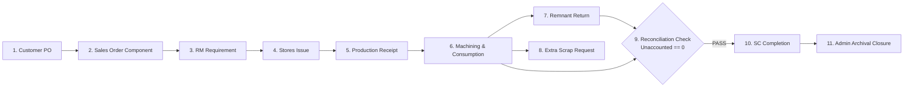
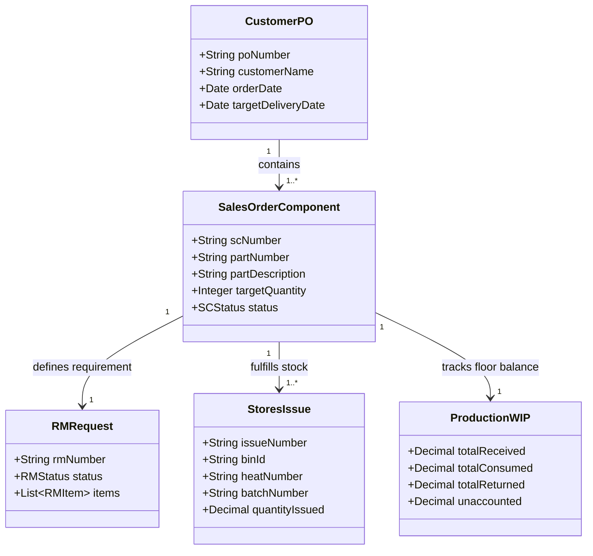
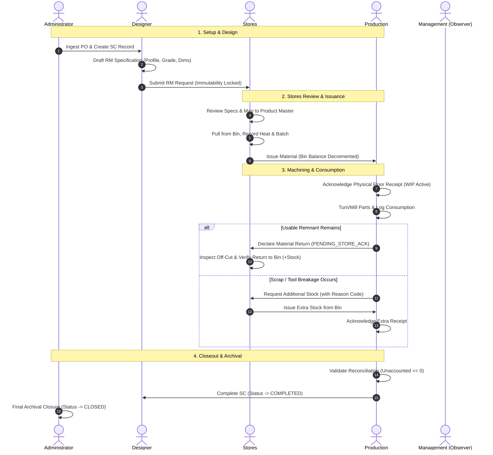
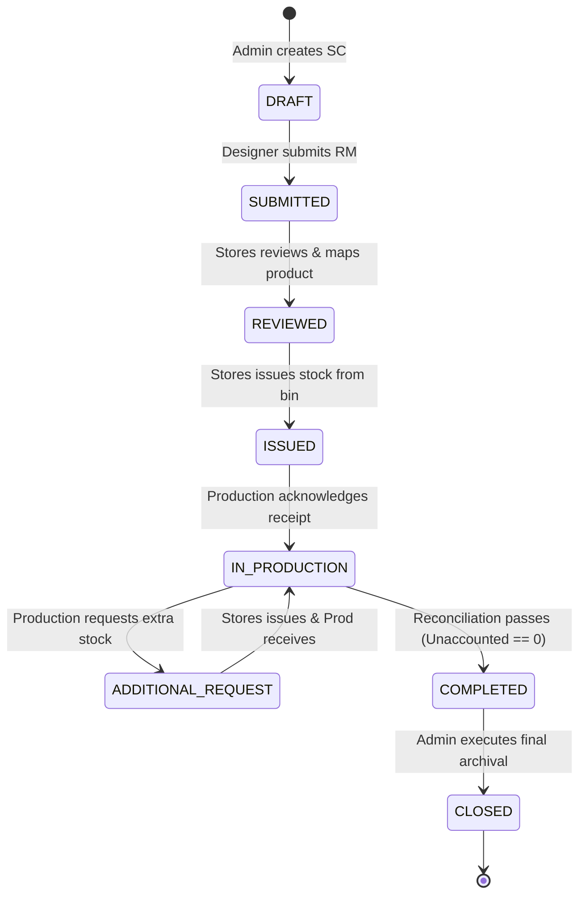
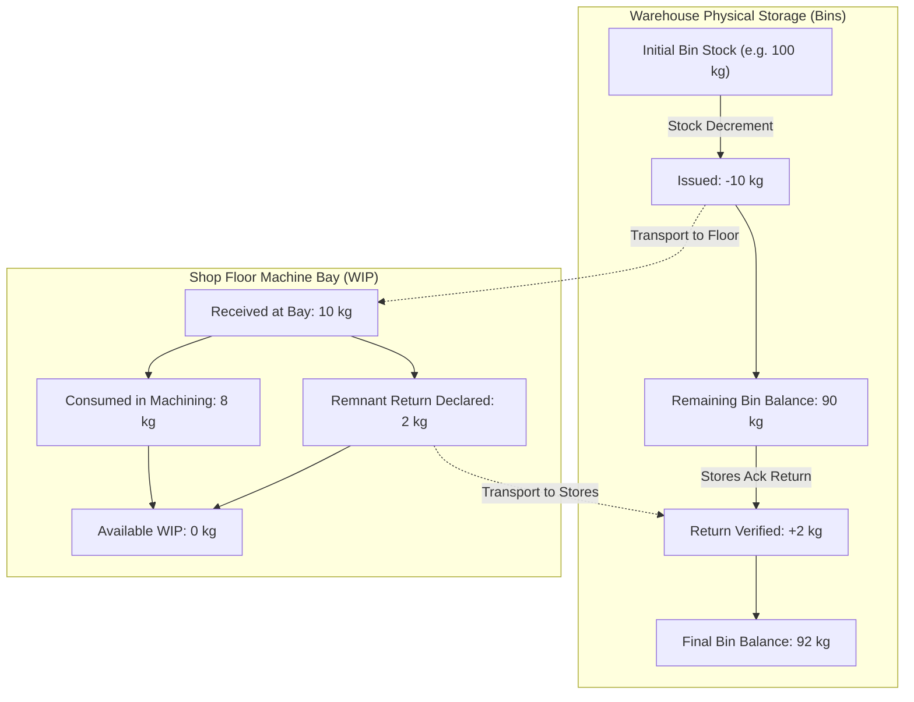
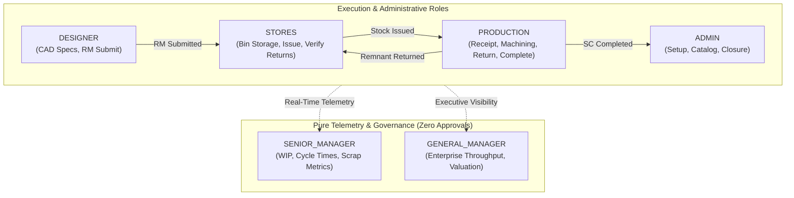
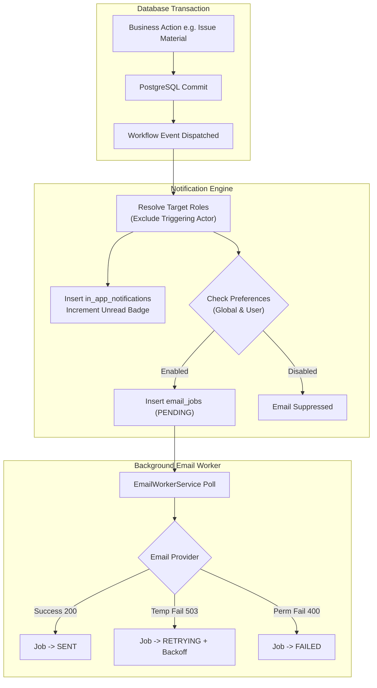
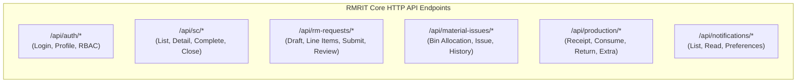

# RMRIT — COMPLETE END-TO-END BUSINESS & OPERATIONAL WORKFLOW REPORT
**Document Type**: Authoritative Manufacturing Workflow & Operational Lifecycle Reference  
**System Baseline**: Phase 16.12 Hardened Architecture Freeze  
**Application**: RMRIT (Raw-Material Requirements & Inventory Traceability System)  
**Target Audience**: Factory Operations, Design Engineering, Warehouse Management, Production Supervisors, QA/QC, Executives & Software Developers  

---

## 1. Executive Summary & Core Manufacturing Domain Overview

### 1.1 What is RMRIT?
**RMRIT** (*Raw-Material Requirements & Inventory Traceability System*) is an enterprise-grade manufacturing operations platform purpose-built for precision machining, casting, and fabrication plants. It acts as the **single source of truth and digital chain of custody** for every piece of raw metal entering the facility—from raw bar/plate receiving, CAD dimensioning, warehouse bin allocation, shop-floor machine turning/milling, scrap/off-cut accounting, to final component dispatch.

### 1.2 The Industrial Problem Solved
Traditional manufacturing plants suffer from critical operational vulnerabilities:
1. **Material Grade Mismatches**: Machinists inadvertently cutting incorrect steel alloys (e.g. standard mild steel vs. hardened tool steel `EN31`/`OHNS`).
2. **Unaccounted Off-Cut Remnants**: Expensive off-cuts and end-pieces abandoned on shop floors or scrapped without inventory re-entry.
3. **Ghost Inventory**: Discrepancies between physical shelf stock and office spreadsheets causing machine downtime.
4. **Approval Bottlenecks**: Bureaucratic approval chains halting multi-million-dollar CNC machinery.
5. **PO-Level Coupling**: A single delayed casting blocking shipping or administrative completion for all other parts on a commercial order.

### 1.3 Key Architectural Principles in RMRIT
- **Independent Component Lifecycle**: Each Sales Order Component (`SC`) progresses autonomously from its parent `PO`.
- **Zero-Approval Flow**: Direct submission from Engineering to Stores eliminates unnecessary middle-management delays.
- **Requirement Immutability**: Once an RM request is submitted, specifications are permanently frozen.
- **Strict Separation of Balances**: Warehouse Bin Inventory and Shop-Floor Work-In-Process (WIP) are mathematically decoupled to prevent double-deductions.
- **Zero-Loss Conservation**: An SC cannot complete until every milligram of issued metal is mathematically accounted for (`Received = Consumed + Returned`).

---

## 2. Structural Hierarchy: PO vs. SC Independence

### 2.1 PO vs. SC Distinction Matrix

| Dimension | Customer Purchase Order (`PO`) | Sales Order Component (`SC`) |
| :--- | :--- | :--- |
| **Business Scope** | Commercial contract with the customer (e.g. `PO-2026-089`). | Specific physical machined/fabricated part (e.g. `SC-001: Shaft Pinion`). |
| **Cardinality** | 1 PO contains 1 to $N$ independent SCs. | Each SC belongs to exactly 1 PO. |
| **Material Linkage** | Has no raw material requirements, bins, or WIP. | Possesses its own RM request, stores issuances, and floor WIP. |
| **Lifecycle Independence** | Archival container; does not block individual parts. | Completes, reconciles, and archives **100% independently**. |
| **Example Scenario** | Customer orders 50 Pinions (`SC-001`) and 50 Flanges (`SC-002`). | `SC-001` completes in 2 days; `SC-002` waits for raw castings without blocking `SC-001`. |

---

## 3. End-to-End Operational Lifecycle (Stages 1 through 13)

---

### Stage 1: Customer PO Ingestion & SC Schedule Setup
- **Actor**: `ADMIN`
- **Actions**:
  1. Ingests customer commercial contract (`PO-2026-901`) with delivery schedules and total ordered quantities.
  2. Creates discrete Sales Order Components (`SC-001: Shaft Drive Pinion`, `SC-002: Gear Housing`).
  3. Assigns lead Design Engineers and target manufacturing dates.
- **State**: SC initialized in `DRAFT` status.

---

### Stage 2: Engineering RM Specification Drafting
- **Actor**: `DESIGNER`
- **Actions**:
  1. Opens assigned SC in `Design RM List`.
  2. Clicks **Create RM Request** (initializes container in `DRAFT`).
  3. Adds dimensional line items derived from CAD drawings:
     - *Profile*: Round Bar, Flat Bar, Plate, Hollow Tube, Hex Bar, Custom Casting.
     - *Alloy Grade*: `EN31`, `OHNS`, `SS304`, `MS`, `EN8`, `Aluminium 6061`.
     - *Dimensions*: Diameter ($\varnothing 50\,\text{mm}$), Length ($250\,\text{mm}$), Thickness, Width.
     - *Quantity*: 10 units.
     - *Calculated Weight*: $3.85\,\text{kg/pc}$ (Total: $38.5\,\text{kg}$).
  4. Attaches official 2D/3D CAD drawing PDF (`DWG-SDP-001.pdf`).
- **Validation**: All line item parameters are fully editable in `DRAFT`.

---

### Stage 3: RM Submission & Immutability Lock (Zero-Approval Gate)
- **Actor**: `DESIGNER`
- **Actions**:
  1. Clicks **Submit RM Request**.
  2. System validates: Request is in `DRAFT` and contains $\ge 1$ valid line item.
  3. **Immutability Lock**: The RM record transitions to `SUBMITTED`, permanently locking profile, alloy grade, dimensions, and quantities against any future direct modification.
  4. Parent SC status updates to `SUBMITTED`.
  5. **Notification Dispatch**: In-app alert and optional email queued for all active `STORES` personnel: *"RM Request Submitted for SC-001"*. (Designer is excluded from self-notification).

---

### Stage 4: Stores Technical Review & Product Master Mapping
- **Actor**: `STORES`
- **Actions**:
  1. Opens pending queue in `Stores Workspace`.
  2. Performs technical review of requested alloy and dimensions against catalog stock.
  3. Maps generic CAD specifications to internal inventory product catalog items (`PROD-EN31-R50`).
  4. Clicks **Review RM Request**.
  5. RM status transitions to `REVIEWED`; SC status transitions to `REVIEWED`.

---

### Stage 5: Warehouse Bin Selection & Heat/Batch Traceability
- **Actor**: `STORES`
- **Actions**:
  1. Navigates to physical warehouse storage: `Warehouse 1` $\rightarrow$ `Bay B` $\rightarrow$ `Rack 02` $\rightarrow$ `Bin B2-01`.
  2. Inspects live bin balances to confirm sufficient physical stock.
  3. Retrieves the steel mill test certificate and inspects physical stamped markings on the bar:
     - **Heat Number**: `#HT-99214` (Foundry melt reference).
     - **Batch Number**: `#B-2026-08` (Supplier receiving lot).

---

### Stage 6: Material Issuance & Atomic Stock Decrement
- **Actor**: `STORES`
- **Actions**:
  1. Enters issuance quantity ($10\,\text{units}$ / $38.5\,\text{kg}$), selected bin ID, heat number, and batch number.
  2. Clicks **Issue Material**.
  3. **Atomic Database Execution**:
     - PostgreSQL transaction verifies `bin_balance >= issue_quantity`.
     - Bin balance is decremented immediately: $\text{Balance}_{\text{new}} = \text{Balance}_{\text{old}} - \text{Quantity}$.
     - Immutable `STORES_ISSUE` stock transaction log is created.
     - SC status updates to `ISSUED`.
  4. **Notification Dispatch**: Alert sent to `PRODUCTION`, `SENIOR_MANAGER`, and `GENERAL_MANAGER`: *"Material Issued for SC-001"*.

---

### Stage 7: Production Floor Physical Verification & Receipt
- **Actor**: `PRODUCTION`
- **Actions**:
  1. Machine operator receives pickup notification, travels to Stores / Machine Bay, and inspects delivered bar stock.
  2. Opens RMRIT and clicks **Acknowledge Receipt**.
  3. **Floor Balance Activation**:
     - SC status transitions to `IN_PRODUCTION`.
     - The issued metal becomes active **Work-In-Process (WIP)** at the machine center.
     - **Zero Warehouse Impact**: Warehouse bin balance was already decremented at Stage 6; floor receipt does not alter warehouse inventory.

---

### Stage 8: Machining Execution & WIP Consumption Logging
- **Actor**: `PRODUCTION`
- **Actions**:
  1. Machinist sets up tooling and turns 8 drive pinions on Lathe #02.
  2. Clicks **Record Consumption**, enters $8\,\text{pieces}$, and inputs machine run notes.
  3. **System Ledger**:
     - `MaterialConsumption` record is logged against the SC.
     - Available floor WIP decrements from 10 to 2.
     - **Zero Warehouse Impact**: Inventory balances in warehouse bins remain untouched.

---

### Stage 9: Scrap / Shortage Exception Channel (Additional Material Request)
- **Actor**: `PRODUCTION` $\rightarrow$ `STORES`
- **Scenario**: A casting subsurface void or tool crash ruins 2 bars during turning.
- **Actions**:
  1. Operator clicks **Request Additional Material**.
  2. Enters requested quantity ($2\,\text{pieces}$) and selects mandatory justification reason code:
     - `SCRAP_ERROR` (Operator error or machine tool crash).
     - `DEFECTIVE_RAW_MATERIAL` (Internal foundry void or crack).
     - `DRAWING_CHANGE` (Engineering drawing revision).
     - `ADDITIONAL_REQUIREMENT` (Sample pieces or QA testing).
  3. SC moves to `ADDITIONAL_REQUEST`.
  4. Stores issues extra stock from a bin with heat/batch numbers.
  5. Production acknowledges receipt; total received WIP increases accordingly.
- **Audit Benefit**: The original RM request baseline is protected; scrap costs are tracked distinctly for management analytics.

---

### Stage 10: Remnant Off-Cut Return (Two-Stage Verification)
- **Actor**: `PRODUCTION` $\rightarrow$ `STORES`
- **Scenario**: 2 full unused bars or usable off-cut lengths remain after completing the batch.
- **Actions**:
  1. **Declaration by Production**:
     - Operator enters 2 units in **Return Material** form.
     - `MaterialReturn` record is created in `PENDING_STORE_ACK` status.
     - *Stock balance is NOT yet restored* (metal is physically on a transport cart).
  2. **Verification by Stores**:
     - Stores staff physically inspects the returned bars/off-cuts for damage and grade stamps.
     - Selects destination storage bin (`BIN-B2-01` or `BIN-SCRAP-01`).
     - Clicks **Verify Return**.
     - System increments the destination bin balance ($+2\,\text{units}$), logs `RETURN` stock transaction, and marks the return `ACKNOWLEDGED`.

---

### Stage 11: Quantitative Material Reconciliation & Zero-Loss Conservation
- **Engine**: Automated Pre-Closeout Calculation
- **Conservation Formula**:
  $$\text{Unaccounted Quantity} = \text{Total Received} - (\text{Total Consumed} + \text{Total Returned})$$
- **Example Validation**:
  $$\text{Unaccounted} = 10 - (8 + 2) = 0.000\,\text{kg} \implies \mathbf{BALANCED}$$

---

### Stage 12: Production Component Completion Closeout
- **Actor**: `PRODUCTION`
- **Actions**:
  1. Operator clicks **Complete SC**.
  2. **System Verification Gates**:
     - **Gate 1**: No pending Additional Material Requests exist.
     - **Gate 2**: No `MaterialReturn` records remain in `PENDING_STORE_ACK`.
     - **Gate 3**: $\text{Unaccounted Quantity} == 0$.
  3. Upon passing all 3 gates, SC status transitions to `COMPLETED`.
  4. Notifications dispatched to `DESIGNER`, `SENIOR_MANAGER`, and `GENERAL_MANAGER`.

---

### Stage 13: Final Administrative Archival Closure
- **Actor**: `ADMIN`
- **Actions**:
  1. QA completes dimensional inspection reports and shipping manifests.
  2. Admin clicks **Close SC**.
  3. SC transitions to `CLOSED` status.
  4. The component record, material issuances, consumption history, and heat number traceability become permanently immutable and archived.

---

## 4. State Machine Matrix

### 4.1 Sales Order Component (`SC`) Status Transitions

| Current Status | Allowed Next Status | Permitted Role | Triggering Action / Event | Validation Rules |
| :--- | :--- | :--- | :--- | :--- |
| `DRAFT` | `SUBMITTED` | `DESIGNER` | Submit RM Request | RM contains $\ge 1$ line item |
| `SUBMITTED` | `REVIEWED` | `STORES` | Review RM Request | All items mapped to catalog products |
| `REVIEWED` | `ISSUED` | `STORES` | Issue Material | Bin balance $\ge$ issue quantity |
| `ISSUED` | `IN_PRODUCTION`| `PRODUCTION` | Acknowledge Receipt | Physical delivery verified |
| `IN_PRODUCTION` | `ADDITIONAL_REQUEST` | `PRODUCTION` | Request Extra Material | Valid justification reason code |
| `ADDITIONAL_REQUEST`| `IN_PRODUCTION` | `STORES`/`PROD` | Issue & Acknowledge Extra | Extra stock received on floor |
| `IN_PRODUCTION` | `COMPLETED` | `PRODUCTION` | Complete SC | Unaccounted $== 0$; zero pending returns/requests |
| `COMPLETED` | `CLOSED` | `ADMIN` | Close SC | Component finished and audited |

---

## 5. Quantitative Conservation & Balance Decoupling

### 5.1 The Two Disjoint Stock Realms

1. **Warehouse Inventory Balance (`bin_products.current_stock`)**:
   - Decrements **only** on `STORES_ISSUE` (Stage 6).
   - Increments **only** on `RETURN` acknowledgment by Stores (Stage 10).
   - **Never affected** by floor receipt, machining consumption, or scrap declarations.

2. **Floor Work-In-Process (`production_wip`)**:
   - Increases upon `Acknowledge Receipt` of issued stock.
   - Decreases as parts are turned (`Record Consumption`) and remnants are sent back (`Return Material`).
   - **Never causes double-deductions** in warehouse bins.

---

## 6. Complete Role & Permission Governance Matrix

| Operational Action | `DESIGNER` | `STORES` | `PRODUCTION` | `SENIOR_MANAGER` | `GENERAL_MANAGER` | `ADMIN` |
| :--- | :---: | :---: | :---: | :---: | :---: | :---: |
| **Create PO / SC** | ❌ | ❌ | ❌ | 👁️ (View Only) | 👁️ (View Only) | ✅ **Full Control** |
| **Draft RM Specifications** | ✅ **Author** | ❌ | ❌ | 👁️ (View Only) | 👁️ (View Only) | ✅ **Full Control** |
| **Submit RM Request** | ✅ **Submit** | ❌ | ❌ | 👁️ (View Only) | 👁️ (View Only) | ✅ **Full Control** |
| **Review & Map Product Master** | ❌ | ✅ **Review** | ❌ | 👁️ (View Only) | 👁️ (View Only) | ✅ **Full Control** |
| **Issue Material from Bins** | ❌ | ✅ **Issue** | ❌ | 👁️ (View Only) | 👁️ (View Only) | ✅ **Full Control** |
| **Acknowledge Floor Receipt** | ❌ | ❌ | ✅ **Receive** | 👁️ (View Only) | 👁️ (View Only) | ✅ **Full Control** |
| **Record Machining Consumption** | ❌ | ❌ | ✅ **Log** | 👁️ (View Only) | 👁️ (View Only) | ✅ **Full Control** |
| **Declare Remnant Return** | ❌ | ❌ | ✅ **Declare** | 👁️ (View Only) | 👁️ (View Only) | ✅ **Full Control** |
| **Verify & Credit Return to Bin**| ❌ | ✅ **Verify** | ❌ | 👁️ (View Only) | 👁️ (View Only) | ✅ **Full Control** |
| **Request Additional Material** | ❌ | ❌ | ✅ **Request** | 👁️ (View Only) | 👁️ (View Only) | ✅ **Full Control** |
| **Complete SC (Reconciliation)** | ❌ | ❌ | ✅ **Complete** | 👁️ (View Only) | 👁️ (View Only) | ✅ **Full Control** |
| **Final SC Archival Closure** | ❌ | ❌ | ❌ | 👁️ (View Only) | 👁️ (View Only) | ✅ **Archive** |

---

## 7. Dual-Channel Notification & Worker Architecture

### 7.1 Notification Event Catalog

| Event Code | Triggering Action | Target Recipients | Actor Excluded? | In-App Message Format |
| :--- | :--- | :--- | :---: | :--- |
| `RM_SUBMITTED` | Designer submits RM | `STORES` | Yes | *"RM Request Submitted for SC: {scNumber}"* |
| `MATERIAL_ISSUED` | Stores issues from bin | `PRODUCTION`, `SENIOR_MANAGER`, `GENERAL_MANAGER` | Yes | *"Material Issued for SC: {scNumber}"* |
| `ADDITIONAL_MATERIAL_REQUESTED` | Production requests extra | `STORES`, `SENIOR_MANAGER`, `GENERAL_MANAGER` | Yes | *"Additional Material Request created for SC: {scNumber}"* |
| `SC_COMPLETED` | Production completes part | `DESIGNER`, `SENIOR_MANAGER`, `GENERAL_MANAGER` | Yes | *"SC Completed: {scNumber}"* |

---

## 8. Failure Recovery, Idempotency & Security Matrix

| Threat / Failure Scenario | Architectural Mitigation | System Behavior & Data Guarantee |
| :--- | :--- | :--- |
| **Rapid Double-Click on Submit/Issue** | Client & Server Idempotency Keys | Deduplicated at database/service layer; exactly 1 record & 1 notification generated. |
| **Negative Bin Stock Attempt** | Check Constraint & Transaction Locks | Transaction rolls back with HTTP 400 (*"Insufficient stock in bin"*); stock never goes $< 0$. |
| **Premature SC Completion Attempt** | Reconciliation Gate Check | Rejected with HTTP 400 (*"Unaccounted metal remains: X kg"*); closeout blocked. |
| **Email Service Provider Outage (503)** | Async Worker & Exponential Backoff | Database transaction remains committed; in-app alerts active; email retried up to 3 times. |
| **Unauthorized User Action (IDOR)** | NestJS JWT Guards & Role Decorators | HTTP 403 Forbidden; users cannot read or mutate entities outside their role or ownership. |

---

## 9. Core Backend API Endpoint Reference

| HTTP Method | Route | Required Role | Description |
| :--- | :--- | :--- | :--- |
| `POST` | `/api/auth/login` | Public | Authenticates credentials, returns signed JWT. |
| `POST` | `/api/rm-requests` | `DESIGNER`, `ADMIN` | Initializes RM request container in `DRAFT`. |
| `POST` | `/api/rm-requests/:id/items` | `DESIGNER`, `ADMIN` | Adds dimensional line item to draft RM. |
| `POST` | `/api/rm-requests/:id/submit` | `DESIGNER`, `ADMIN` | Submits RM request; freezes line items permanently. |
| `POST` | `/api/rm-requests/:id/review` | `STORES`, `ADMIN` | Reviews RM and maps specifications to product master. |
| `POST` | `/api/material-issues` | `STORES`, `ADMIN` | Issues stock from bin with heat/batch #; decrements bin stock. |
| `POST` | `/api/production/receipt` | `PRODUCTION`, `ADMIN`| Acknowledges physical delivery at machine bay; activates WIP. |
| `POST` | `/api/production/consumption`| `PRODUCTION`, `ADMIN`| Logs machined parts against active WIP balance. |
| `POST` | `/api/production/returns` | `PRODUCTION`, `ADMIN`| Declares remnant off-cut return (`PENDING_STORE_ACK`). |
| `POST` | `/api/material-returns/:id/ack`| `STORES`, `ADMIN` | Inspects and verifies return; credits destination bin balance. |
| `POST` | `/api/production/additional-requests`| `PRODUCTION`, `ADMIN`| Requests extra raw stock with mandatory reason code. |
| `POST` | `/api/sc/:id/complete` | `PRODUCTION`, `ADMIN`| Executes reconciliation checks and marks SC `COMPLETED`. |
| `POST` | `/api/sc/:id/close` | `ADMIN` | Executes final archival closure of the completed SC. |
| `GET` | `/api/notifications` | Authenticated | Retrieves user notifications with unread count. |
| `PATCH`| `/api/notifications/:id/read`| Authenticated | Marks notification as read. |

---

## 10. Operational Summary & Certification Sign-Off

The RMRIT business and operational workflow represents a hardened, zero-loss manufacturing lifecycle:
- **Commercial Ingestion** cleanly partitions customer orders into isolated, trackable components.
- **Engineering Requisitions** lock definitively upon submission with zero bureaucratic approval delay.
- **Warehouse Management** provides strict bin-level physical stock deduction and metallurgical heat/batch traceability.
- **Shop-Floor Machining** strictly separates Work-In-Process from warehouse storage, enforcing mathematical zero-loss reconciliation before completion.
- **Administrative Governance** preserves an immutable, auditable historical record for every manufactured component.

**Report Status**: **OFFICIALLY CERTIFIED & PRODUCTION READY**  
**Architecture Baseline**: Phase 16.12 Hardened Architecture Freeze
