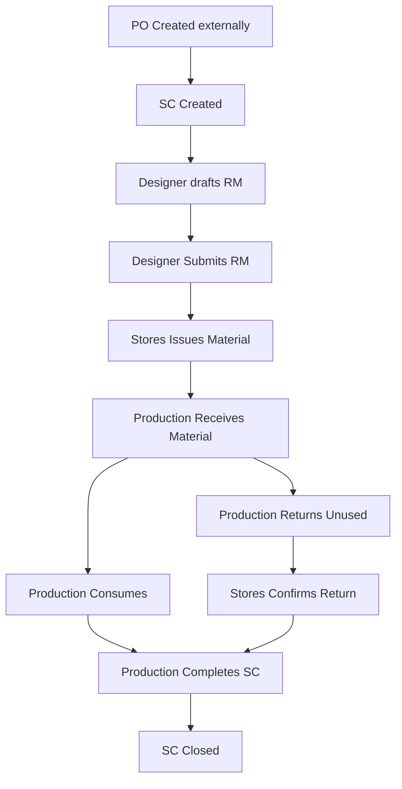
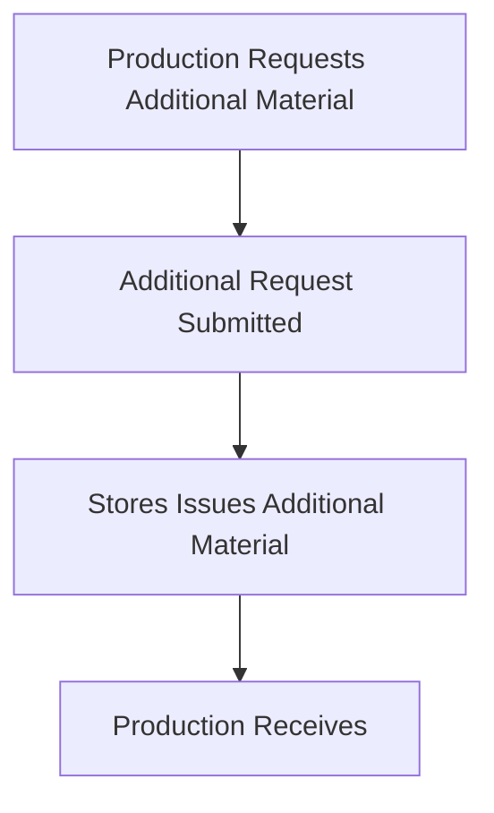

# BUSINESS WORKFLOW & STATE DESIGN

**Status: FINAL PHASE 2.3 DESIGN**

## 1. Primary Workflow Diagram
The overarching RMRIT lifecycle for material requirement and production fulfillment:

## 2. RM States
RM Requests follow a strict one-way state progression.

| State | Who Transitions | Trigger | Immutable? |
|---|---|---|---|
| **DRAFT** | Designer | RM is created | No. Items can be added, updated, removed. |
| **SUBMITTED** | Designer | Designer clicks "Submit" | Yes. RM items and quantities become immutable. |
| **PARTIAL_ISSUE** | Stores | Stores issues < 100% of material | Partial. Issue records added. Original RM locked. |
| **ISSUED** | Stores | Stores issues 100% of material | Yes. |

*(Note: There are no `VERIFICATION_PENDING` or `REJECTED` states. Submissions flow directly to Stores).*

## 3. SC States
An SC represents an independent production schedule. It does NOT depend on the PO closing.

| State | Who Transitions | Trigger |
|---|---|---|
| **ACTIVE** | System | Automatically upon SC creation or receiving an RM. |
| **COMPLETED** | Production | Production explicitly clicks "Complete SC". |

- **SC Closure Rule**: SCs close completely independently. An open SC-002 does not prevent SC-001 from being closed under the same PO.

## 4. Material Issue & Lifecycle
The material transitions across distinct accounting buckets without rewriting original requirements:

1. **Requested**: The quantity requested by the Designer on the RM.
2. **Available**: Live value queried from the authoritative Inventory backend.
3. **Issued**: Material explicitly checked out by Stores (reduces Inventory via `STOCK_OUT`). Multiple partial issue transactions are supported per RM line item.
4. **Received**: The quantity Production physically acknowledges receiving from Stores.

## 5. Production Accounting
Production is responsible for tracking material post-receipt. The system relies entirely on user-entered metrics and never auto-assumes consumption.

- **Quantity Constraint Rule**: `Consumed + Returned <= Total Received`
- **Unaccounted Material Formula**: `Unaccounted = Received - Consumed - Returned`

If `Consumed + Returned > Received`, the system rejects the transaction.
Return Confirmation: Production submits a return, but it remains pending until Stores explicitly confirms receipt of the returned stock (generating a `STOCK_IN`).

## 6. Additional Material Workflow
If Production runs out of material (due to wastage, damage, manufacturing errors, or under-estimation), they initiate a separate workflow:

- **Immutability Rule**: The original RM Request must remain exactly as the Designer submitted it. The extra material is strictly tied to a new `Additional Material Request` entity to preserve full traceability and explain *why* extra was needed.

## 7. Error / Exception Paths
The business rules support operational exceptions strictly through tracking, rather than blocking approvals:
- **Wastage / Damage / Manufacturing Error**: Logged as explicit consumption/loss types during the Production phase.
- **Stock Shortage**: Stores cannot fulfill the entire RM. State transitions to `PARTIAL_ISSUE`. Production can begin working on the partial stock while waiting for further issues.
- **No rejections**: If a Designer makes a mistake *after* submission, an administrative/workflow correction is required, as there is no standard "Reject back to Draft" approval loop.
