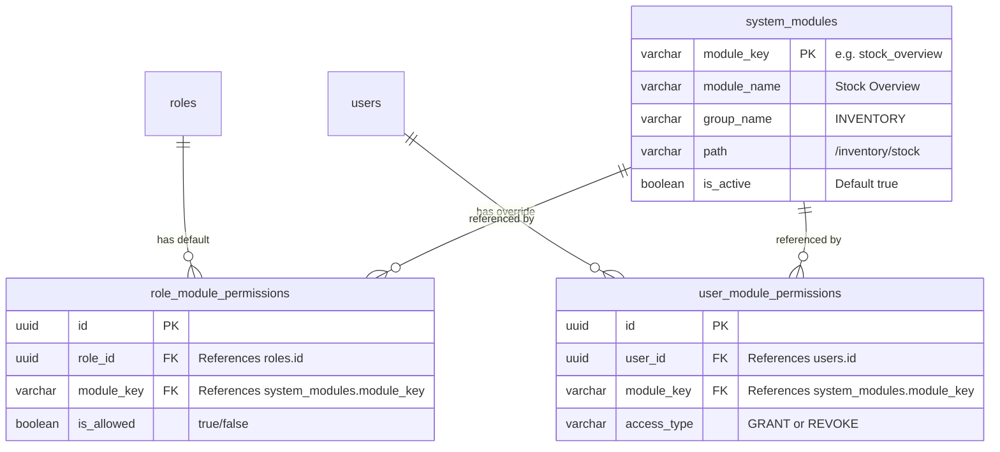

# Dynamic Role & User Module Access Control: Architectural Audit & Implementation Plan

> **Executive Status:** Proposal & Technical Design  
> **Prepared for:** RMRIT System Governance & Administration  
> **Scope:** Dynamic Module Assignment for Roles & Individual Users (e.g. Granting Inventory/Stock access to specific Designers)

---

## 1. Executive Summary & Gap Analysis

### 1.1 Current State (Static Hardcoded RBAC)
Today, access control in RMRIT is statically locked at compile-time:
* **Frontend Routing & Sidebar:** In `frontend/src/routeConfig.tsx`, each page defines a hardcoded array:
  ```typescript
  // Example from routeConfig.tsx
  { name: 'Stock Overview', path: '/inventory/stock', roles: ['STORES', 'ADMIN', 'SENIOR_MANAGER', 'GENERAL_MANAGER', 'DESIGNER'] }
  { name: 'Stock Movement', path: '/inventory/movements', roles: ['STORES', 'ADMIN'] }
  ```
  The sidebar (`Sidebar.tsx`) and route shield (`ProtectedRoute.tsx`) merely compare `currentUser.role` against this static array.
* **Backend Endpoint Guards:** Controllers use `@Roles(UserRole.STORES, UserRole.ADMIN)` evaluated by `RolesGuard`.
* **Database State:** The `roles` table only holds names (`ADMIN`, `STORES`, `PRODUCTION`, `DESIGNER`, `SENIOR_MANAGER`, `GENERAL_MANAGER`). There is **zero database persistence** for permissions or module assignments.
* **Administrative Limitation:** If an Admin wants a specific user (e.g., *"Designer 1"*) or a role to access the **Inventory / Stock** or **Delivery Challan** modules, they cannot do so through the UI. It requires editing TypeScript source code and redeploying.

### 1.2 Target State (Dynamic Access Control Matrix)
1. **Admin Authority:** System Administrators can dynamically grant or revoke access to any module for:
   * **Role Level:** Set default module permissions per system role.
   * **User Level:** Grant specific module overrides to individual users (e.g., Designer User "Kavitha" can be granted access to "Stock Overview" and "Stock Movement" without granting it to all Designers).
2. **Dynamic UI Rendering:** The Sidebar and routing automatically adapt in real-time based on the active user's effective permissions.
3. **Backend API Shielding:** APIs validate permissions dynamically, preventing unauthorized URL-direct navigation or payload submission.
4. **Intuitive Administrative UI:** An **Access Control Matrix** integrated directly into the `Users Master & Access Control` workspace (`/masters/users`).

---

## 2. Permission Model Architecture: 3 Options

| Model | How it Works | Pros | Cons | Recommendation |
| :--- | :--- | :--- | :--- | :--- |
| **Option A: Pure Role-Based (RBAC)** | Admin checks boxes per Role (e.g. All Designers get Stock). | Simple to understand. | Cannot grant access to *"Designer 1"* without granting to all designers. | Insufficient for user's explicit requirement. |
| **Option B: Pure User-Based (Direct)** | Every single user has their own list of allowed modules. | Maximum granularity. | High administrative overhead (setting up every new user from scratch). | Tedious for bulk users. |
| **Option C: Hybrid Role Defaults + User Overrides (Best Practice)** | 1. Roles have base module permissions.<br>2. Individual users inherit their role's modules by default.<br>3. Admin can grant extra modules or restrict modules per specific user. | • Solves *"Designer 1 gets Stock"* seamlessly.<br>• Sensible defaults for new accounts.<br>• Clean UI with inherit badge. | Slightly more tables/logic. | **Recommended (Industry Standard)** |

---

## 3. System Module Catalog (22 Core Modules)

To allow checkbox assignment, all system pages are cataloged into standardized module keys:

```mermaid
graph TD
    subgraph MODULE_GROUPS["System Module Groups"]
        RM["RM WORKFLOW"]
        INV["INVENTORY"]
        DC["DELIVERY CHALLAN"]
        GOV["GOVERNANCE"]
        MST["MASTERS"]
        REP["REPORTS & OVERVIEW"]
    end

    RM --> M1["rm_creation (RM Creation)"]
    RM --> M2["rm_requisitions (My Requisitions)"]
    RM --> M3["rm_issue (Stores RM Issue)"]
    RM --> M4["extra_requests (Extra Requests)"]
    RM --> M5["return_verify (Return Verification)"]
    RM --> M6["production_rm (My RM)"]
    RM --> M7["consumption (Production Consumption)"]

    INV --> I1["stock_overview (Stock Overview)"]
    INV --> I2["stock_movements (Stock Movements)"]
    INV --> I3["supplier_inward (Supplier Inward / GRN)"]
    INV --> I4["msl_alerts (MSL Alerts)"]

    DC --> D1["dc_type1 (DC Type 1 - Process)"]
    DC --> D2["dc_type2 (DC Type 2 - General)"]
    DC --> D3["dc_returns (DC Returns)"]

    GOV --> G1["sc_traceability (SC Traceability)"]
    GOV --> G2["po_traceability (PO Traceability)"]
    GOV --> G3["vendor_slas (Vendor SLAs)"]
    GOV --> G4["vendor_analytics (Vendor Analytics)"]

    MST --> T1["users_master (Users & Access)"]
    MST --> T2["products_master (Products Master)"]
    MST --> T3["warehouses_master (Warehouses & Bins)"]
    MST --> T4["vendors_master (Vendors Master)"]
    MST --> T5["process_master (Process Master)"]

    REP --> R1["overview (Overview Dashboard)"]
    REP --> R2["enterprise_reports (Enterprise Reports)"]
```



---

## 4. Technical Architecture & Database Design

### 4.1 Relational Schema (PostgreSQL via Neon)



#### SQL Definition
```sql
-- 1. Master list of modules
CREATE TABLE system_modules (
    module_key VARCHAR(50) PRIMARY KEY,
    name VARCHAR(100) NOT NULL,
    group_name VARCHAR(50) NOT NULL,
    route_path VARCHAR(150) NOT NULL,
    description VARCHAR(255),
    sort_order INT DEFAULT 0
);

-- 2. Default permissions per Role
CREATE TABLE role_module_permissions (
    id UUID PRIMARY KEY DEFAULT gen_random_uuid(),
    role_id UUID NOT NULL REFERENCES roles(id) ON DELETE CASCADE,
    module_key VARCHAR(50) NOT NULL REFERENCES system_modules(module_key) ON DELETE CASCADE,
    is_allowed BOOLEAN NOT NULL DEFAULT true,
    created_at TIMESTAMP DEFAULT CURRENT_TIMESTAMP,
    CONSTRAINT uq_role_module UNIQUE (role_id, module_key)
);

-- 3. Granular overrides per User (allows "Designer 1 gets Stock")
CREATE TABLE user_module_permissions (
    id UUID PRIMARY KEY DEFAULT gen_random_uuid(),
    user_id UUID NOT NULL REFERENCES users(id) ON DELETE CASCADE,
    module_key VARCHAR(50) NOT NULL REFERENCES system_modules(module_key) ON DELETE CASCADE,
    access_type VARCHAR(10) NOT NULL CHECK (access_type IN ('GRANT', 'REVOKE')),
    created_at TIMESTAMP DEFAULT CURRENT_TIMESTAMP,
    CONSTRAINT uq_user_module UNIQUE (user_id, module_key)
);
```

### 4.2 Effective Permission Resolution Formula
When a user requests access:
$$\text{Effective Access} = \begin{cases}
\text{TRUE} & \text{if User is ADMIN} \\
\text{TRUE} & \text{if User Override} = \text{'GRANT'} \\
\text{FALSE} & \text{if User Override} = \text{'REVOKE'} \\
\text{TRUE} & \text{if Role has Permission and no User Override} \\
\text{FALSE} & \text{otherwise}
\end{cases}$$

---

## 5. Backend Implementation Plan

### 5.1 NestJS Service & Controller
Extend `backend/src/permissions/`:
* `GET /api/permissions/modules`: Returns all 22 system modules grouped.
* `GET /api/permissions/matrix`: Returns full role-by-module matrix for Admin view.
* `PUT /api/permissions/role/:roleId`: Bulk update allowed modules for a given role.
* `GET /api/permissions/user/:userId`: Returns effective permissions + specific overrides for a user.
* `PUT /api/permissions/user/:userId`: Set custom grants/revocations for an individual user.
* `GET /api/auth/me`: Updated to include `effectiveModules: string[]` in the session payload.

### 5.2 Dynamic Guard (`ModuleAccessGuard`)
* Create `@RequireModule('stock_overview')` decorator.
* The Guard checks if `currentUser.role === 'ADMIN'` (always passes) OR if `user.effectiveModules.includes(requiredModule)`.

---

## 6. Frontend UI / UX Plan

### 6.1 Users Master Workspace Integration (`/masters/users`)

```
┌────────────────────────────────────────────────────────────────────────────────────────────────────────┐
│ Users Master & Access Control                                                   [+ New User] [⚙ Role Matrix] │
│ Manage employee accounts, assign system roles, configure departments, and control active access.       │
│                                                                                                        │
│ [Search...                                                                ]                            │
│ ┌──────────────────────┬──────────────────────┬──────────────┬──────────────┬─────────────────────────┐│
│ │ USER / DEPARTMENT    │ EMAIL ADDRESS        │ ASSIGNED ROLE│ ACTIVE STATUS│ ACCESS PERMISSIONS     ││
│ ├──────────────────────┼──────────────────────┼──────────────┼──────────────┼─────────────────────────┤│
│ │ Ramesh (Designer 1)  │ designer@airtronic...│ [Designer ▾] │ [Active]     │ [⚙ Manage Access (3)]  ││
│ │ Stores Manager       │ stores@airtronic...  │ [Stores ▾]   │ [Active]     │ [⚙ Manage Access (7)]  ││
│ └──────────────────────┴──────────────────────┴──────────────┴──────────────┴─────────────────────────┘│
└────────────────────────────────────────────────────────────────────────────────────────────────────────┘
```

1. **New Action Column in Users Table:**
   * A button **`Manage Access`** next to Deactivate and Reset PWD.
   * Clicking opens an **Access Drawer / SlideOver Modal** showing all 22 modules categorized by group.
   * Checkboxes indicate:
     - 🔵 **Inherited from Role** (e.g. RM Creation, My Requisitions)
     - 🟢 **Custom Granted by Admin** (e.g. Stock Overview, Stock Movement checked for Designer 1)
     - ⚪ **Not Accessible**

2. **Top-Level `Role Matrix` Button:**
   * Opens an interactive spreadsheet-style grid: Rows = Modules, Columns = Roles (`ADMIN`, `DESIGNER`, `STORES`, `PRODUCTION`, `SENIOR_MANAGER`, `GENERAL_MANAGER`).
   * Admin can toggle checkboxes in 1 click and press "Save Matrix".

3. **Dynamic Sidebar & ProtectedRoute:**
   * `Sidebar.tsx`:
     ```typescript
     const navItems = ROUTE_CONFIG.filter(item => 
       currentUser?.role === 'ADMIN' || currentUser?.effectiveModules?.includes(item.moduleKey)
     );
     ```
   * Instantly reacts when Admin updates permissions without requiring the user to re-login.

---

## 7. Safety, Security & Admin Protections

1. **Admin Self-Lock Guard:**
   * The `ADMIN` role and Admin accounts are hard-coded to always retain access to all modules, specifically `users_master` and `permissions_matrix`. An admin cannot accidentally lock themselves out of the system.
2. **Backward Compatibility:**
   * If a module does not have an explicit DB record yet, the system falls back to the existing static `roles` defined in `routeConfig.tsx`.
3. **Audit Trail:**
   * Any change made by an Admin to role permissions or user overrides will log to the `audit_logs` table with actor, timestamp, and target user/role.

---

## 8. Phased Implementation Roadmap

* **Phase 1: Database Migration & Module Catalog Seed**
  - Create `system_modules`, `role_module_permissions`, and `user_module_permissions` tables.
  - Seed all 22 system modules and default mappings matching current roles.
* **Phase 2: Backend API & Permissions Service**
  - Implement `PermissionsService` and `PermissionsController` with endpoints for role matrix and user overrides.
  - Hydrate `authApi.getMe()` and JWT token with `effectiveModules`.
* **Phase 3: Frontend UI Components**
  - Build `UserAccessDrawer.tsx` (slide-over modal for per-user module grants).
  - Build `RolePermissionMatrixModal.tsx` (role-wide default matrix).
  - Update `UserMasterWorkspace.tsx` with "Manage Access" button.
* **Phase 4: Dynamic Navigation & Route Guards**
  - Connect `ROUTE_CONFIG` with `moduleKey`.
  - Update `Sidebar.tsx` and `ProtectedRoute.tsx` to read `effectiveModules`.
* **Phase 5: End-to-End Verification**
  - Test scenario: Log in as Admin -> Grant Designer 1 access to "Stock Overview" -> Log in as Designer 1 -> Verify "Stock Overview" appears in sidebar and opens successfully.
