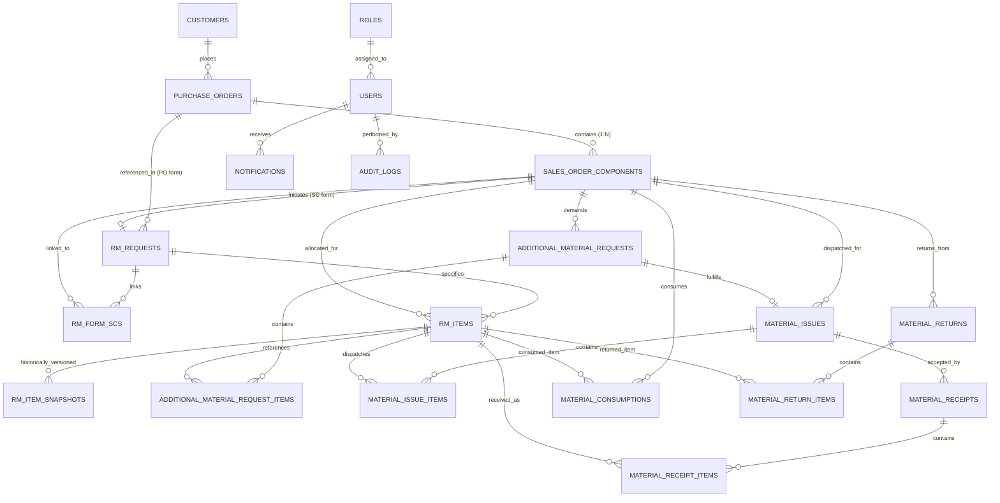

# RMRIT System — Database Design & Schema Architecture

## 1. Entity Relationship Diagram (ERD)

---

## 2. Table Descriptions & Schemas (20 Entities)

### 2.1 Identity & Access

1. **`roles`**: System roles (`ADMIN`, `DESIGNER`, `STORES`, `PRODUCTION`, `SENIOR_MANAGER`, `GENERAL_MANAGER`).
2. **`users`**: System actors with hashed credentials, department, and active status.

### 2.2 Commercial Core

3. **`customers`**: External client metadata (`name`, `code`, `contact_person`, `email`).
4. **`purchase_orders`**: PO external grouping reference (`po_number` UNIQUE, `customer_id`).
5. **`sales_order_components`**: Primary independent work unit (`sc_number`, `po_id`, `status`, `completed_at`, `completed_by_id`, `completion_remarks`).

### 2.3 Raw Material Specifications & Revisions

6. **`rm_requests`**: Central form header supporting Option A (`SC`) and Option B (`PO`). Directly submitted to Stores (`DRAFT`, `SUBMITTED`, `COMPLETED`).
7. **`rm_form_scs`**: Junction entity linking multiple SCs to a PO-level RM form.
8. **`rm_items`**: Dimensional material requirements (`material`, `material_type`, `grade`, `size`, `quantity`, `length`, `width`, `thickness`, `diameter`, `weight`).
9. **`rm_item_snapshots`**: Immutable revision ledger capturing designer submissions and revisions.

### 2.4 Material Movement Ledgers

10. **`additional_material_requests`**: Scrap/re-work header with reason codes (`ADDITIONAL_REQUIREMENT`, `DAMAGE`, `WASTAGE`, `MANUFACTURING_ERROR`, `OTHER`).
11. **`additional_material_request_items`**: Additional request line items with requested and approved quantities.
12. **`material_issues`**: Stores dispatch slip header supporting `INITIAL_ISSUE` and `ADDITIONAL_ISSUE`.
13. **`material_issue_items`**: Physical dispatch line items with heat numbers and batch traceability.
14. **`material_receipts`**: Shop floor physical receipt header with discrepancy tracking (`RECEIVED`, `PARTIAL`, `DISCREPANCY`).
15. **`material_receipt_items`**: Shop floor received quantities.
16. **`material_consumptions`**: Operator material machining logs.
17. **`material_returns`**: Return slip header with Stores acknowledgment tracking (`PENDING_STORE_ACK`, `ACKNOWLEDGED`, `REJECTED`).
18. **`material_return_items`**: Scrap/leftover material quantities returned to Stores.

### 2.5 Compliance & System

19. **`notifications`**: Lightweight targeted event notifications (`user_id`, `title`, `message`, `type`, `target_entity`, `target_id`, `is_read`).
20. **`audit_logs`**: Immutable, append-only digital paper trail with JSONB `old_values`, `new_values`, and `metadata`.

---

## 3. Workflow Status Definitions & Enums

| Enum Type               | Allowed Values                                                                                                           | Usage / Context                                        |
| :---------------------- | :----------------------------------------------------------------------------------------------------------------------- | :----------------------------------------------------- |
| **`ScStatus`**          | `DRAFT`, `SUBMITTED`, `STORES_PENDING`, `PARTIALLY_ISSUED`, `ISSUED`, `IN_PRODUCTION`, `ADDITIONAL_REQUEST`, `COMPLETED` | Tracks component work unit lifecycle.                  |
| **`FormType`**          | `SC`, `PO`                                                                                                               | Identifies single-SC or multi-SC batch form.           |
| **`RmRequestStatus`**   | `DRAFT`, `SUBMITTED`, `COMPLETED`                                                                                        | RM form lifecycle state (direct submission to Stores). |
| **`MaterialIssueType`** | `INITIAL_ISSUE`, `ADDITIONAL_ISSUE`                                                                                      | Dispatches for primary demand vs additional approvals. |
| **`ReceiptStatus`**     | `RECEIVED`, `PARTIAL`, `DISCREPANCY`                                                                                     | Shop floor delivery verification.                      |
| **`ReturnStatus`**      | `PENDING_STORE_ACK`, `ACKNOWLEDGED`, `REJECTED`                                                                          | Stores return acknowledgment workflow.                 |
| **`AdditionalReason`**  | `ADDITIONAL_REQUIREMENT`, `DAMAGE`, `WASTAGE`, `MANUFACTURING_ERROR`, `OTHER`                                            | Structured defect/scrap categorization.                |

---

## 4. Integrity Constraints & Invariants

1. **Unique Constraints**:
   - `purchase_orders.po_number` UNIQUE
   - `sales_order_components(po_id, sc_number)` COMPOSITE UNIQUE
   - `rm_form_scs(rm_form_id, sc_id)` COMPOSITE UNIQUE
   - `material_issues.issue_number` UNIQUE
2. **PostgreSQL Check Constraints**:
   - Positive quantities on all line items (`quantity > 0`, `quantity_issued > 0`, `quantity_received > 0`, `quantity_returned > 0`).
   - Non-negative consumption quantities (`consumed_quantity >= 0`).
3. **Mass Conservation Invariant**:
   $$\text{Consumed} + \text{Returned} \le \text{Received}$$
   $$\text{Floor Scrap} = \text{Received} - (\text{Consumed} + \text{Returned})$$
