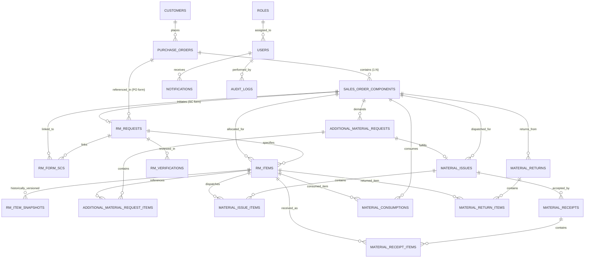

# RMRIT System — Database Design & Schema Architecture

## 1. Entity Relationship Diagram (ERD)

---

## 2. Table Descriptions & Schemas (21 Entities)

### 2.1 Identity & Access

1. **`roles`**: System roles (`ADMIN`, `DESIGNER`, `SENIOR_MANAGER`, `STORES_MANAGER`, `PRODUCTION`).
2. **`users`**: System actors with hashed credentials, department, and active status.

### 2.2 Commercial Core

3. **`customers`**: External client metadata (`name`, `code`, `contact_person`, `email`).
4. **`purchase_orders`**: PO external grouping reference (`po_number` UNIQUE, `customer_id`).
5. **`sales_order_components`**: Primary independent work unit (`sc_number`, `po_id`, `status`, `completed_at`, `completed_by_id`, `completion_remarks`).

### 2.3 Raw Material Specifications & Revisions

6. **`rm_requests`**: Central form header supporting Option A (`SC`) and Option B (`PO`).
7. **`rm_form_scs`**: Junction entity linking multiple SCs to a PO-level RM form.
8. **`rm_items`**: Dimensional material requirements (`material`, `material_type`, `grade`, `size`, `quantity`, `length`, `width`, `thickness`, `diameter`, `weight`).
9. **`rm_verifications`**: Senior Manager verification decisions (`PENDING`, `APPROVED`, `REVISED`, `REJECTED`).
10. **`rm_item_snapshots`**: Immutable revision ledger capturing designer original submissions vs senior modifications.

### 2.4 Material Movement Ledgers

11. **`additional_material_requests`**: Scrap/re-work header with reason codes (`ADDITIONAL_REQUIREMENT`, `DAMAGE`, `WASTAGE`, `MANUFACTURING_ERROR`, `OTHER`).
12. **`additional_material_request_items`**: Additional request line items with requested and approved quantities.
13. **`material_issues`**: Stores dispatch slip header supporting `INITIAL_ISSUE` and `ADDITIONAL_ISSUE`.
14. **`material_issue_items`**: Physical dispatch line items with heat numbers and batch traceability.
15. **`material_receipts`**: Shop floor physical receipt header with discrepancy tracking (`RECEIVED`, `PARTIAL`, `DISCREPANCY`).
16. **`material_receipt_items`**: Shop floor received quantities.
17. **`material_consumptions`**: Operator material machining logs.
18. **`material_returns`**: Return slip header with Stores acknowledgment tracking (`PENDING_STORE_ACK`, `ACKNOWLEDGED`, `REJECTED`).
19. **`material_return_items`**: Scrap/leftover material quantities returned to Stores.

### 2.5 Compliance & System

20. **`notifications`**: Lightweight targeted event notifications (`user_id`, `title`, `message`, `type`, `target_entity`, `target_id`, `is_read`).
21. **`audit_logs`**: Immutable, append-only digital paper trail with JSONB `old_values`, `new_values`, and `metadata`.

---

## 3. Workflow Status Definitions & Enums

| Enum Type                | Allowed Values                                                                                                                                               | Usage / Context                                        |
| :----------------------- | :----------------------------------------------------------------------------------------------------------------------------------------------------------- | :----------------------------------------------------- |
| **`ScStatus`**           | `DRAFT`, `SUBMITTED`, `VERIFICATION_PENDING`, `VERIFIED`, `STORES_PENDING`, `PARTIALLY_ISSUED`, `ISSUED`, `IN_PRODUCTION`, `ADDITIONAL_REQUEST`, `COMPLETED` | Tracks component work unit lifecycle.                  |
| **`FormType`**           | `SC`, `PO`                                                                                                                                                   | Identifies single-SC or multi-SC batch form.           |
| **`RmRequestStatus`**    | `DRAFT`, `SUBMITTED`, `VERIFIED`, `REJECTED`, `COMPLETED`                                                                                                    | RM form approval and completion state.                 |
| **`VerificationStatus`** | `PENDING`, `APPROVED`, `REVISED`, `REJECTED`                                                                                                                 | Senior Manager review decision.                        |
| **`MaterialIssueType`**  | `INITIAL_ISSUE`, `ADDITIONAL_ISSUE`                                                                                                                          | Dispatches for primary demand vs additional approvals. |
| **`ReceiptStatus`**      | `RECEIVED`, `PARTIAL`, `DISCREPANCY`                                                                                                                         | Shop floor delivery verification.                      |
| **`ReturnStatus`**       | `PENDING_STORE_ACK`, `ACKNOWLEDGED`, `REJECTED`                                                                                                              | Stores return acknowledgment workflow.                 |
| **`AdditionalReason`**   | `ADDITIONAL_REQUIREMENT`, `DAMAGE`, `WASTAGE`, `MANUFACTURING_ERROR`, `OTHER`                                                                                | Structured defect/scrap categorization.                |

---

## 4. Integrity Constraints & Invariants

1. **Unique Constraints**:
   - `purchase_orders.po_number` UNIQUE
   - `sales_order_components(po_id, sc_number)` COMPOSITE UNIQUE
   - `rm_form_scs(rm_form_id, sc_id)` COMPOSITE UNIQUE
   - `material_issues.issue_number` UNIQUE
2. **PostgreSQL Check Constraints**:
   - `sales_order_components`: `CHECK (target_quantity > 0)`
   - `rm_items`: `CHECK (quantity > 0)`
   - `rm_item_snapshots`: `CHECK (quantity > 0)`
   - `additional_material_request_items`: `CHECK (quantity_requested > 0)`
   - `material_issue_items`: `CHECK (quantity_issued > 0)`
   - `material_receipt_items`: `CHECK (quantity_received > 0)`
   - `material_consumptions`: `CHECK (consumed_quantity >= 0)`
   - `material_return_items`: `CHECK (quantity_returned > 0)`

---

## 5. Material Accounting & Conservation Rules

### Invariant 1: Conservation of Mass

$$\text{Consumed Quantity} + \text{Returned Quantity} \le \text{Received Quantity}$$

### Invariant 2: Unaccounted Floor Quantity (Scrap / Loss)

$$\text{Unaccounted Quantity} = \text{Received} - (\text{Consumed} + \text{Returned})$$

### Invariant 3: Pending Stores Issue

$$\text{Pending Issue} = \max(0, \text{Requested Quantity} - \text{Total Issued Quantity})$$

### Invariant 4: Batch Closure Auto-Derivation

When the operator logs returns directly at batch completion:
$$\text{Derived Consumed} = \text{Received} - \text{Returned}$$

---

## 6. Verification & Automated Test Matrix

The database schema, constraints, relationships, and lifecycle invariants are fully verified across **41 automated test cases**:

- **Migration & Rollback Tests**: `backend/src/entities.spec.ts`
- **Relationship & Foreign Key Cascade Tests**: `backend/src/entities.spec.ts`
- **7 Database Design Principles Suite**: `backend/src/entities.spec.ts`
- **Section 34 Ten-Step Lifecycle Tests**: `backend/src/workflow-database-lifecycle.spec.ts`
- **Multi-Material Reconciliation Analytics**: `backend/src/production/utils/material-reconciliation.util.ts`
