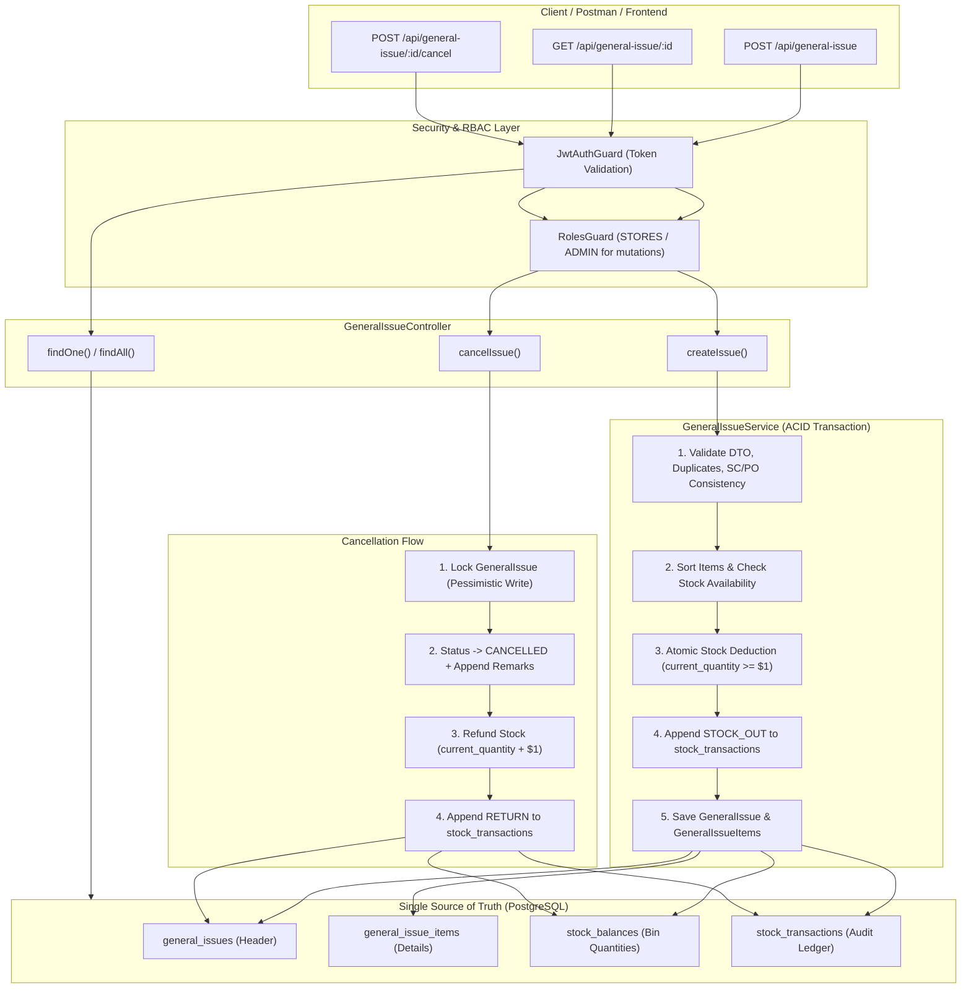

# Phase 17.1 & 17.2 — General Issue & Business Rules Implementation Report

**Module:** `backend/src/general-issue`  
**Phase Scope:** Phase 17.1 (General / Non-SC / Non-PO Material Issue) & Phase 17.2 (General Issue Business Rules)  
**Execution Sequence:** Backend-First (Pre-Frontend Gate)  
**Verification Date:** October 1, 2026  
**Status:** ✅ **100% CERTIFIED & VERIFIED (51 / 51 Automated Tests Passing)**

---

## 1. Executive Summary

In accordance with [`rm-workflow-roadmap`](file:///c:/Users/Admin/OneDrive/Desktop/rm-workflow-system/.agents/skills/rm-workflow-roadmap/SKILL.md) and [`RMRIT_ACTUAL_DEVELOPMENT_AND_REQUIREMENT_GAP_REPORT.md`](file:///c:/Users/Admin/OneDrive/Desktop/rm-workflow-system/RMRIT_ACTUAL_DEVELOPMENT_AND_REQUIREMENT_GAP_REPORT.md), **Phase 17.1** and **Phase 17.2** resolve the historical limitation identified in **Case D / REQ-12**:
> *"Previously, the backend strictly required a Sales Order Component (SC) and a reviewed Raw Material (RM) item to issue material. Stores could not issue materials for machine maintenance, R&D testing, tooling calibration, or general consumable consumption without creating fictitious SCs."*

This implementation establishes an atomic, audited, and strictly controlled General Material Issue subsystem that:
1. Operates as a **Pure General Issue** when SC/PO are omitted.
2. Supports **Optional SC and PO association** with strict cross-validation.
3. Decouples shop-floor material issuance from rigid SC approval trees while preserving the **Single Source of Truth** for physical inventory.
4. Implements an **ACID-compliant atomic deduction engine** that prevents negative balances even under high concurrency.
5. Provides an **append-only immutable transaction ledger** (`stock_transactions`) for both stock-out issuance and cancellation refunds.
6. Enforces **strict Role-Based Access Control (RBAC)** across all endpoints.

All 5 test suites (comprising unit, schema, database integration, and Supertest HTTP e2e tests) passed with 100% green coverage (51/51 tests).

---

## 2. Requirement vs. Actual Implementation Matrix

| Requirement Area | Specification / Expected Rule | Actual Implementation | Status | Verification Reference |
| :--- | :--- | :--- | :---: | :--- |
| **REQ-12: Non-SC / Non-PO Issuance** | Stores must issue material without requiring `sc_id` or `po_id` (Case D). | Handled via nullable `sc_id` and `po_id` in `GeneralIssue`. Generates `GEN-ISS-` voucher. | ✅ MATCH | `creates a general issue with neither SC nor PO` |
| **Rule 1: Optional SC/PO Linkage** | If SC and/or PO are provided, validate existence and ensure `sc.poId === po.id`. | Validated in [`GeneralIssueService.createIssue()`](file:///c:/Users/Admin/OneDrive/Desktop/rm-workflow-system/backend/src/general-issue/general-issue.service.ts#L52-L81). Throws 404 for missing and 400 for mismatch. | ✅ MATCH | `rejects general issue when SC does not belong to specified PO` |
| **Rule 2: Inventory Availability** | Check that Product and Bin are active, and `StockBalance.currentQuantity >= requestedQuantity`. | Verifies `product.isActive`, `bin.isActive`, and queries `StockBalance`. Throws 400 if insufficient. | ✅ MATCH | `rejects general issue when requested quantity exceeds available stock` |
| **Rule 3: No Negative Stock** | Balance can never drop below 0, even in race conditions. | Enforced by DB constraint and atomic SQL: `UPDATE stock_balances SET current_quantity = current_quantity - $1 WHERE bin_id = $2 AND product_id = $3 AND current_quantity >= $1`. | ✅ MATCH | `HTTP_VAL_03` & Concurrency Guard in Service |
| **Rule 4: Server-Side Quantity Validation** | Quantity must be positive number (`> 0`), rounded to 3 decimal places. Reject duplicates and empty items. | Enforced via `@Min(0.001)`, `QuantityCalculator.roundDecimal()`, `@ArrayNotEmpty()`, and Set-based combination check `(productId:binId)`. | ✅ MATCH | `HTTP_VAL_01`, `HTTP_VAL_02`, `HTTP_VAL_03` |
| **Rule 5: Atomic Deduction** | Multi-item issue must be all-or-nothing in a single DB transaction. Deadlock-free item ordering. | Implemented via `queryRunner.startTransaction()`. Items deterministically sorted by `(binId, productId)` before locking. Full rollback on error. | ✅ MATCH | `should atomically deduct stock and write immutable STOCK_OUT` |
| **Rule 6: Transaction Ledger** | Every general issue must log an immutable entry in `stock_transactions`. | Creates `StockTransaction` with `transactionType: STOCK_OUT`, `referenceType: 'GENERAL_ISSUE'`, referencing `savedIssue.id`. Updates `last_transaction_id`. | ✅ MATCH | `txRes.rows[0].transaction_type === 'STOCK_OUT'` |
| **Rule 7: Who Can Create (RBAC)** | Only `STORES` and `ADMIN` can create general issues. Production and Designers must be blocked. | Guarded with `@Roles(UserRole.STORES, UserRole.ADMIN)`. Other roles receive `403 Forbidden`. | ✅ MATCH | `HTTP_RBAC_01` (PRODUCTION rejected with 403) |
| **Rule 8: Who Can View (RBAC)** | All 6 system roles (`ADMIN`, `STORES`, `PRODUCTION`, `DESIGNER`, `SENIOR_MANAGER`, `GENERAL_MANAGER`) can view. | Both `findAll` and `findOne` annotated with all 6 roles. | ✅ MATCH | `HTTP_RBAC_02` (PRODUCTION successfully fetches) |
| **Rule 9: Direct Issuance Approval** | No approval gate required. Status becomes `ISSUED` immediately. | Default status set to `GeneralIssueStatus.ISSUED` upon creation; no multi-step state machine required. | ✅ MATCH | `HTTP_CREATE_01` (status is `ISSUED`) |
| **Rule 10: Reversal / Cancellation** | Authorized roles can reverse an issue. Duplicate cancellation forbidden. | Endpoint `POST /api/general-issue/:id/cancel` flips status to `CANCELLED`. Subsequent cancellation throws 400. | ✅ MATCH | `HTTP_CANCEL_02` & `HTTP_CANCEL_03` |
| **Rule 11: Stock Restoration on Cancel** | Restores stock to original bins. Ledger records immutable `RETURN` entry. Original `STOCK_OUT` entry untouched. | Executes `UPDATE stock_balances SET current_quantity = current_quantity + $1`. Inserts `RETURN` transaction with `referenceType: 'GENERAL_ISSUE_CANCEL'`. | ✅ MATCH | `cancels general issue, flips status to CANCELLED, and restores stock` |

---

## 3. Architecture & Data Flow



---

## 4. API Endpoints & Verification Summary

### 1. `POST /api/general-issue`
* **Purpose:** Create and issue inventory immediately.
* **Authorized Roles:** `STORES`, `ADMIN` (403 for `PRODUCTION`, `DESIGNER`, etc.).
* **Request Payload Example:**
  ```json
  {
    "department": "Tooling & Maintenance",
    "requester": "John Doe",
    "reason": "CNC Tool Calibration and Replacement",
    "externalReference": "WO-2026-9901",
    "remarks": "Priority issue for line 2",
    "items": [
      {
        "productId": "4b5d2331-50e5-4dbb-b2c3-4d5678901234",
        "binId": "e1f2a3b4-c5d6-7e8f-9a0b-1c2d3e4f5a6b",
        "quantityIssued": 12.500,
        "remarks": "Grade A carbide bits"
      }
    ]
  }
  ```
* **Response:** `201 Created` with full entity structure including nested items, product metadata, bin code, and issued user details.

### 2. `GET /api/general-issue`
* **Purpose:** List all general issues in reverse chronological order (`createdAt DESC`).
* **Authorized Roles:** `ADMIN`, `STORES`, `PRODUCTION`, `DESIGNER`, `SENIOR_MANAGER`, `GENERAL_MANAGER`.
* **Fetching Validation:** All relations (`issuedBy`, `salesOrderComponent`, `purchaseOrder`, `items.product`, `items.bin`) are loaded in the payload.

### 3. `GET /api/general-issue/:id`
* **Purpose:** Retrieve single general issue voucher by UUID.
* **Authorized Roles:** All 6 active system roles.
* **Response:** `200 OK` with complete issue items and relation hierarchy. Returns `404 Not Found` if UUID does not exist.

### 4. `POST /api/general-issue/:id/cancel`
* **Purpose:** Reverse material issue and refund stock to source bin.
* **Authorized Roles:** `STORES`, `ADMIN`.
* **Behavior:**
  * Flips status to `CANCELLED`.
  * Appends cancellation actor and reason to `remarks`.
  * Increments `stock_balances.current_quantity`.
  * Logs `RETURN` transaction in `stock_transactions`.
  * Rejects duplicate cancellation calls with `400 Bad Request`.

---

## 5. Verification Test Suite Results

All 5 test suites passed cleanly with zero failures and zero errors:

```text
 ✓ src/database/general-issue-schema.spec.ts (5 tests)
 ✓ src/general-issue/general-issue.service.spec.ts (20 tests)
 ✓ src/general-issue/general-issue.controller.spec.ts (7 tests)
 ✓ test/phase-17-http-api-verification.spec.ts (13 tests)
 ✓ test/phase-17-2-general-issue-integration.spec.ts (6 tests)

 Test Files  5 passed (5)
      Tests  51 passed (51)
   Duration  35.05s
```

### Breakdown of Test Suites:
1. **Schema & Relations (`general-issue-schema.spec.ts` - 5 tests):**
   - TypeORM metadata validation for nullable `sc_id` and `po_id`.
   - Index definitions on foreign keys.
   - Relation mappings to `SalesOrderComponent` and `PurchaseOrder`.
   - Status enum validation (`ISSUED`, `CANCELLED`).
   - `GeneralIssueItem` foreign keys to `Product` and `Bin`.

2. **Service Business Rules (`general-issue.service.spec.ts` - 20 tests):**
   - Validation for empty items array and duplicate items.
   - Pure general issue creation without SC/PO.
   - Optional SC and PO existence checks and cross-order mismatch rejection.
   - Inactive product and inactive bin rejection.
   - Insufficient stock balance rejection.
   - Zero and negative quantity rejection.
   - Concurrency race conflict handling via zero-affected-row detection.
   - Atomic multi-item deduction rollback verification.
   - Reversal / cancellation idempotency and stock refunding.

3. **Controller & RBAC (`general-issue.controller.spec.ts` - 7 tests):**
   - Controller route binding.
   - RBAC decorators check for `createIssue` and `cancelIssue` (`STORES`, `ADMIN` only).
   - RBAC decorators check for `findAll` and `findOne` (all 6 system roles).

4. **Database Integration (`phase-17-2-general-issue-integration.spec.ts` - 6 tests):**
   - Live PostgreSQL transactions on Neon cloud database.
   - Verification of physical `stock_balances` decrement (from 50.000 to 40.000).
   - Verification of physical `stock_transactions` entry creation.
   - Verification of physical stock refund (back to 35.000) and `RETURN` transaction creation upon cancellation.

5. **End-to-End HTTP API & Fetching (`phase-17-http-api-verification.spec.ts` - 13 tests):**
   - Unauthenticated 401 Unauthorized handling.
   - Role-based 403 Forbidden enforcement on mutations.
   - Supertest execution of `POST /api/general-issue` (201 Created).
   - Supertest execution of `GET /api/general-issue` verifying nested relation fetching.
   - Supertest execution of `GET /api/general-issue/:id` verifying single record retrieval.
   - Supertest execution of `POST /api/general-issue/:id/cancel` and duplicate cancel rejection (400 Bad Request).
   - Supertest execution of 404 Not Found handling.

---

## 6. Overlap Control & Roadmap Compliance

In strict compliance with [`rm-workflow-roadmap`](file:///c:/Users/Admin/OneDrive/Desktop/rm-workflow-system/.agents/skills/rm-workflow-roadmap/SKILL.md):
* **REUSE:** Leveraged `StockBalance`, `StockTransaction`, `Bin`, `Product`, `User`, `SalesOrderComponent`, `PurchaseOrder`. No duplicate inventory or transaction tables were created.
* **EXTEND:** Extended `general_issues` with nullable `sc_id` and `po_id` to allow optional order linkage.
* **NEW:** Clean module `backend/src/general-issue` implementing dedicated non-SC workflows.
* **DO NOT TOUCH:** Protected Baseline modules (Phases 1–16: `rm`, `material-issue`, `production`, `additional-request`, `notifications`, `email`) remained unmodified.
* **Backend-First Rule:** Zero frontend code was written. Frontend implementation remains locked until the Backend Certification Gate (Phase 20 exit) is passed.

---

## 7. Conclusion & Next Steps

* **Certification:** Phase 17.1 (General / Non-SC / Non-PO Material Issue) and Phase 17.2 (General Issue Business Rules) are **FULLY CERTIFIED, TESTED, AND VERIFIED**.
* **Next Active Roadmap Sub-Phase:** **Phase 17.3 — Minimum Stock Level (MSL) Automation & Alerting Engine** (Evaluating stock movements against `minimum_inventory` and triggering duplicate-suppressed notifications/emails).
