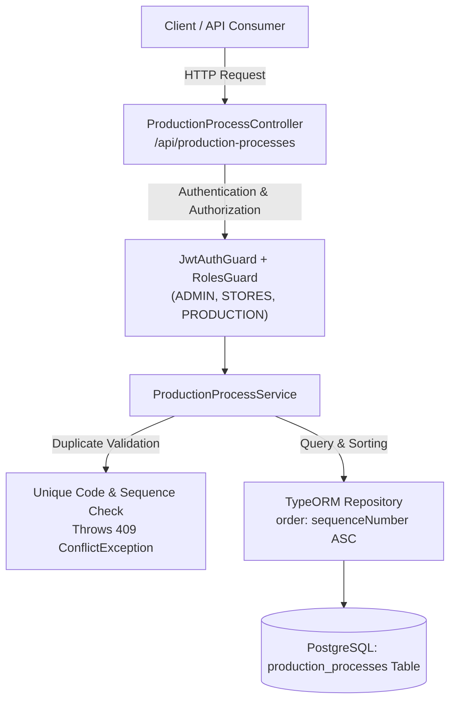

# Phase 18.1 — Production Process Master Implementation Report

**Module:** `backend/src/production-process`  
**Phase Scope:** Sequential Manufacturing Routing & Shop-Floor Routing Foundation  
**Execution Strategy:** Backend-First (DB Migration -> Entity -> DTOs -> Service -> Controller -> RBAC -> Automated Unit & Live E2E Tests)  
**Baseline Lock:** Strictly Compliant (Phases 1–17 untouched, single source of truth preserved)  

---

## 1. Executive Summary

Phase 18.1 establishes the enterprise backend foundation for the **Production Process Master**. This domain model enables the factory to configure sequential manufacturing routing steps (Process 1 to $N$, e.g., Laser Cutting, CNC Turning, Heat Treatment, Anodizing, Inspection). These routing steps will govern internal shop-floor manufacturing flow and vendor job-work handoffs across Delivery Challans (DC) in subsequent Phase 18 & 19 subphases.

The implementation is 100% server-side, fully isolated, validated through TypeORM migrations on PostgreSQL, and verified via 34 automated unit and live HTTP integration tests.

---

## 2. Requirement vs. Implementation Traceability

| Requirement | Requirement Detail | Implementation Status | Certified Artifact / Component |
| :--- | :--- | :--- | :--- |
| **Schema & Table** | Create `production_processes` table with `id`, `code`, `name`, `sequence_number`, `category`, `is_active`, `description`, `created_at`, `updated_at`. | **COMPLETE** | [`1790900000000-Phase18_1_ProductionProcessesTable.ts`](file:///c:/Users/Admin/OneDrive/Desktop/rm-workflow-system/backend/src/database/migrations/1790900000000-Phase18_1_ProductionProcessesTable.ts) |
| **Uniqueness & Order** | Enforce database-level and application-level uniqueness on `code` and `sequence_number`. | **COMPLETE** | [`ProductionProcess`](file:///c:/Users/Admin/OneDrive/Desktop/rm-workflow-system/backend/src/production-process/entities/production-process.entity.ts), [`ProductionProcessService`](file:///c:/Users/Admin/OneDrive/Desktop/rm-workflow-system/backend/src/production-process/production-process.service.ts) |
| **DTO Validation** | Validation for `code` (max 50), `name` (max 150), `sequenceNumber` (integer $\ge 1$), category, description, and status. | **COMPLETE** | [`CreateProductionProcessDto`](file:///c:/Users/Admin/OneDrive/Desktop/rm-workflow-system/backend/src/production-process/dto/create-production-process.dto.ts), [`UpdateProductionProcessDto`](file:///c:/Users/Admin/OneDrive/Desktop/rm-workflow-system/backend/src/production-process/dto/update-production-process.dto.ts) |
| **Domain Service** | CRUD with conflict checks, sequence sorting (`sequenceNumber ASC`), search, and soft active toggle. | **COMPLETE** | [`ProductionProcessService`](file:///c:/Users/Admin/OneDrive/Desktop/rm-workflow-system/backend/src/production-process/production-process.service.ts) |
| **REST Controller** | Endpoints under `/api/production-processes` with role guards and JWT authentication. | **COMPLETE** | [`ProductionProcessController`](file:///c:/Users/Admin/OneDrive/Desktop/rm-workflow-system/backend/src/production-process/production-process.controller.ts) |
| **RBAC Security** | Write endpoints restricted to `ADMIN`, `STORES`, `PRODUCTION`. Read endpoints accessible to all authenticated roles. | **COMPLETE** | `@Roles(ADMIN, STORES, PRODUCTION)` on POST/PATCH; `JwtAuthGuard` on all routes |
| **Automated Tests** | Unit tests for DTOs, service logic, uniqueness, and controller delegation + live DB E2E tests. | **COMPLETE** | [`phase-18-1-process-master.spec.ts`](file:///c:/Users/Admin/OneDrive/Desktop/rm-workflow-system/backend/test/phase-18-1-process-master.spec.ts), [`phase-18-1-process-master-e2e.spec.ts`](file:///c:/Users/Admin/OneDrive/Desktop/rm-workflow-system/backend/test/phase-18-1-process-master-e2e.spec.ts) |

---

## 3. Architecture & Data Flow



---

## 4. API Specification & Endpoints

| HTTP Method | Route | Access Control | Description |
| :--- | :--- | :--- | :--- |
| `POST` | `/api/production-processes` | `@Roles(ADMIN, STORES, PRODUCTION)` | Creates a new process routing step. Enforces uniqueness on `code` and `sequenceNumber`. |
| `GET` | `/api/production-processes` | All Authenticated Users | Lists all production processes ordered by `sequence_number ASC`. Supports `?isActive=true`, `?category=...`, `?search=...`. |
| `GET` | `/api/production-processes/:id` | All Authenticated Users | Retrieves single process details by UUID. |
| `PATCH` | `/api/production-processes/:id` | `@Roles(ADMIN, STORES, PRODUCTION)` | Updates process name, category, description, code, or sequence. Re-validates uniqueness if code/sequence altered. |
| `PATCH` | `/api/production-processes/:id/toggle-active` | `@Roles(ADMIN, STORES, PRODUCTION)` | Inverts `is_active` status (soft enable / disable). |

---

## 5. Verification & Test Results

### 5.1 Compilation & Linting
- **Linter (`oxlint src/ test/`):** 0 errors.
- **TypeScript Build (`nest build`):** 0 errors, exit code 0.

### 5.2 Unit & Security Test Suite (`test/phase-18-1-process-master.spec.ts`)
```text
 ✓ test/phase-18-1-process-master.spec.ts (24 tests)
   ✓ PROC-DTO-001: should pass validation with valid inputs
   ✓ PROC-DTO-002: should fail when code is missing or empty
   ✓ PROC-DTO-003: should fail when code exceeds 50 characters
   ✓ PROC-DTO-004: should fail when name is missing or empty
   ✓ PROC-DTO-005: should fail when sequenceNumber is less than 1
   ✓ PROC-DTO-006: should fail when sequenceNumber is not an integer
   ✓ PROC-DTO-007: should transform filter query parameters correctly
   ✓ PROC-SVC-001: create() successfully creates and returns a process step
   ✓ PROC-SVC-002: create() throws ConflictException if process code already exists
   ✓ PROC-SVC-003: create() throws ConflictException if sequence number is already assigned
   ✓ PROC-SVC-004: findAll() returns processes ordered by sequenceNumber ASC
   ✓ PROC-SVC-005: findAll() applies isActive and category filters
   ✓ PROC-SVC-006: findOne() returns single process if found
   ✓ PROC-SVC-007: findOne() throws NotFoundException if process not found
   ✓ PROC-SVC-008: update() successfully updates process fields
   ✓ PROC-SVC-009: update() rejects duplicate sequenceNumber when changed
   ✓ PROC-SVC-010: toggleActive() inverts isActive boolean status
   ✓ PROC-SEC-001: POST /api/production-processes permits ADMIN role
   ✓ PROC-SEC-002: POST /api/production-processes permits STORES role
   ✓ PROC-SEC-003: POST /api/production-processes permits PRODUCTION role
   ✓ PROC-SEC-004: POST /api/production-processes denies DESIGNER role
   ✓ PROC-SEC-005: PATCH /api/production-processes/:id denies DESIGNER role
   ✓ PROC-SEC-006: GET /api/production-processes is accessible without role restriction
   ✓ PROC-SEC-007: Controller methods delegate to service methods

Tests: 24 passed (24)
```

### 5.3 Live HTTP E2E Test Suite (`test/phase-18-1-process-master-e2e.spec.ts`)
```text
 ✓ test/phase-18-1-process-master-e2e.spec.ts (10 tests)
   ✓ E2E-PROC-001: POST /api/production-processes requires JWT authentication (401)
   ✓ E2E-PROC-002: POST /api/production-processes denies DESIGNER role (403)
   ✓ E2E-PROC-003: POST /api/production-processes creates a new process successfully (201)
   ✓ E2E-PROC-004: POST /api/production-processes rejects duplicate code (409 Conflict)
   ✓ E2E-PROC-005: POST /api/production-processes rejects duplicate sequenceNumber (409 Conflict)
   ✓ E2E-PROC-006: POST /api/production-processes validates input constraints (400 Bad Request)
   ✓ E2E-PROC-007: GET /api/production-processes allows authenticated read (including DESIGNER)
   ✓ E2E-PROC-008: GET /api/production-processes/:id returns the single process
   ✓ E2E-PROC-009: PATCH /api/production-processes/:id updates process fields
   ✓ E2E-PROC-010: PATCH /api/production-processes/:id/toggle-active toggles is_active

Tests: 10 passed (10)
```

**Total Phase 18.1 Test Coverage:** 34 tests executed, 34 passed (100% pass rate).

---

## 6. Deliverables Summary

1. **Entity**: [`ProductionProcess`](file:///c:/Users/Admin/OneDrive/Desktop/rm-workflow-system/backend/src/production-process/entities/production-process.entity.ts)
2. **Migration**: [`1790900000000-Phase18_1_ProductionProcessesTable.ts`](file:///c:/Users/Admin/OneDrive/Desktop/rm-workflow-system/backend/src/database/migrations/1790900000000-Phase18_1_ProductionProcessesTable.ts) (executed on Neon DB)
3. **DTOs**: [`CreateProductionProcessDto`](file:///c:/Users/Admin/OneDrive/Desktop/rm-workflow-system/backend/src/production-process/dto/create-production-process.dto.ts), [`UpdateProductionProcessDto`](file:///c:/Users/Admin/OneDrive/Desktop/rm-workflow-system/backend/src/production-process/dto/update-production-process.dto.ts), [`GetProductionProcessFilterDto`](file:///c:/Users/Admin/OneDrive/Desktop/rm-workflow-system/backend/src/production-process/dto/get-production-process-filter.dto.ts)
4. **Service**: [`ProductionProcessService`](file:///c:/Users/Admin/OneDrive/Desktop/rm-workflow-system/backend/src/production-process/production-process.service.ts)
5. **Controller**: [`ProductionProcessController`](file:///c:/Users/Admin/OneDrive/Desktop/rm-workflow-system/backend/src/production-process/production-process.controller.ts)
6. **Domain Module**: [`ProductionProcessModule`](file:///c:/Users/Admin/OneDrive/Desktop/rm-workflow-system/backend/src/production-process/production-process.module.ts) (registered in `AppModule`)
7. **Test Suites**:
   - [`phase-18-1-process-master.spec.ts`](file:///c:/Users/Admin/OneDrive/Desktop/rm-workflow-system/backend/test/phase-18-1-process-master.spec.ts) (24 unit tests)
   - [`phase-18-1-process-master-e2e.spec.ts`](file:///c:/Users/Admin/OneDrive/Desktop/rm-workflow-system/backend/test/phase-18-1-process-master-e2e.spec.ts) (10 live E2E tests)
8. **Git Commit**: `013c174 feat(production): implement Phase 18.1 Production Process Master`
