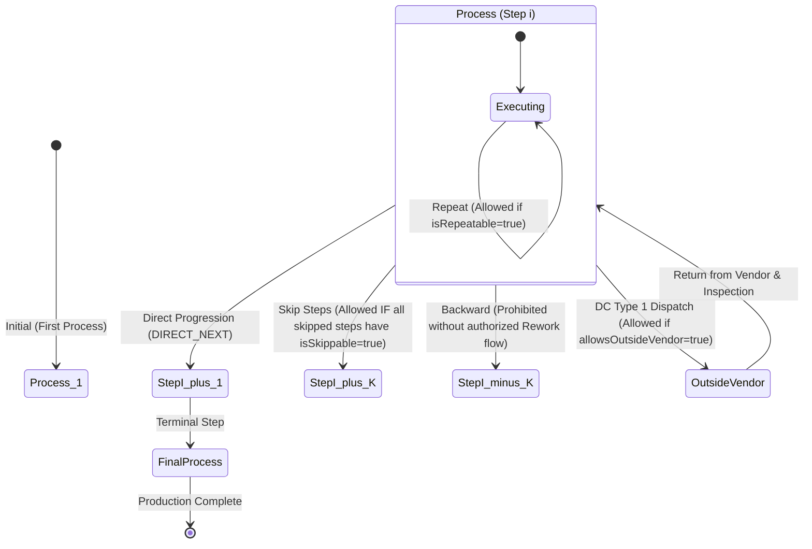

# Phase 18.2 — Process Sequence Rules & Routing Engine Implementation Report

**Module:** `backend/src/production-process`  
**Phase Scope:** Process Sequence Rules, Navigational Logic, Transition Validation Engine, and Vendor Job-Work Eligibility  
**Execution Strategy:** Backend-First (DB Migration -> Entity Extension -> Routing Service -> Controller Endpoints -> Automated Unit & Live E2E Tests)  
**Baseline Lock:** Strictly Compliant (Phases 1–17 and Phase 18.1 protected; 0 regressions)  

---

## 1. Executive Summary

Phase 18.2 introduces the **Process Sequence Rules and Routing Engine**, providing server-side intelligence to govern how components and work-orders progress through sequential manufacturing steps ($1 \dots N$). The engine resolves first/previous/next/final steps, evaluates whether intermediate steps can be legally bypassed or repeated, and filters stages where outside-vendor job-work handoff is permissible.

This routing foundation is **strictly required** for subsequent Phase 19 Delivery Challans (DC Type 1: Production Process Outward).

---

## 2. Requirement vs. Implementation Traceability

| Requirement | Requirement Detail | Implementation Status | Certified Artifact / Component |
| :--- | :--- | :--- | :--- |
| **First Process** | Determine initial manufacturing operation (lowest active sequence number). | **COMPLETE** | `ProcessRoutingService.getFirstProcess()` |
| **Final Process** | Determine terminal manufacturing step (highest active sequence number). | **COMPLETE** | `ProcessRoutingService.getFinalProcess()` |
| **Next Process** | Determine chronological successor step in routing ($> \text{current sequence}$). | **COMPLETE** | `ProcessRoutingService.getNextProcess()` |
| **Previous Process** | Determine chronological predecessor step in routing ($< \text{current sequence}$). | **COMPLETE** | `ProcessRoutingService.getPreviousProcess()` |
| **Skip Rule (`isSkippable`)** | Flag & logic governing whether an intermediate process can be bypassed. | **COMPLETE** | `is_skippable` column, `validateTransition()` |
| **Repeat Rule (`isRepeatable`)** | Flag & logic governing whether an operation can repeat / loop on same step. | **COMPLETE** | `is_repeatable` column, `validateTransition()` |
| **Vendor Rule (`allowsOutsideVendor`)** | Flag & logic identifying processes eligible for outside vendor job-work. | **COMPLETE** | `allows_outside_vendor` column, `getEligibleVendorProcesses()` |
| **Transition Validator** | Server-side validation engine enforcing transition integrity & rework policy. | **COMPLETE** | `ProcessRoutingService.validateTransition()` |
| **Database Migration** | Add `is_skippable`, `is_repeatable`, and `allows_outside_vendor` to `production_processes`. | **COMPLETE** | [`1790900100000-Phase18_2_ProcessSequenceRules.ts`](file:///c:/Users/Admin/OneDrive/Desktop/rm-workflow-system/backend/src/database/migrations/1790900100000-Phase18_2_ProcessSequenceRules.ts) |

---

## 3. Routing Engine State Machine & Transition Rules



### Transition Rule Definitions:
1. **Direct Progression (`DIRECT_NEXT`)**: Moving to the adjacent active successor step is always valid.
2. **Loop / Repetition (`REPEAT`)**: Repeating the current operation is allowed **only if** `currentProcess.isRepeatable === true`.
3. **Skipping Intermediate Steps (`SKIP`)**: Skipping one or more active intermediate processes is allowed **only if** *every* intermediate process has `isSkippable === true`. If any intermediate process has `isSkippable === false`, the transition is rejected with `400 / { isValid: false, reason: 'Cannot skip mandatory process(es): ...' }`.
4. **Backward Movement (`BACKWARD_REWORK`)**: Transitioning to an earlier sequence step is blocked to prevent unauthorized state corruption unless handled via an authorized rework flow.
5. **Outside-Vendor Processing (`VENDOR_ELIGIBLE`)**: Only processes flagged with `allowsOutsideVendor === true` can be targeted by Delivery Challans (DC Type 1).

---

## 4. REST API Specification

| HTTP Method | Route | Access Control | Description |
| :--- | :--- | :--- | :--- |
| `GET` | `/api/production-processes/routing/first` | All Authenticated | Retrieves the initial manufacturing step (lowest active sequence). |
| `GET` | `/api/production-processes/routing/final` | All Authenticated | Retrieves the terminal manufacturing step (highest active sequence). |
| `GET` | `/api/production-processes/routing/vendor-eligible` | All Authenticated | Retrieves all processes permitting outside-vendor job-work (DC Type 1 foundation). |
| `GET` | `/api/production-processes/:id/navigation` | All Authenticated | Retrieves complete navigation context: `{ current, previous, next, first, final, isFirst, isFinal, isSkippable, isRepeatable, allowsOutsideVendor }`. |
| `POST` | `/api/production-processes/routing/validate-transition` | All Authenticated | Validates transition from `fromProcessId` to `toProcessId` returning `{ isValid, transitionType, skippedProcesses, reason }`. |

---

## 5. Verification & Test Execution Results

### 5.1 Static Analysis & Compilation
- **Linter (`oxlint src/ test/`):** 0 errors.
- **TypeScript Compiler (`nest build`):** 0 errors, exit code 0.

### 5.2 Unit Test Suite (`test/phase-18-2-process-routing.spec.ts`)
```text
 ✓ test/phase-18-2-process-routing.spec.ts (15 tests)
   ✓ ROUTE-NAV-001: getFirstProcess() returns process with lowest sequence number
   ✓ ROUTE-NAV-002: getFinalProcess() returns process with highest sequence number
   ✓ ROUTE-NAV-003: getNextProcess() finds subsequent active process
   ✓ ROUTE-NAV-004: getNextProcess() returns null if currently at final process
   ✓ ROUTE-NAV-005: getPreviousProcess() finds preceding active process
   ✓ ROUTE-NAV-006: getPreviousProcess() returns null if currently at first process
   ✓ ROUTE-NAV-007: getNavigation() returns complete navigation object with boundary flags
   ✓ ROUTE-RULE-001: DIRECT_NEXT — Moving to adjacent successor step is valid
   ✓ ROUTE-RULE-002: REPEAT — Repeat on repeatable process (CNC-01) is allowed
   ✓ ROUTE-RULE-003: REPEAT — Repeat on non-repeatable process (CUT-01) is rejected
   ✓ ROUTE-RULE-004: SKIP — Skipping an optional/skippable step (POL-01) is allowed
   ✓ ROUTE-RULE-005: SKIP — Skipping an unskippable step is rejected
   ✓ ROUTE-RULE-006: BACKWARD — Backward transition is prohibited without rework authorization
   ✓ ROUTE-RULE-007: INACTIVE — Transition involving inactive process is rejected
   ✓ ROUTE-VND-001: getEligibleVendorProcesses() returns only processes with allowsOutsideVendor = true

Tests: 15 passed (15)
```

### 5.3 Live HTTP E2E Test Suite (`test/phase-18-2-process-routing-e2e.spec.ts`)
```text
 ✓ test/phase-18-2-process-routing-e2e.spec.ts (10 tests)
   ✓ E2E-ROUTE-001: GET /api/production-processes/routing/first returns lowest active process
   ✓ E2E-ROUTE-002: GET /api/production-processes/routing/final returns highest active process
   ✓ E2E-ROUTE-003: GET /api/production-processes/:id/navigation returns previous, next and flags
   ✓ E2E-ROUTE-004: GET /api/production-processes/routing/vendor-eligible returns only outside vendor allowed processes
   ✓ E2E-ROUTE-005: POST /api/production-processes/routing/validate-transition allows direct progression
   ✓ E2E-ROUTE-006: POST /api/production-processes/routing/validate-transition allows skipping skippable Deburring step
   ✓ E2E-ROUTE-007: POST /api/production-processes/routing/validate-transition rejects skipping unskippable CNC step
   ✓ E2E-ROUTE-008: POST /api/production-processes/routing/validate-transition allows loop on repeatable CNC step
   ✓ E2E-ROUTE-009: POST /api/production-processes/routing/validate-transition rejects loop on non-repeatable Cutting step
   ✓ E2E-ROUTE-010: POST /api/production-processes/routing/validate-transition rejects backward transition without rework

Tests: 10 passed (10)
```

### 5.4 Cumulative Phase 18 Test Status
```text
 ✓ test/phase-18-1-process-master.spec.ts (24 tests)
 ✓ test/phase-18-1-process-master-e2e.spec.ts (10 tests)
 ✓ test/phase-18-2-process-routing.spec.ts (15 tests)
 ✓ test/phase-18-2-process-routing-e2e.spec.ts (10 tests)

Test Files: 4 passed (4)
Tests:      59 passed (59)
```

---

## 6. Deliverables & Git Records

1. **Migration**: [`1790900100000-Phase18_2_ProcessSequenceRules.ts`](file:///c:/Users/Admin/OneDrive/Desktop/rm-workflow-system/backend/src/database/migrations/1790900100000-Phase18_2_ProcessSequenceRules.ts)
2. **Entity**: [`ProductionProcess`](file:///c:/Users/Admin/OneDrive/Desktop/rm-workflow-system/backend/src/production-process/entities/production-process.entity.ts) with `is_skippable`, `is_repeatable`, `allows_outside_vendor`
3. **DTOs**: [`ValidateProcessTransitionDto`](file:///c:/Users/Admin/OneDrive/Desktop/rm-workflow-system/backend/src/production-process/dto/validate-transition.dto.ts), [`CreateProductionProcessDto`](file:///c:/Users/Admin/OneDrive/Desktop/rm-workflow-system/backend/src/production-process/dto/create-production-process.dto.ts)
4. **Service**: [`ProcessRoutingService`](file:///c:/Users/Admin/OneDrive/Desktop/rm-workflow-system/backend/src/production-process/process-routing.service.ts)
5. **Controller**: [`ProductionProcessController`](file:///c:/Users/Admin/OneDrive/Desktop/rm-workflow-system/backend/src/production-process/production-process.controller.ts)
6. **Unit Tests**: [`phase-18-2-process-routing.spec.ts`](file:///c:/Users/Admin/OneDrive/Desktop/rm-workflow-system/backend/test/phase-18-2-process-routing.spec.ts)
7. **E2E Tests**: [`phase-18-2-process-routing-e2e.spec.ts`](file:///c:/Users/Admin/OneDrive/Desktop/rm-workflow-system/backend/test/phase-18-2-process-routing-e2e.spec.ts)
8. **Git Commit**: `6d5e28d feat(production): implement Phase 18.2 Process Sequence Rules and Routing Engine`
